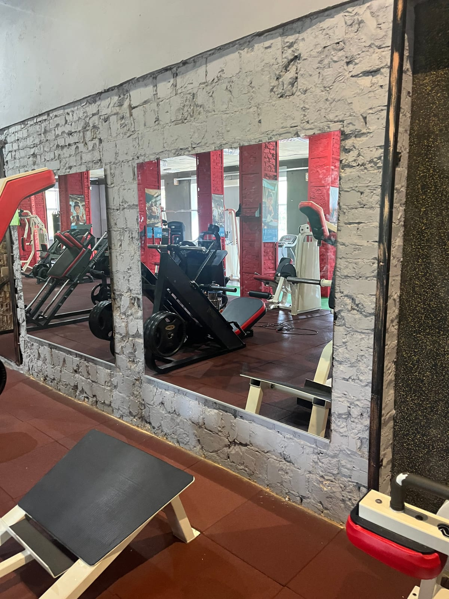

В зале бокса и единоборств зеркало помогает отрабатывать технику ударов, стойку и работу ног. Но это пространство с высокой нагрузкой, поэтому **безопасность зеркал здесь — вопрос номер один**. Рассказываем, какое стекло и монтаж выбрать для боксёрского зала.

## Зачем зеркала в зале бокса

- **Техника ударов и стойка.** Спортсмен видит себя и корректирует движения.
- **Работа ног.** Контроль перемещений и баланса.
- **Простор и свет.** Зеркальная стена делает зал визуально больше.

## Безопасность — главное

В боксе и единоборствах риск удара по стене высокий (перчаткой, снарядом, при падении). Поэтому зеркало **обязательно** монтируется **на защитную плёнку** с тыльной стороны: даже если стекло треснет, оно **останется на плёнке и не разлетится** на осколки. Это критическое требование для контактных видов спорта. Подробнее — [безопасный монтаж больших зеркал](/ru/statti/bezpechnyy-montazh-velykykh-dzerkal/).

## Прочное стекло и надёжное крепление

Для боксёрских залов берут **более прочное стекло** (обычно 4–6 мм) и **надёжное крепление** с учётом вибраций и нагрузок. При необходимости зеркальную зону делают только там, где нет прямого контакта со снарядами, а остальную стену оставляют закрытой.

## Размеры

Зеркало делают от пола (с отступом 10–15 см) высотой от 2 м, чтобы спортсмен видел себя полностью. Раскладку полотен планируем под ваш зал и расположение ринга или мешков.

## Сколько стоит и как заказать

Цена зависит от площади, толщины стекла и монтажа. Мы — производитель в Киеве: замеры, изготовление **по вашим размерам**, безопасный монтаж и доставка по Украине. Смотрите также [зеркала для спортзала](/ru/statti/dzerkala-dlya-sportzalu-rozmiry-montazh/) и [фитнес-клуба](/ru/statti/dzerkalna-stina-u-fitnes-klub/). Категория — [зеркала для спортзалов и студий](/ru/katalog/dzerkala-dlya-sportzaliv/). Чтобы рассчитать — [оставьте заявку](#zayavka).

## Частые вопросы

**Безопасны ли зеркала в боксёрском зале?**
Да, при условии монтажа на защитную плёнку — стекло не разлетится даже при ударе.

**Какая толщина стекла нужна?**
Обычно 4–6 мм — такое стекло жёстче и безопаснее для больших полотен.

**Можно ли зеркало не на всю стену?**
Да, делаем зеркальную зону только там, где это нужно и безопасно.
