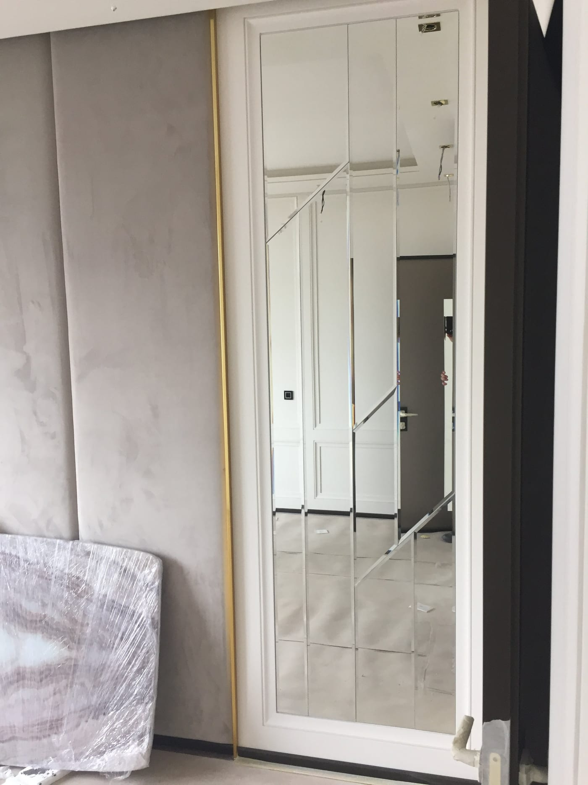

В зале спортивной или художественной гимнастики зеркало — важный инструмент: оно помогает ставить элементы, контролировать линии тела, осанку и синхронность. А поскольку в таких залах часто занимаются дети, **безопасность зеркал здесь особенно важна**. Рассказываем, какую зеркальную стену выбрать для гимнастики.

## Зачем зеркала в зале гимнастики

- **Постановка элементов.** Гимнаст видит положение тела, рук, ног.
- **Линии и осанка.** Особенно важно в художественной гимнастике.
- **Синхронность** в групповых выступлениях.
- **Простор и свет** — зал выглядит больше и светлее.

## Высота — от пола, высоко

Зеркало делают **от пола** (с отступом 10–15 см) и высоким — чтобы было видно тело и в стойках, и в элементах с поднятыми руками или предметом. Стену собирают сплошной, без «разрывов».

## Ровное стекло без искажений

Для контроля линий тела нужно **ровное отражение без волн** — используем качественное стекло достаточной толщины (4–6 мм), которое не «играет» на больших полотнах.

## Безопасность (особенно для детей)

Большое зеркало **обязательно** монтируется **на защитную плёнку** с тыльной стороны: при ударе или падении стекло останется на плёнке и не рассыплется. Для детских залов это критическое требование. Подробнее — [безопасный монтаж больших зеркал](/ru/statti/bezpechnyy-montazh-velykykh-dzerkal/).

## Сколько стоит и как заказать

Цена зависит от площади, толщины стекла и монтажа. Мы — производитель в Киеве: замеры, изготовление **по вашим размерам**, безопасный монтаж и доставка по Украине. Смотрите также [зеркала для танцевальной студии](/ru/statti/dzerkala-dlya-tantsyuvalnoyi-studiyi/) и обзор — [зеркала для залов и студий](/ru/statti/dzerkala-dlya-zaliv-i-studiy/). Категория — [зеркала для спортзалов и студий](/ru/katalog/dzerkala-dlya-sportzaliv/). Чтобы рассчитать — [оставьте заявку](#zayavka).

## Частые вопросы

**Безопасны ли зеркала в детском зале гимнастики?**
Да, при условии монтажа на защитную плёнку — стекло не разлетится даже при ударе.

**Какой высоты делать зеркало для гимнастики?**
От пола и высоко — чтобы было видно элементы с поднятыми руками или предметом.

**Вы делаете замеры и монтаж?**
Да, в Киеве и области; полотна отправляем по всей Украине.
