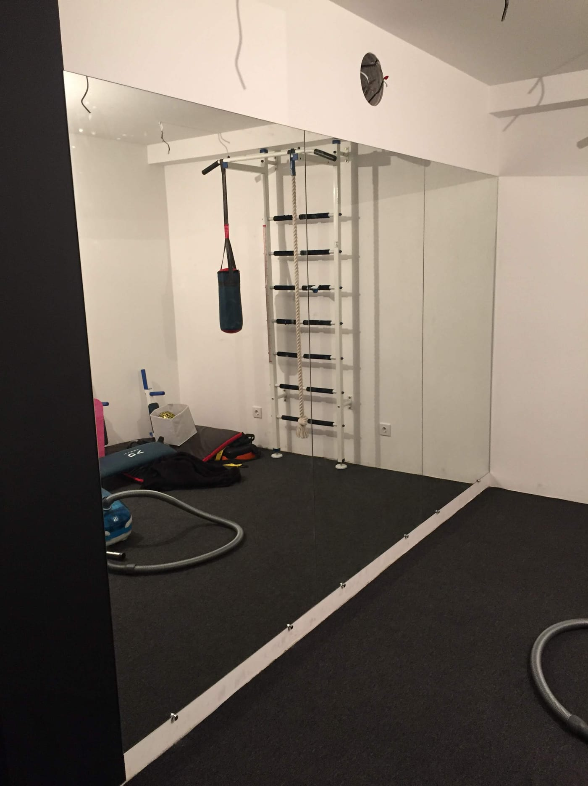

Кроссфит — это высокоинтенсивные функциональные тренировки с весом, снарядами и взрывными движениями. Зеркало в таком зале помогает контролировать технику, но из-за нагрузки и риска ударов **безопасность здесь выходит на первое место**. Рассказываем, какое стекло и монтаж выбрать для кроссфит-зала.

## Зачем зеркала в кроссфит-зале

- **Техника упражнений.** Приседания, рывки, толчки — всё видно и можно корректировать.
- **Контроль осанки** под нагрузкой, чтобы избежать травм.
- **Простор и свет.** Зеркальная стена визуально расширяет зал.

## Безопасность — главное

В кроссфите рядом со стеной летают гири, wall balls, штанги. Поэтому зеркало **обязательно** монтируется **на защитную плёнку** с тыльной стороны: даже если стекло треснет от удара, оно **останется на плёнке и не разлетится**. Это критично для функциональных зон. Подробнее — [безопасный монтаж больших зеркал](/ru/statti/bezpechnyy-montazh-velykykh-dzerkal/).

## Прочное стекло и зонирование

Берём **более прочное стекло 4–6 мм** и надёжное крепление. Зеркальную стену часто делают **не сплошной**, а только в зоне, где нет прямого контакта со снарядами (например, зона растяжки или техники), а рабочую зону с тяжёлыми снарядами оставляют без зеркал. Раскладку планируем под ваш зал.

## Сколько стоит и как заказать

Цена зависит от площади, толщины стекла и монтажа. Мы — производитель в Киеве: замеры, изготовление **по вашим размерам**, безопасный монтаж и доставка по Украине. Обзор всех типов залов — [зеркала для залов и студий](/ru/statti/dzerkala-dlya-zaliv-i-studiy/); детально про спорт — [зеркала для спортзала](/ru/statti/dzerkala-dlya-sportzalu-rozmiry-montazh/). Категория — [зеркала для спортзалов и студий](/ru/katalog/dzerkala-dlya-sportzaliv/). Чтобы рассчитать — [оставьте заявку](#zayavka).

## Частые вопросы

**Безопасны ли зеркала в кроссфит-зале?**
Да, при условии монтажа на защитную плёнку — стекло не разлетится даже при ударе снарядом.

**Нужно ли зеркало на всю стену?**
Не обязательно — часто делают зеркальную зону только там, где это безопасно и нужно для контроля техники.

**Какая толщина стекла?**
Обычно 4–6 мм — жёстче и безопаснее для больших полотен.
