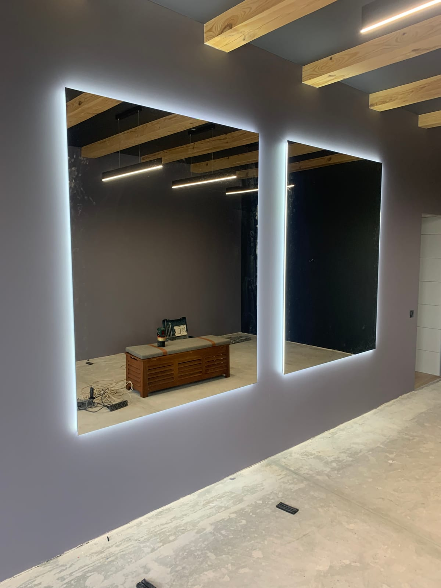

В парикмахерской зеркало работает целый день — возле него мастер стрижёт, красит, укладывает, а клиент следит за результатом. Поэтому зеркала для парикмахерской должны быть большими, с ровным отражением и правильным светом. Рассказываем, какие зеркала выбрать и как заказать их под ваш зал.

## Зеркала на рабочее место парикмахера

- **Размер.** Обычно полотно 100–160 см высотой, чтобы клиент видел себя полностью сидя.
- **Ширина.** От 60 см на одно место; для «островных» станций — шире или **двусторонние** зеркала.
- **Высота монтажа.** Центр зеркала — примерно на уровне глаз сидящего клиента.

Точные размеры подбираем под ваши кресла и планировку, чтобы рабочие места встали равномерно.

## Свет на рабочем месте

Парикмахеру нужен **ровный свет без теней и желтизны** — иначе сложно оценить цвет и ровность стрижки. Оптимальное решение — [зеркало с LED-подсветкой](/ru/katalog/dzerkala-z-led-pidsvitkoyu/) по контуру, при необходимости с регулировкой яркости. Свет по периметру равномерно освещает лицо и голову со всех сторон.

## Форматы зеркал для парикмахерской

- **Отдельные зеркала на каждое место** — классика, легко заменить или перенести.
- **Сплошная зеркальная стена** — визуально расширяет зал и делает его светлее; смотрите [зеркала в интерьере](/ru/katalog/dzerkala-v-interyeri/).
- **Двусторонние / островные** — для расстановки кресел по центру зала.
- **В раме** — под цвет и стиль вашего заведения.

## Безопасность и практичность

Парикмахерская — место с высокой проходимостью и влагой (мойки, окрашивание). Поэтому важны **влагостойкое стекло** и аккуратно обработанный край. Для больших полотен применяем защитную плёнку с тыльной стороны — при повреждении стекло не разлетается. Ухаживать за такими зеркалами просто: протирание мягкой тканью без абразивов.

## Почему выгодно заказывать у производителя

- **Точно под ваши размеры и количество рабочих мест.**
- **Единое качество и вид** для всего зала.
- **Цена от производителя** без переплат посредникам.
- **Замеры и монтаж «под ключ»** — в Киеве и области, доставка по Украине.

## Сколько стоит и как заказать

Цена зависит от количества рабочих мест, размера зеркал, типа подсветки и монтажа. Мы — [производитель зеркал на заказ](/ru/statti/dzerkala-na-zamovlennya-v-kievi/) в Киеве. Смотрите также [зеркала для салона красоты](/ru/statti/dzerkala-dlya-salonu-krasy/) и [для барбершопа](/ru/statti/dzerkala-v-barbershop/). Чтобы получить просчёт под вашу парикмахерскую — [оставьте заявку](#zayavka).

## Частые вопросы

**Какого размера зеркало на рабочее место парикмахера?**
Обычно 100–160 см высотой и от 60 см шириной — точный размер подбираем под ваши кресла.

**Нужна ли парикмахерской LED-подсветка?**
Да, ровный свет по контуру даёт правильный цвет и удобство в работе — это почти стандарт для современных парикмахерских.

**Вы делаете двусторонние зеркала для островных мест?**
Да, изготавливаем двусторонние и островные зеркальные станции на заказ.

**Есть ли доставка в другие города?**
Да, отправляем по всей Украине; замеры и монтаж — в Киеве и области.
