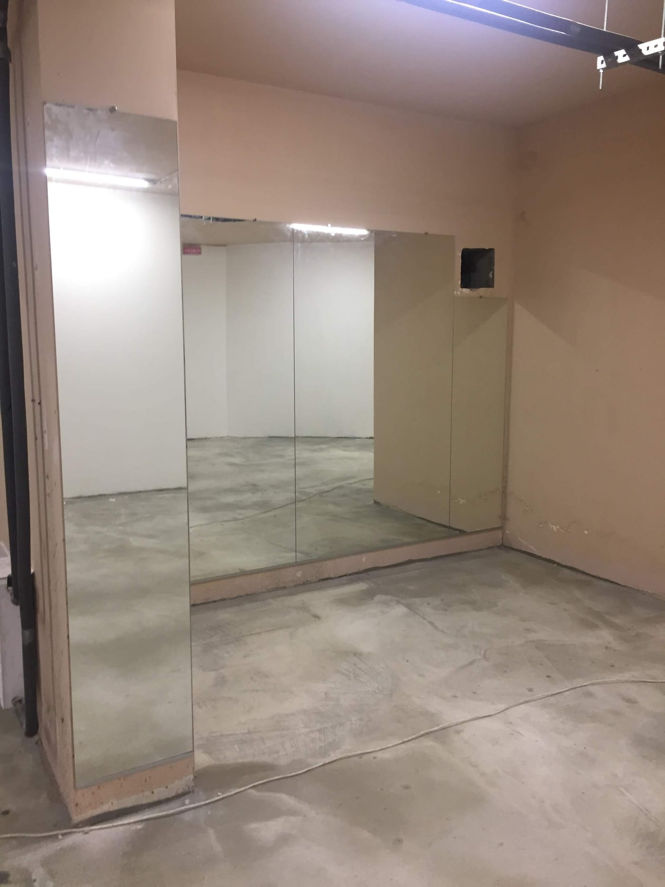

В залах реабилитации, ЛФК и физиотерапии зеркало — это не декор, а часть лечебного процесса: пациент видит свои движения, контролирует осанку, симметрию и правильность выполнения упражнений. Рассказываем, какую зеркальную стену выбрать для реабилитационного или медицинского зала.

## Зачем зеркала в зале реабилитации

- **Обратная связь для пациента.** Человек видит, правильно ли выполняет движение, и корректирует его.
- **Контроль осанки и симметрии** — важно после травм и операций.
- **Работа специалиста.** Реабилитологу удобнее показывать и контролировать технику.
- **Простор и свет** — светлый, открытый зал воспринимается комфортнее.

## Удобная высота и ровное стекло

Зеркало делают **от пола** (с отступом 10–15 см) высотой от 2 м — чтобы было видно тело и стоя, и сидя, и в коляске. Для точного контроля движений нужно **ровное отражение без волн** — используем качественное стекло достаточной толщины (4–6 мм).

## Безопасность

В медицинских и реабилитационных залах безопасность — на первом месте. Зеркало **обязательно** монтируется **на защитную плёнку** с тыльной стороны: при ударе или падении стекло останется на плёнке и не рассыплется. Подробнее — [безопасный монтаж больших зеркал](/ru/statti/bezpechnyy-montazh-velykykh-dzerkal/).

## Сколько стоит и как заказать

Цена зависит от площади, толщины стекла и монтажа. Мы — производитель в Киеве: замеры, изготовление **по вашим размерам**, безопасный монтаж и доставка по Украине. Смотрите также [зеркала для спортзала](/ru/statti/dzerkala-dlya-sportzalu-rozmiry-montazh/) и обзор — [зеркала для залов и студий](/ru/statti/dzerkala-dlya-zaliv-i-studiy/). Категория — [зеркала для спортзалов и студий](/ru/katalog/dzerkala-dlya-sportzaliv/). Чтобы рассчитать — [оставьте заявку](#zayavka).

## Частые вопросы

**Зачем зеркало в зале ЛФК?**
Чтобы пациент видел свои движения и осанку и мог корректировать их — это ускоряет восстановление.

**Безопасны ли зеркала в медицинском зале?**
Да, при условии монтажа на защитную плёнку — стекло не разлетится даже при ударе.

**Вы делаете замеры и монтаж?**
Да, в Киеве и области; полотна отправляем по всей Украине.
