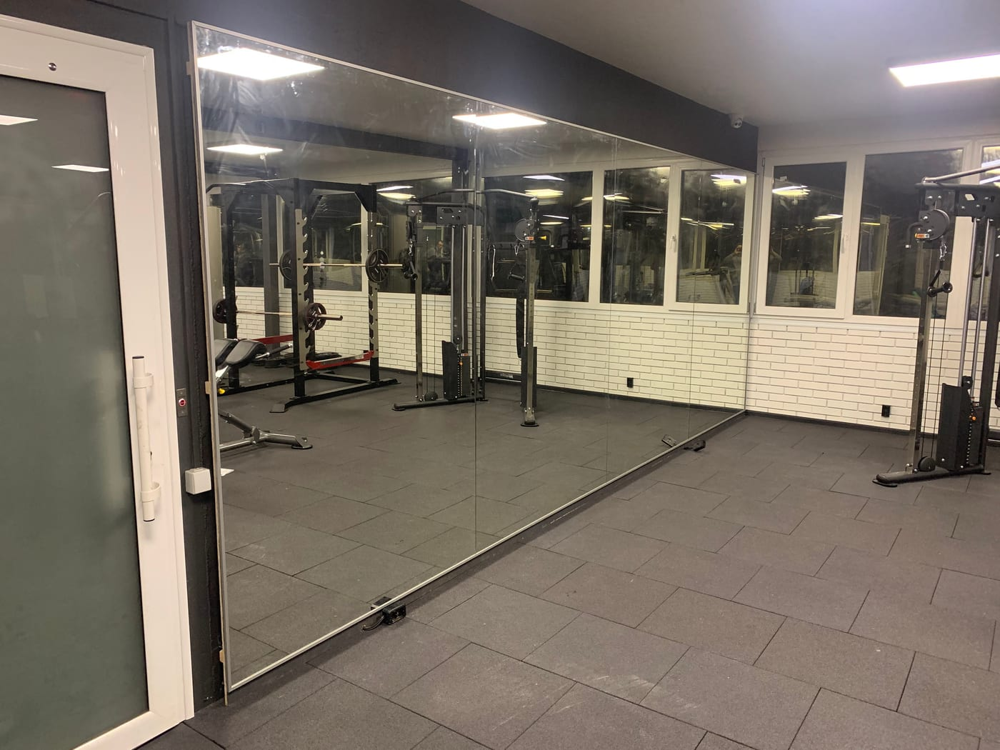

Зеркала — обязательный элемент любого спортзала, фитнес-клуба или студии: они помогают контролировать технику, визуально расширяют зал и делают его светлее. Но большие полотна — это вопрос не только эстетики, но и безопасности. Рассказываем, как правильно выбрать и смонтировать зеркала для зала.

## Для каких залов нужны зеркала

Зеркальная стена уместна практически в любом помещении для тренировок:

- **тренажёрный зал и спортзал** — контроль техники во время упражнений;
- **[фитнес-клуб](/ru/statti/dzerkalna-stina-u-fitnes-klub/)** — большая зеркальная стена на групповой зал;
- **[танцевальная студия](/ru/statti/dzerkala-dlya-tantsyuvalnoyi-studiyi/)** — сплошное зеркало от пола для хореографии;
- **[йога](/ru/statti/dzerkala-dlya-yohy/) и [стретчинг](/ru/statti/dzerkala-dlya-streychyngu/)** — ровное полотно от пола для контроля позы;
- **[бокс и единоборства](/ru/statti/dzerkala-dlya-boksu/)** — прочное стекло с обязательной защитной плёнкой;
- **[пол дэнс](/ru/statti/dzerkala-dlya-pul-dansu/)** — высокая стена до потолка с раскладкой вокруг пилонов;
- **[кроссфит](/ru/statti/dzerkala-dlya-krosfitu/), [пилатес](/ru/statti/dzerkala-dlya-pilatesu/), [гимнастика](/ru/statti/dzerkala-dlya-himnastyky/)** — функциональные и студийные залы;
- **[реабилитация и ЛФК](/ru/statti/dzerkala-dlya-reabilitatsiyi/)** — медицинские и реабилитационные центры;
- **[домашний (частный) зал](/ru/statti/dzerkala-dlya-domashnoho-sportzalu/)** — под вашу комнату или дом.

## Какие размеры выбрать

- **Высота.** Оптимально — от пола (или с небольшим отступом) до 2–2,2 м, чтобы человек видел себя в полный рост во время упражнений.
- **Ширина.** Обычно зеркальную стену собирают из нескольких полотен, закрывая весь нужный участок.
- **Отступ от пола.** Часто оставляют 10–15 см, чтобы защитить край от влаги и ударов.

Точную раскладку полотен мы рассчитываем под размеры вашего зала.

## Толщина стекла

Для спортзалов используют **более прочное стекло** — обычно толщиной 4–6 мм, жёстче и безопаснее для больших полотен. Более тонкое стекло на большой площади «играет» и даёт искажение отражения, поэтому для залов не подходит. Конкретную толщину подбираем под размер зеркала и способ монтажа.

## Способы монтажа

- **На клей/герметик** — полотно приклеивается к подготовленной ровной стене.
- **Механическое крепление** — с помощью профилей или креплений, видимых или скрытых.

Часто способы комбинируют. Мастер выбирает решение под тип и состояние вашей стены. Подробнее о работе с большими полотнами — в статье [безопасный монтаж больших зеркал](/ru/statti/bezpechnyy-montazh-velykykh-dzerkal/).

## Безопасность — главное

Большое зеркало в зале обязательно монтируется **на защитную плёнку** с тыльной стороны. Если произойдёт удар (мячом, гантелью, при падении), стекло **останется на плёнке и не разлетится** на осколки. Это ключевое требование безопасности для помещений, где занимаются люди.

Посмотреть направление можно в категории [зеркала для спортзалов](/ru/katalog/dzerkala-dlya-sportzaliv/), а обзор всех типов залов — в статье [зеркала для залов и студий](/ru/statti/dzerkala-dlya-zaliv-i-studiy/).

## Освещение и дополнительные опции

- **Правильный свет.** Зеркальная стена отражает освещение и делает зал светлее; при необходимости добавляем LED-подсветку.
- **Подогрев.** Во влажных зонах (бассейны, wellness) зеркало можно сделать с подогревом против запотевания.
- **Сегментирование.** Большую стену делим на секции — это упрощает доставку, монтаж и последующее обслуживание.

## Уход за зеркалами в зале

Зеркала в зале протирают мягкой тканью без абразивов; для больших полотен важна аккуратная обработка краёв ещё на производстве, чтобы не было сколов. При правильном монтаже зеркальная стена служит годами без потери вида.

## Сколько стоит

Цена зависит от общей площади зеркальной стены, толщины стекла и сложности монтажа. Чтобы получить просчёт под ваш зал — [оставьте заявку](#zayavka), и мы бесплатно всё рассчитаем, при необходимости с выездом на замеры. Замеры и монтаж — в Киеве и области, доставка полотен — Новой Почтой по всей Украине.

## Частые вопросы

**Безопасны ли большие зеркала в зале?**
Да, при условии монтажа на защитную плёнку и надёжного крепления — стекло не разлетится даже при ударе.

**Какая толщина стекла нужна для спортзала?**
Обычно 4–6 мм в зависимости от размера полотна — такое стекло жёстче и не даёт искажений.

**Сколько дней занимает изготовление и монтаж?**
Обычно несколько рабочих дней; точный срок зависит от объёма и называется при заказе.

**Можно ли зеркало от пола до потолка?**
Да, монтируем сплошные полотна или секции на любую высоту вашего зала.

**Вы делаете зеркала для залов в других городах?**
Изготавливаем и отправляем полотна по всей Украине; замеры и монтаж выполняем в Киеве и области.
