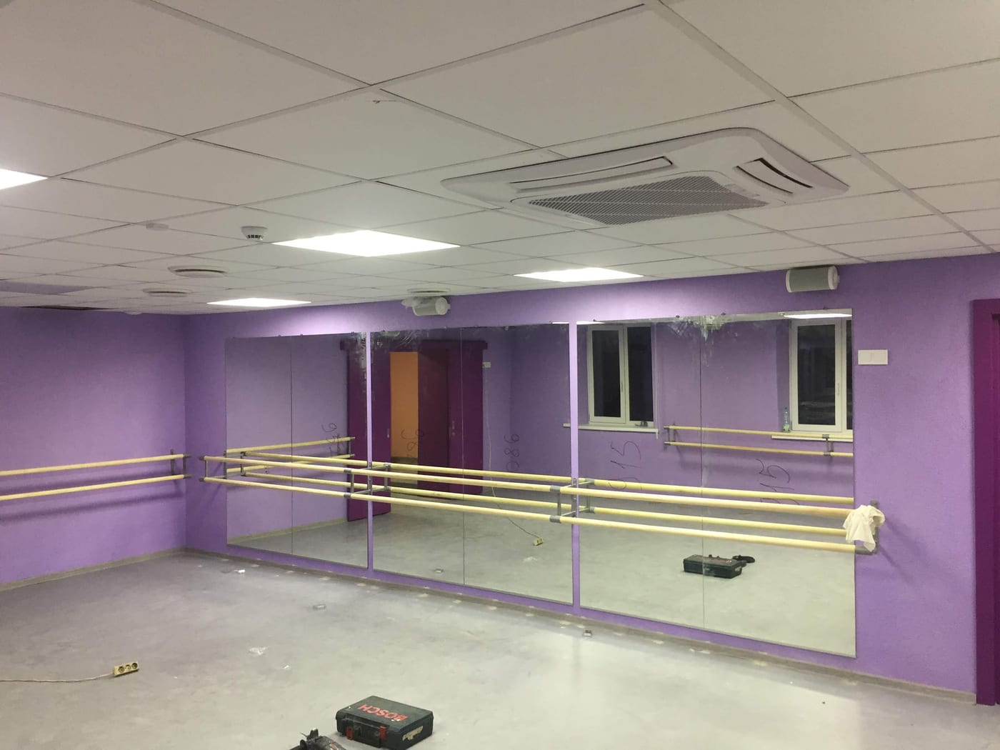

В **танцевальном зале** или фитнес-студии зеркало — не декор, а рабочий инструмент: танцоры контролируют осанку, линии и синхронность, а на фитнесе — технику упражнений. Поэтому к зеркалам в зале особые требования. Рассказываем, какую высоту и толщину выбрать и как безопасно смонтировать зеркальную стену для танцевального зала.

## Для каких залов подходит

Сплошная зеркальная стена нужна почти в любом движении:

- **танцевальные студии и балетные залы** — контроль линий и синхронности;
- **[фитнес-клубы и групповые залы](/ru/statti/dzerkalna-stina-u-fitnes-klub/)** — техника упражнений;
- **[йога](/ru/statti/dzerkala-dlya-yohy/), пилатес, [стретчинг](/ru/statti/dzerkala-dlya-streychyngu/)** — контроль положения тела;
- **[пол дэнс](/ru/statti/dzerkala-dlya-pul-dansu/)** — высокая стена до потолка;
- **[бокс и единоборства](/ru/statti/dzerkala-dlya-boksu/)** — с обязательной защитной плёнкой;
- **тренажёрные [спортзалы](/ru/statti/dzerkala-dlya-sportzalu-rozmiry-montazh/)** — большая зеркальная стена.

## Зеркала для разных танцевальных залов

Под каждый формат зала — свои нюансы высоты и раскладки зеркал:

- **балетный зал** — зеркало от пола плюс станок; высота такая, чтобы были видны и стопы, и поднятые руки;
- **зал бальных танцев** — широкая сплошная зеркальная стена для работы в парах;
- **хореографическая школа и детская студия** — обязательный монтаж на защитную плёнку, небольшой отступ от пола;
- **современные танцы, хип-хоп, contemporary** — большая площадь зеркал для работы групп;
- **танцевальные залы при фитнес-клубах** — совмещение зон для танца и функциональных тренировок.

Под ваш танцевальный зал подберём размер, высоту и раскладку полотен — [оставьте заявку](#zayavka), рассчитаем бесплатно.

## Оптимальная высота

Чтобы танцор видел себя полностью — от стоп до головы — зеркало должно быть достаточно высоким:

- **низ** — от пола или с небольшим отступом 10–15 см;
- **верх** — не менее 2 м, лучше выше, чтобы в отражение вмещались поднятые руки.

Зеркальную стену обычно делают сплошной на всю ширину зала, чтобы не было «разрывов» в отражении.

## Толщина и качество стекла

Для студий важно, чтобы зеркало давало **ровное отражение без волн и искажений** — иначе линии тела искажаются. Поэтому используем качественное стекло достаточной толщины (обычно 4–6 мм), которое не «играет» на больших полотнах. Конкретную толщину подбираем под размер.

## Безопасность танцоров

Это самое важное. Большие зеркала в зале монтируются **на защитную плёнку**: при падении или ударе стекло останется на плёнке и не рассыплется. Крепление подбираем надёжное, с учётом интенсивного движения в зале. Подробнее — [безопасный монтаж больших зеркал](/ru/statti/bezpechnyy-montazh-velykykh-dzerkal/).

Обзор всех типов залов — в статье [зеркала для залов и студий](/ru/statti/dzerkala-dlya-zaliv-i-studiy/). Категория — [зеркала для спортзалов и студий](/ru/katalog/dzerkala-dlya-sportzaliv/).

## Балетный станок и оборудование

Если в зале есть станок (у стены) — зеркало заводят за него или подбирают высоту так, чтобы станок не перекрывал отражение ног. Раскладку полотен мы планируем с учётом станков, кондиционеров и розеток.

## Освещение и уход

- **Свет.** Ровное освещение без прямых бликов в зеркало; при необходимости добавляем LED-подсветку.
- **Уход.** Протирание мягкой тканью без абразивов; аккуратно обработанный край на производстве защищает от сколов.

## Советы для студий

- оставляйте зеркальную стену сплошной — так удобнее работать группам;
- позаботьтесь о равномерном освещении, чтобы не было бликов;
- сегментируйте большую стену на секции — это упрощает доставку и монтаж.

Чтобы рассчитать зеркальную стену под вашу студию — [оставьте заявку](#zayavka), при необходимости выедем на замеры. Замеры и монтаж — в Киеве и области, доставка полотен — по всей Украине.

## Частые вопросы

**Искажает ли большое зеркало отражение?**
Качественное стекло достаточной толщины (4–6 мм) даёт ровное отражение без волн — именно такое мы и используем для студий.

**На какую высоту можно сделать зеркала?**
От пола до потолка — сплошным полотном или секциями, под размеры вашего зала.

**Безопасны ли зеркала для активных занятий?**
Да, при условии монтажа на защитную плёнку и надёжного крепления.

**Вы делаете зеркала для студий в других городах?**
Изготавливаем и отправляем полотна по всей Украине; замеры и монтаж — в Киеве и области.

**Сколько стоят зеркала для танцевального зала?**
Цена зависит от площади зеркальной стены, толщины стекла и монтажа. Мы — производитель, поэтому считаем под конкретный танцевальный зал по вашим размерам — [оставьте заявку](#zayavka), рассчитаем бесплатно.
