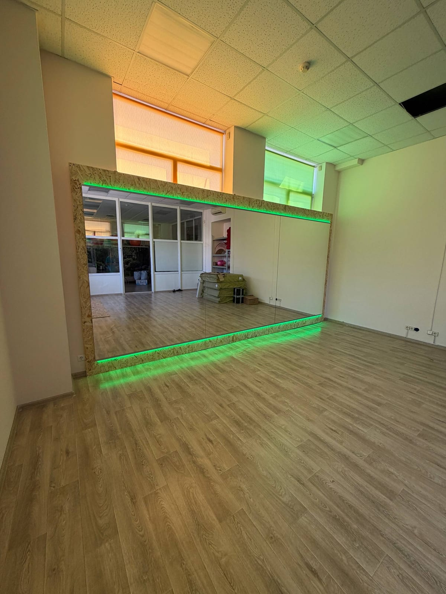

В танцевальной студии зеркало — не декор, а рабочий инструмент: танцоры контролируют осанку, линии и синхронность. Поэтому к зеркалам в зале для танцев особые требования. Рассказываем, какую высоту и толщину выбрать и как безопасно смонтировать зеркальную стену.

## Оптимальная высота

Чтобы танцор видел себя полностью — от стоп до головы — зеркало должно быть достаточно высоким:

- **низ** — от пола или с небольшим отступом 10–15 см;
- **верх** — не менее 2 м, лучше выше, чтобы в отражение вмещались поднятые руки.

Зеркальную стену обычно делают сплошной на всю ширину зала, чтобы не было «разрывов» в отражении.

## Толщина и качество стекла

Для студий важно, чтобы зеркало давало **ровное отражение без волн и искажений** — иначе линии тела искажаются. Поэтому используем качественное стекло достаточной толщины, которое не «играет» на больших полотнах. Конкретную толщину подбираем под размер.

## Безопасность танцоров

Это самое важное. Большие зеркала в зале для танцев монтируются **на защитную плёнку**: при падении или ударе стекло останется на плёнке и не рассыплется. Крепление подбираем надёжное, с учётом интенсивного движения в зале.

Посмотреть направление можно в категории [зеркала для спортзалов и студий](/ru/katalog/dzerkala-dlya-sportzaliv/).

## Советы для студий

- оставляйте зеркальную стену сплошной — так удобнее работать группам;
- позаботьтесь о равномерном освещении, чтобы не было бликов;
- если есть станки или оборудование — учтите отступы при раскладке полотен.

Чтобы рассчитать зеркальную стену под вашу студию — [оставьте заявку](#zayavka), при необходимости выедем на замеры.

## Частые вопросы

**Искажает ли большое зеркало отражение?**
Качественное стекло достаточной толщины даёт ровное отражение без волн — именно такое мы и используем для студий.

**На какую высоту можно сделать зеркала?**
От пола до потолка — сплошным полотном или секциями, под размеры вашего зала.

**Безопасны ли зеркала для активных занятий?**
Да, при условии монтажа на защитную плёнку и надёжного крепления.
