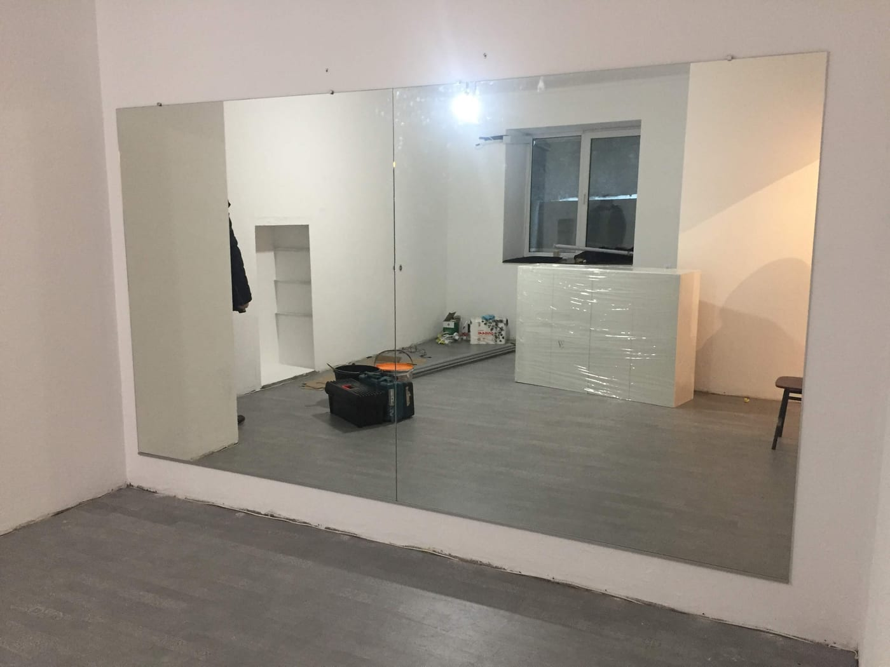

В йога-студии зеркало — это инструмент осознанной практики: оно помогает контролировать позу, выравнивание тела и симметрию в асанах. Но пространство для йоги требует спокойствия и безопасности, поэтому и к зеркалам здесь особые требования. Рассказываем, какую зеркальную стену выбрать для йоги.

## Зачем зеркала в йога-студии

- **Контроль позы.** Практикующий видит выравнивание тела и корректирует асану.
- **Визуальный простор.** Зеркальная стена делает зал светлее и просторнее.
- **Спокойствие.** Ровное отражение без волн не отвлекает во время практики.

## Какую высоту выбрать

Для йоги зеркало делают **от пола** (или с отступом 10–15 см) высотой не менее 2 м — чтобы было видно тело и в положении стоя, и в перевёрнутых асанах. Стену обычно собирают сплошной, без «разрывов» в отражении.

## Стекло без искажений

Важно, чтобы зеркало давало **ровное отражение без волн** — иначе линии тела искажаются. Используем качественное стекло достаточной толщины (обычно 4–6 мм), которое не «играет» на больших полотнах.

## Безопасность

Большое зеркало в студии монтируется **на защитную плёнку** с тыльной стороны: при ударе или падении стекло останется на плёнке и не рассыплется. Это базовое требование безопасности для залов, где занимаются люди. Подробнее — [безопасный монтаж больших зеркал](/ru/statti/bezpechnyy-montazh-velykykh-dzerkal/).

## Освещение

Для йоги лучше мягкий ровный свет без прямых бликов в зеркало. При необходимости добавляем LED-подсветку.

## Сколько стоит и как заказать

Цена зависит от площади зеркальной стены, толщины стекла и монтажа. Мы — производитель в Киеве: делаем замеры, изготавливаем **по размерам вашей студии** и монтируем. Смотрите также [зеркала для спортзала](/ru/statti/dzerkala-dlya-sportzalu-rozmiry-montazh/), [танцевальной студии](/ru/statti/dzerkala-dlya-tantsyuvalnoyi-studiyi/) и [стретчинга](/ru/statti/dzerkala-dlya-streychyngu/). Категория — [зеркала для спортзалов и студий](/ru/katalog/dzerkala-dlya-sportzaliv/). Чтобы рассчитать — [оставьте заявку](#zayavka).

## Частые вопросы

**Какой высоты зеркала для йоги?**
Обычно от пола до 2 м и выше — чтобы было видно тело и в перевёрнутых асанах.

**Безопасны ли большие зеркала в студии?**
Да, при условии монтажа на защитную плёнку и надёжного крепления.

**Вы делаете замеры и монтаж?**
Да, в Киеве и области; полотна отправляем по всей Украине.
