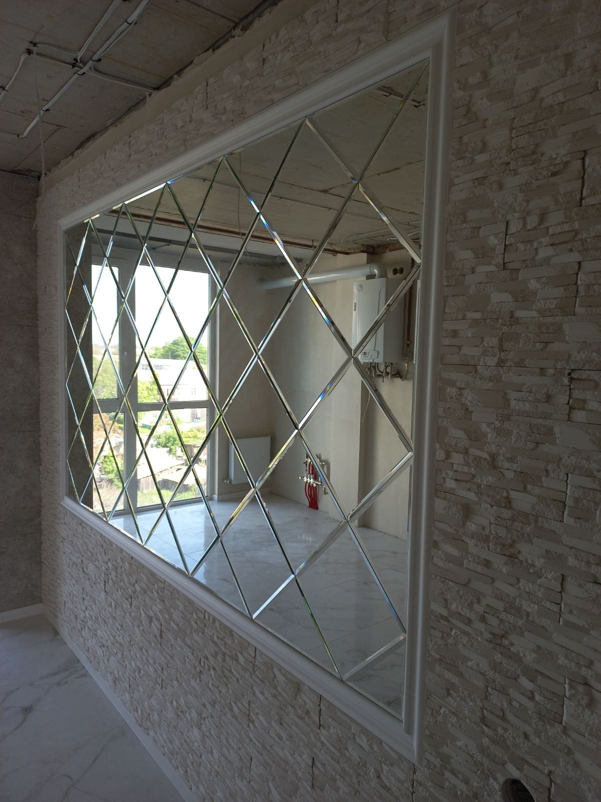

Зеркальная плитка — это стильный способ отделать стену, потолок или колонну: она визуально расширяет помещение, добавляет света и создаёт эффект роскоши. Рассказываем о видах, формах и монтаже зеркальной плитки и где её лучше применить.

## Где используют зеркальную плитку

- **На стене в гостиной или спальне** — акцентная зеркальная стена;
- **в ванной** — влагостойкая отделка, делающая санузел просторнее;
- **на потолке** — визуально «поднимает» помещение;
- **в прихожей и коридоре** — добавляет света в узком пространстве;
- **на колоннах и нишах** — маскирует и украшает конструкции.

## Формы и виды плитки

- **квадрат и прямоугольник** — классика для ровной укладки;
- **ромб** — самая популярная форма, создаёт эффектный диагональный узор;
- **шестигранник (соты)** — современный геометрический акцент;
- **плитка с фацетом** — шлифованная грань по краю даёт игру света, как у хрусталя. Подробнее — [зеркало с фацетом](/ru/katalog/dzerkala-z-fatsetom/).

Можно комбинировать обычное зеркало с **тонированным** (графит, бронза) для более глубокого узора.

## Как крепится зеркальная плитка

В зависимости от поверхности и размера — на **специальный клей** или механически. Мы готовим поверхность, делаем точную раскладку и монтируем без видимых креплений, аккуратно и надёжно. Для больших участков и потолков обязательно учитываем безопасность крепления.

## Сколько стоит и как заказать

Цена зависит от площади, формы, типа зеркала (обычное или тонированное) и наличия фацета. Мы — производитель, поэтому режем и обрабатываем плитку **по вашим размерам**, делаем замеры и монтаж в Киеве и области. Смотрите также [зеркальные панно](/ru/katalog/dzerkalni-panno/) и [зеркала в интерьере](/ru/katalog/dzerkala-v-interyeri/). Чтобы рассчитать стоимость — [оставьте заявку](#zayavka).

## Частые вопросы

**Можно ли зеркальную плитку в ванную?**
Да, зеркало влагостойкое и отлично подходит для ванной; при необходимости комбинируем с тонированным стеклом.

**Какая форма плитки самая популярная?**
Ромб с фацетом — он создаёт эффектный диагональный узор и игру света.

**Вы делаете раскладку и монтаж?**
Да, разрабатываем раскладку под ваше пространство и монтируем «под ключ».
