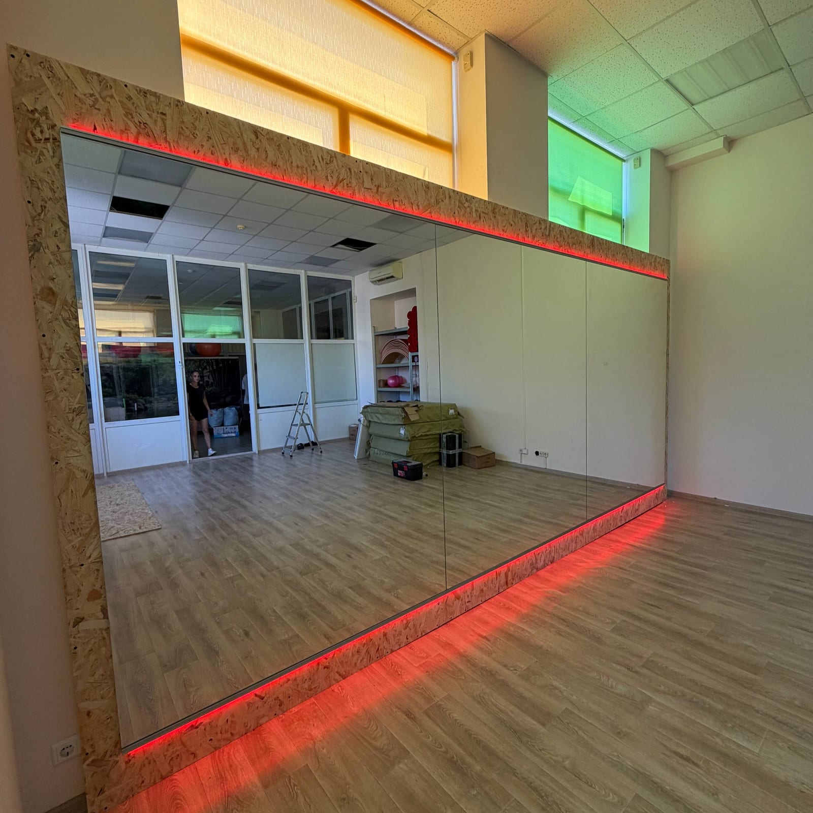

Зеркальная стена — одна из ключевых деталей при обустройстве фитнес-клуба, тренажёрного зала или студии. Она не только функциональна, но и формирует впечатление от пространства. Естественно, что владельцев интересует цена. Объясняем, из чего она складывается и как получить точный просчёт под ваш зал.

## Из чего складывается цена

Стоимость зеркальной стены формируется из нескольких частей:

- **Площадь** — считается по квадратным метрам зеркального полотна.
- **Толщина и качество стекла** — для залов нужно более прочное стекло.
- **Обработка краёв** — шлифовка кромки полотен.
- **Защитная плёнка** — обязательна для безопасности, добавляется к стоимости.
- **Монтаж** — подготовка стены, крепление, сложность работ.
- **Доставка** крупногабаритных полотен.

## Почему цену считают индивидуально

Нет универсального прайса «за стену», ведь залы разные: разная площадь, высота, состояние стен и способ монтажа. Поэтому мы считаем стоимость **под конкретный объект** — это честнее и точнее, чем усреднённая цифра. Для крупных заказов возможны более выгодные условия за квадратный метр.

Посмотреть направление можно в категории [зеркала для спортзалов](/ru/katalog/dzerkala-dlya-sportzaliv/), а о монтаже и безопасности — в статье [зеркала для спортзала: размеры, монтаж и безопасность](/ru/statti/dzerkala-dlya-sportzalu-rozmiry-montazh/).

## Что входит в работу «под ключ»

- выезд на замеры и просчёт;
- изготовление полотен по размерам зала;
- наклеивание защитной плёнки;
- доставка и профессиональный монтаж;
- аккуратная уборка после установки.

## Как получить просчёт

Быстрее всего — [оставить заявку](#zayavka) или позвонить. Мы согласуем выезд на замеры (Киев и область) и подготовим стоимость под ваш зал — без скрытых доплат.

## Частые вопросы

**Можно ли заказать только изготовление, без монтажа?**
Да, возможны разные варианты — от «только полотна» до полного цикла «под ключ».

**Делаете ли вы скидки на крупные объекты?**
Для масштабных заказов обсуждаем индивидуальные условия — обращайтесь, рассчитаем.

**Сколько времени занимает обустройство зеркальной стены?**
Зависит от площади; ориентировочный срок называем после замеров.
