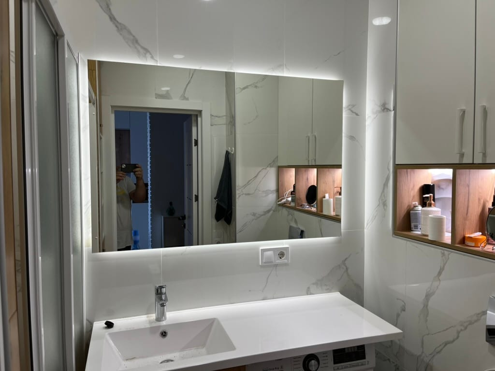

**Амбилайт** (ambilight) — это фоновая, или контурная, LED-подсветка, которую размещают **за зеркалом по периметру**. Свет мягко ложится на стену вокруг зеркала и создаёт эффект **«парящего» зеркала**, которое будто висит в воздухе над стеной. Мы изготавливаем зеркала с подсветкой Амбилайт на заказ в Киеве по вашим размерам и форме.

## Что такое подсветка Амбилайт

LED-ленту монтируют не на лицевой части, а **за зеркалом**, направляя свет на стену. В результате:

- зеркало выглядит так, будто **парит** над стеной (нет видимого крепления в темноте);
- свет **мягкий и непрямой** — не слепит, создаёт уютную атмосферу;
- подчёркивается форма зеркала — особенно красиво на круглых и фигурных моделях.

## Фоновая vs фронтальная подсветка

| Тип | Куда светит | Для чего |
|---|---|---|
| **Фоновая (Амбилайт)** | по периметру на стену | атмосфера, эффект парения, декор |
| **Фронтальная** | вперёд, на лицо | макияж, бритьё, рабочий свет |

Для ванной и зоны макияжа часто сочетают **оба типа**: фронтальный для ухода + фоновый для атмосферы. Как выбрать подсветку — в статье [зеркало с LED-подсветкой: как выбрать](/ru/statti/dzerkalo-z-led-pidsvitkoyu-yak-vybraty/).

## Где уместно «парящее» зеркало

- **Ванная комната** — мягкий ночной свет, современный вид.
- **Спальня, гостиная, прихожая** — декоративный акцент.
- **Салон красоты, HoReCa** — эффектный элемент интерьера.

## Опции и размеры

Делаем Амбилайт любого размера и формы (прямоугольное, круглое, овальное, фигурное), с влагостойким стеклом для ванной. Доступны: тёплый / нейтральный / холодный свет, **регулировка яркости (диммер)**, сенсорное включение. Полный набор опций — на странице [LED-зеркала на заказ](/ru/led-zerkala-na-zakaz/).

## Как заказать

1. Пришлите размер и форму (или вызовите мастера на замеры).
2. Выбираете тип света и опции — считаем цену, просчёт бесплатный.
3. Изготавливаем и монтируем собственной бригадой в Киеве и области; доставка по Украине.

## Частые вопросы

**Что такое зеркало Амбилайт?**
Это зеркало с фоновой LED-подсветкой по периметру, направленной на стену. Она создаёт мягкий непрямой свет и эффект «парящего» зеркала.

**Чем фоновая подсветка отличается от фронтальной?**
Фоновая светит на стену вокруг зеркала (атмосфера, декор), фронтальная — вперёд на лицо (для макияжа и бритья). Их можно сочетать.

**Подходит ли Амбилайт для ванной?**
Да, делаем с влагостойким стеклом и безопасным монтажом; по желанию добавляем антизапотевание.

**Сколько стоит зеркало с фоновой подсветкой?**
Цена зависит от размера, формы и опций. Считаем под ваш размер — [оставьте заявку](#zayavka).

Хотите «парящее» зеркало под свой интерьер? [Оставьте заявку](#zayavka) или позвоните — рассчитаем и изготовим по вашим размерам.
