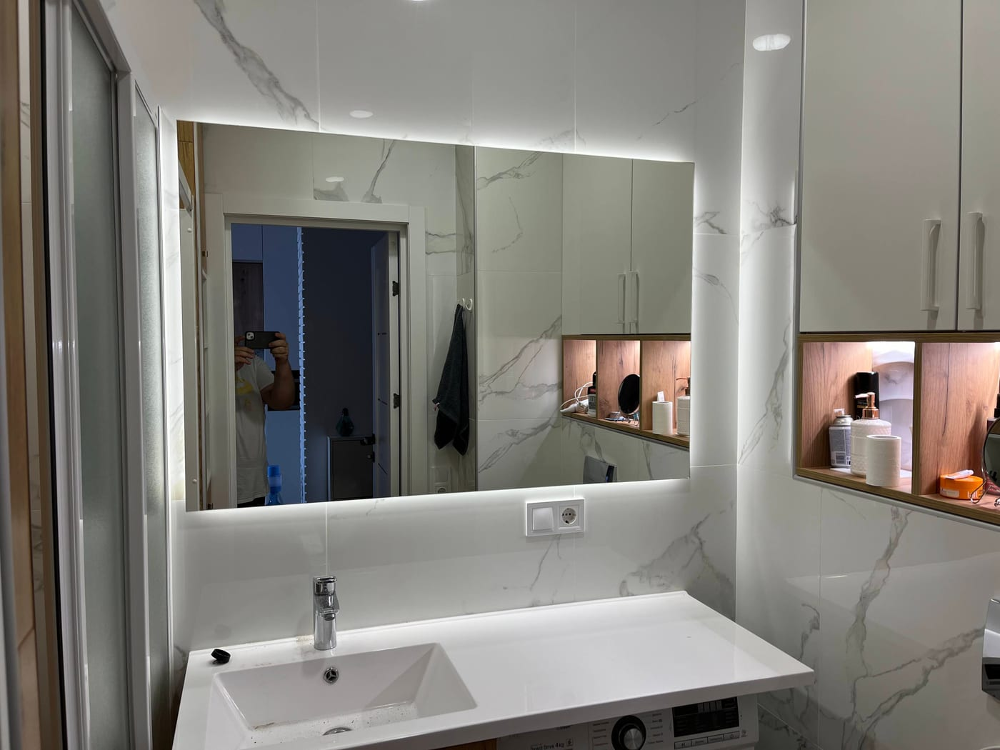

Зеркало — главный функциональный элемент ванной комнаты: возле него мы начинаем и завершаем день. Поэтому оно должно быть влагостойким, удобного размера и с правильным светом. Рассказываем, какое зеркало выбрать в ванную комнату и как заказать его по вашим размерам у производителя в Киеве.

## Какое зеркало выбрать в ванную

- **[С LED-подсветкой](/ru/katalog/dzerkala-z-led-pidsvitkoyu/)** — ровный свет без теней, удобно для макияжа и бритья; современный вид.
- **[С антизапотеванием](/ru/statti/dzerkalo-z-antyzapotivannyam-dlya-vannoyi/)** — подогрев не даёт зеркалу потеть после душа.
- **[С фацетом](/ru/katalog/dzerkala-z-fatsetom/)** — шлифованная грань добавляет «дорогой» вид.
- **[Круглое или фигурное](/ru/statti/krugle-dzerkalo-na-zamovlennya/)** — трендовые формы, смягчающие интерьер.

## Размер и размещение

- **Ширина** — часто делают зеркало по ширине раковины или тумбы (или чуть шире).
- **Высота** — чтобы было удобно и взрослым, и детям; для маленьких ванных большое зеркало визуально расширяет пространство и добавляет света.
- **Размещение** — над раковиной; при необходимости — зеркальная стена или ниша.

Мы — производитель, поэтому режем зеркало **точно по вашим размерам**, в том числе под нестандартные ниши.

## Влага и безопасность

Для ванной используем **влагостойкое зеркало** с качественным серебряным покрытием и аккуратно обработанным краем. Это важно, ведь в ванной постоянная влага и перепады температуры. При необходимости добавляем подогрев (антизапотевание) и безопасное крепление.

## Почему выгодно заказывать у производителя

- **Точный размер и форма** — без компромиссов со стандартными зеркалами из магазина.
- **Цена без посредников.**
- **Дополнительные опции** — подсветка, подогрев, фацет, форма.
- **Замеры и монтаж «под ключ»** — в Киеве и области, доставка по Украине.

## Сколько стоит и как заказать

Цена зависит от размера, формы, наличия подсветки, подогрева и обработки края. Чтобы узнать стоимость зеркала в ванную — [оставьте заявку](#zayavka), и мы рассчитаем под ваше пространство. Смотрите также [зеркальную плитку в ванную](/ru/statti/dzerkalna-plitka-u-vannu-ta-na-stinu/) и категорию [зеркала для ванной](/ru/katalog/dzerkala-dlya-vannoyi/).

## Частые вопросы

**Какое зеркало лучше в ванную — с подсветкой или без?**
С LED-подсветкой удобнее: ровный свет без теней. Для влажных ванных добавляют ещё и подогрев против запотевания.

**Можно ли зеркало нестандартной формы в ванную?**
Да, делаем круглые, овальные и фигурные зеркала любых размеров на заказ.

**Вы делаете замеры и монтаж?**
Да, в Киеве и области; готовые зеркала отправляем Новой Почтой по всей Украине.
