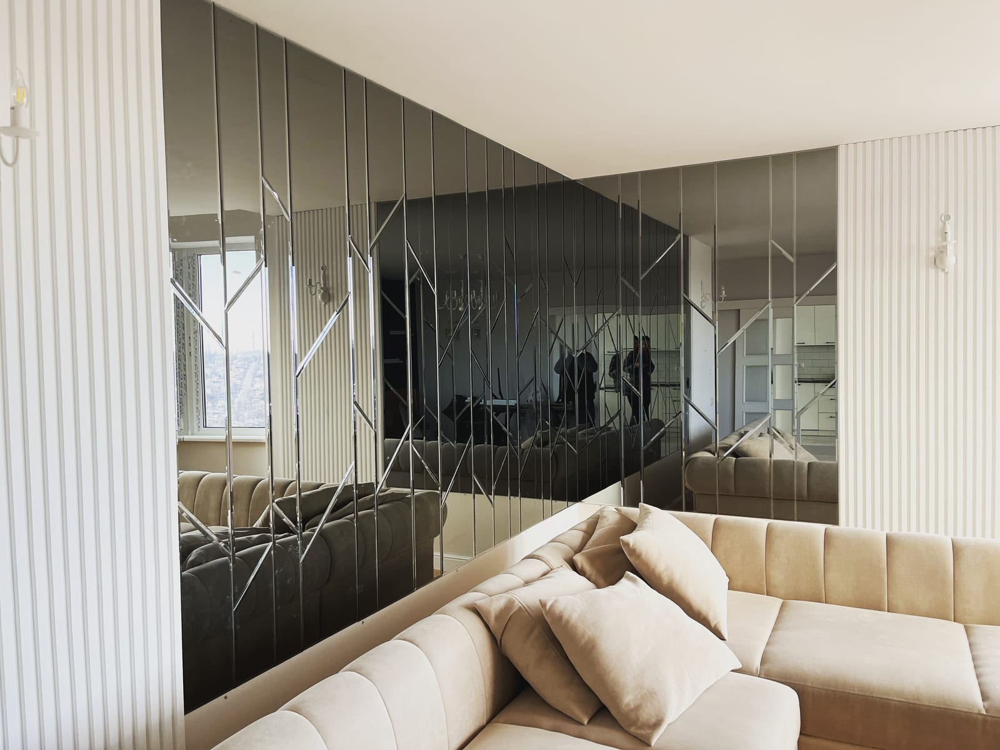

Гостиная — главная комната для гостей и отдыха, поэтому и зеркало здесь играет особую роль: оно и визуально увеличивает пространство, и становится стильным акцентом интерьера. Рассказываем, какое зеркало выбрать в гостиную, какого размера и где его лучше разместить.

## Зачем зеркало в гостиной

- **Расширяет пространство.** Большое зеркало визуально удваивает комнату и добавляет глубины.
- **Добавляет света.** Отражает дневное и вечернее освещение, делает гостиную светлее.
- **Работает как декор.** Красивое зеркало с фацетом или панно становится центром композиции на стене.
- **Подчёркивает стиль.** От классики до минимализма — форма и обрамление подбираются под ваш интерьер.

## Какие зеркала подходят для гостиной

- **Большое настенное зеркало** — над диваном, комодом или камином; главный акцент.
- **Зеркало с фацетом** — шлифованная грань добавляет «дорогого» вида и игры света. Подробнее — [зеркало с фацетом](/ru/katalog/dzerkala-z-fatsetom/).
- **Зеркальное панно** — композиция из элементов, создающая эффект роскошной стены. Смотрите [зеркальные панно](/ru/katalog/dzerkalni-panno/).
- **Зеркало с LED-подсветкой** — современный акцент с мягким светом.

## Какой размер и форму выбрать

- над диваном зеркало обычно делают шириной ⅔ от ширины дивана;
- для эффекта простора выбирайте большое полотно от пола или на всю свободную стену;
- круглое или овальное зеркало смягчает строгие линии современного интерьера;
- прямоугольное вертикальное «поднимает» потолок, горизонтальное — «расширяет» стену.

Точные размеры и форму подбираем под ваше пространство. Готовые решения — в категории [зеркала в интерьере](/ru/katalog/dzerkala-v-interyeri/).

## Как заказать зеркало в гостиную

Мы — производитель, поэтому изготавливаем зеркало в гостиную **на заказ по вашим размерам**: выбираете форму, обработку края (фацет), при необходимости — подсветку. Выполняем замеры и монтаж в Киеве и области, отправляем Новой Почтой по всей Украине. Чтобы узнать цену — [оставьте заявку](#zayavka).

## Частые вопросы

**Какое зеркало выбрать для маленькой гостиной?**
Большое настенное зеркало — оно лучше всего визуально расширяет небольшую комнату и добавляет света.

**Можно ли зеркало в гостиную с фацетом или панно?**
Да, это самые популярные варианты для гостиной — они выглядят дорого и эффектно.

**Вы делаете доставку в другие города?**
Да, готовые зеркала отправляем Новой Почтой по всей Украине; замеры и монтаж — в Киеве и области.

**Где посмотреть каталог зеркал в гостиную и как купить?**
Готовые варианты и примеры работ — в категории [зеркала в интерьере](/ru/katalog/dzerkala-v-interyeri/). Купить зеркало в гостиную по вашим размерам можно, [оставив заявку](#zayavka): рассчитаем цену от производителя и привезём Новой Почтой.

**Читайте также:** [зеркало в прихожую и коридор](/ru/statti/dzerkalo-u-peredpokiy/) и [зеркало в спальню](/ru/statti/dzerkalo-u-spalnyu/) — решения для других комнат квартиры.
