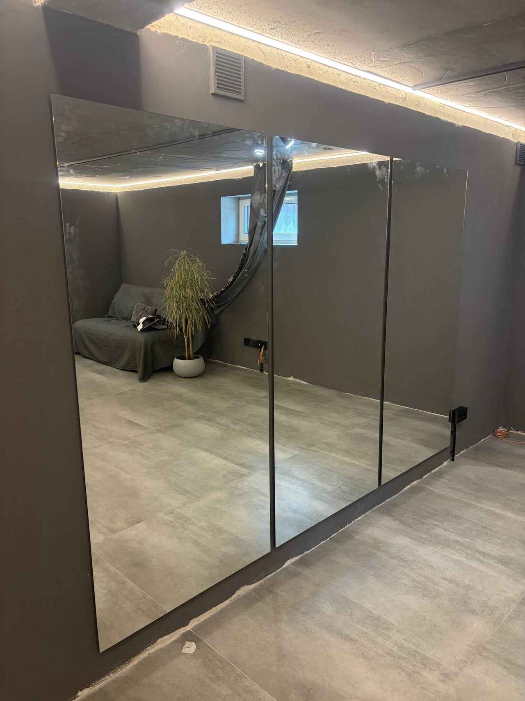

Зеркало в квартире — это и практичная вещь, и элемент декора: оно добавляет света, визуально расширяет пространство и завершает интерьер. Мы — производитель, поэтому изготавливаем **зеркало в квартиру на заказ** по вашим размерам и форме. Рассказываем, какое зеркало подойдёт для каждой комнаты и как его правильно подобрать.

## Зеркало для каждой комнаты

- **[Прихожая и коридор](/ru/statti/dzerkalo-u-peredpokiy/)** — здесь зеркало нужнее всего: собраться перед выходом, визуально расширить узкое пространство. Часто — [в полный рост](/ru/statti/dzerkalo-v-povnyy-zrist-na-zamovlennya/).
- **[Спальня](/ru/statti/dzerkalo-u-spalnyu/)** — большое зеркало или зеркало на дверцах шкафа; красиво смотрится [с мягкой LED-подсветкой](/ru/statti/dzerkalo-z-led-pidsvitkoyu-yak-vybraty/).
- **[Гостиная](/ru/statti/dzerkalo-u-vitalnyu/)** — акцентное зеркало или [декоративное панно](/ru/statti/dzerkalne-panno-v-ukrayini---stilniy-ta-funktsionalniy-element/) над диваном или консолью.
- **Ванная комната** — [влагостойкое зеркало с подсветкой и антизапотеванием](/ru/statti/dzerkalo-u-vannu-kimnatu-kiyiv/).
- **Детская** — небольшое безопасное зеркало с обработанным краем.

## Какие бывают формы

- **прямоугольные** — универсальны, подходят для любой комнаты;
- **[круглые и овальные](/ru/statti/krugle-dzerkalo-na-zamovlennya/)** — мягкий силуэт для спальни, прихожей, ванной;
- **[в полный рост](/ru/statti/dzerkalo-v-povnyy-zrist-na-zamovlennya/)** — чтобы видеть себя полностью;
- **фигурные и [декоративные](/ru/statti/zerkala-dekorativnye/)** — акцент в интерьере;
- **[с фацетом](/ru/statti/dzerkalo-z-fatsetom-shcho-tse/)** — с элегантной шлифованной гранью.

## Как подобрать размер

Размер зависит от места и задачи:

- в **полный рост** — от 500×1500 мм и выше, чтобы было видно всю фигуру;
- над **комодом или умывальником** — ширина примерно как у мебели под ним;
- **акцентное** зеркало в гостиную — крупное, чтобы работало как декор.

Мы режем зеркало **точно по вашим размерам** — посмотреть ходовые форматы и цены можно в статье [зеркало по размеру](/ru/statti/dzerkalo-za-rozmirom-na-zamovlennya-kiyiv/). Готовые варианты — в категории [зеркала в интерьере](/ru/katalog/dzerkala-v-interyeri/), или закажите [зеркало на стену](/ru/tovar/dzerkalo-na-stinu/) (от 990 грн).

## Куда повесить: простые правила

- зеркало напротив окна — умножает дневной свет по комнате;
- центр зеркала — на уровне глаз (обычно 150–160 см от пола);
- в узком коридоре вертикальное зеркало «вытягивает» пространство;
- избегайте прямых бликов светильников в зеркало.

## Почему на заказ у производителя

- точный размер под вашу стену или мебель без переплат;
- любая форма, фацет, LED-подсветка, антизапотевание;
- влагостойкое покрытие для ванной;
- замеры и монтаж в Киеве, доставка Новой Почтой по Украине.

Чтобы подобрать зеркало в квартиру под ваш интерьер — [оставьте заявку](#zayavka), рассчитаем бесплатно.

## Частые вопросы

**Какое зеркало выбрать в прихожую?**
Чаще всего — вертикальное или в полный рост; оно и функциональное, и визуально расширяет узкое пространство.

**Можно ли заказать зеркало нестандартной формы?**
Да — круглое, овальное, фигурное, с вырезами под розетки или мебель, по вашему шаблону.

**Сколько стоит зеркало в квартиру?**
Цена зависит от размера, формы и опций (фацет, подсветка). Мы — производитель, поэтому считаем под ваш размер — [оставьте заявку](#zayavka).
