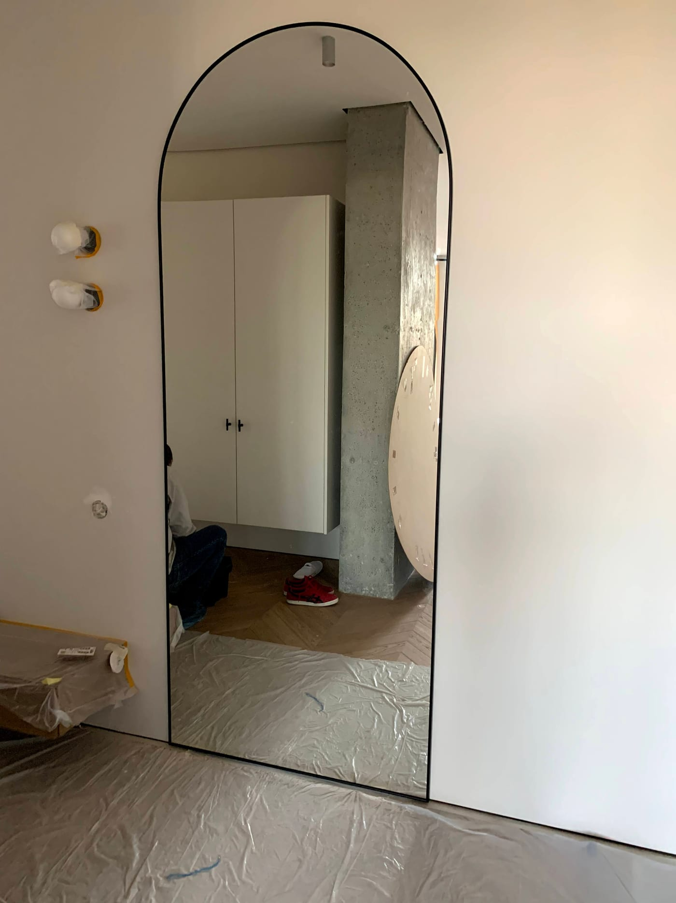

Зеркало в полный рост — практически обязательный элемент спальни, гардеробной или прихожей: без него трудно оценить образ перед выходом. Рассказываем, какой размер выбрать, как его закрепить и на что обратить внимание при заказе по вашим параметрам.

## Какой размер выбрать

Чтобы видеть себя полностью, ориентируйтесь на такие параметры:

- **Высота** — от 140 см и выше; оптимально 160–180 см, чтобы отражение вмещало человека с запасом.
- **Ширина** — от 40 см для узкого зеркала, 50–70 см — комфортно, чтобы видеть себя «в кадре».

Точные размеры подбираем под ваше место — узкое пространство между шкафами, дверь гардеробной или свободный участок стены.

## Варианты размещения

- **На стену** — классический вариант, крепится надёжно и занимает минимум места.
- **В нишу или между мебелью** — зеркало изготавливается точно по размеру проёма.
- **В раме** — как самостоятельный декоративный предмет.
- **На дверь шкафа или гардеробной** — экономит пространство.

## Безопасность большого зеркала

Большое зеркало тяжёлое, поэтому надёжное крепление критически важно. Мы:

- подбираем крепление под тип стены (бетон, гипсокартон, плитка);
- при необходимости клеим зеркало на защитную плёнку, чтобы при ударе стекло не разлеталось;
- выполняем монтаж самостоятельно — аккуратно и безопасно.

## Сколько стоит и где посмотреть

Цена зависит от размера, обработки края и способа монтажа. Варианты для комнат смотрите в категории [зеркала в интерьере](/ru/katalog/dzerkala-v-interyeri/), а чтобы рассчитать стоимость под ваше пространство — [оставьте заявку](#zayavka).

## Частые вопросы

**Можно ли зеркало в полный рост с подсветкой?**
Да, добавляем LED-подсветку по периметру или сбоку — удобно для гардеробной.

**Какая толщина стекла нужна для большого зеркала?**
Для настенных зеркал в полный рост обычно используют стекло большей толщины для жёсткости — подскажем оптимальный вариант.

**Безопасно ли вешать такое зеркало в детской?**
Да, при условии надёжного крепления и монтажа на защитную плёнку.
