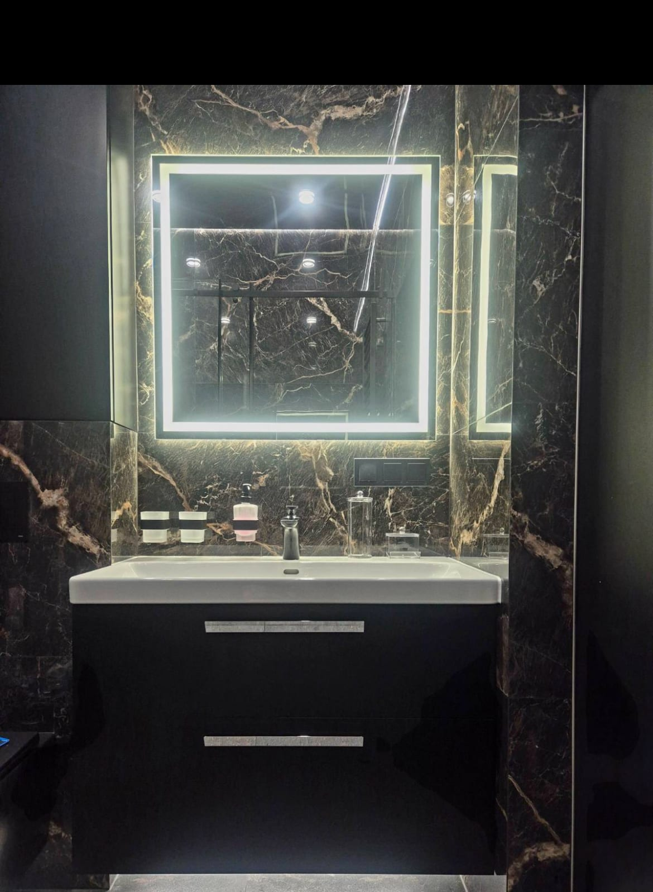

Запотевшее зеркало после горячего душа — привычное мелкое неудобство в ванной. Приходится вытирать поверхность полотенцем или ждать, пока влага сойдёт сама. Современное решение этой проблемы — зеркало с антизапотеванием (подогревом). Рассказываем, как оно работает, безопасно ли и когда его стоит заказывать.

## Как работает антизапотевание

За зеркалом (с тыльной стороны) крепится тонкая **нагревательная плёнка или мат**. Когда вы заходите в ванную, плёнка слегка подогревает поверхность зеркала — примерно до температуры тела. Из-за этого конденсат на тёплом стекле не образуется, и зеркало остаётся прозрачным даже в пару.

Подогрев можно:

- включать отдельной кнопкой или синхронно со светом;
- оставлять включённым на всё время приёма душа;
- комбинировать с LED-подсветкой в одном зеркале.

## Безопасно ли это в ванной

Да. Нагревательные плёнки для зеркал рассчитаны именно на влажные помещения:

- работают на безопасной низкой мощности, лишь слегка нагревая стекло;
- имеют герметичную, полностью изолированную проводку;
- не контактируют с водой — плёнка скрыта за зеркалом и защищена.

Монтаж и подключение выполняет мастер, поэтому всё соответствует требованиям безопасности.

## Кому стоит заказать зеркало с подогревом

- семьям, где ванной пользуются несколько человек подряд;
- если вы бреетесь или делаете макияж сразу после душа;
- в санузлах со слабой вентиляцией, где влага долго не сходит;
- всем, кто ценит комфорт и не любит каждый день вытирать зеркало.

Антизапотевание — это опция, которую мы добавляем к зеркалу **любого размера и формы**, в том числе вместе с подсветкой. Подробнее о вариантах — в категории [зеркала для ванной комнаты](/ru/katalog/dzerkala-dlya-vannoyi/).

## Сколько стоит

Подогрев добавляется как опция к основной стоимости зеркала и зависит от площади поверхности. Точную сумму считаем под конкретный размер — [оставьте заявку](#zayavka), и мы бесплатно проконсультируем и рассчитаем.

## Частые вопросы

**Много ли электроэнергии потребляет подогрев?**
Нет. Нагревательная плёнка работает на низкой мощности и включается только при необходимости.

**Можно ли совместить подогрев и LED-подсветку?**
Да, это самая популярная комбинация для ванной — свет без теней плюс чистое зеркало в пару.

**Долговечна ли нагревательная плёнка?**
Да, качественная плёнка рассчитана на длительную работу; мы используем надёжные материалы и предоставляем гарантию.
