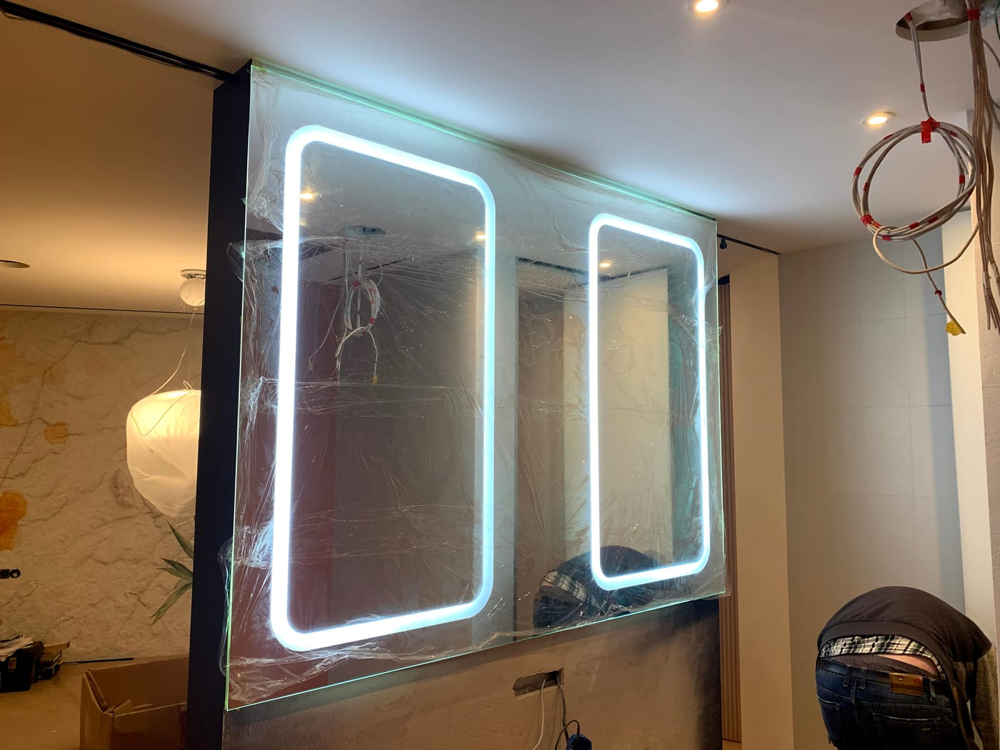

Зеркало с LED-подсветкой — это не только источник равномерного света для макияжа или бритья, но и современный акцент в интерьере. Но моделей на рынке много, и легко растеряться: фронтальная или контурная подсветка, тёплый или холодный свет, нужно ли антизапотевание. В этом гиде разложим всё по полочкам, чтобы вы выбрали зеркало, удобное именно для вас.

## Чем удобно зеркало с LED-подсветкой

Главное преимущество — **равномерный свет без теней на лице**. В отличие от верхнего светильника, который светит сверху и оставляет тени, подсветка по периметру зеркала освещает лицо мягко и со всех сторон. Это удобно для макияжа, бритья, ухода за кожей.

Другие плюсы:

- придаёт помещению современный вид и ощущение простора;
- экономит электроэнергию (LED потребляет мало);
- служит дополнительным ночным освещением в ванной или спальне;
- долговечно — качественные LED-модули работают десятки тысяч часов.

## Виды подсветки: фронтальная, контурная, боковая

Это первое, что стоит определить, ведь от типа зависит характер света.

- **Фронтальная** — свет выходит «на вас» из матовой полосы на поверхности зеркала. Лучше всего освещает лицо, идеальна для макияжа.
- **Контурная (по периметру)** — свет идёт из-под краёв зеркала на стену, создавая эффект «парения». Более декоративная, мягкая атмосфера.
- **Боковая** — световые полосы слева и справа. Хороший компромисс: и лицо освещено, и выглядит стильно.

Можно комбинировать — например, фронтальную для функциональности и контурную для атмосферы.

## Какой свет выбрать: тёплый, нейтральный или холодный

Температуру света измеряют в Кельвинах (К):

- **Тёплый (2700–3000 К)** — уютный, желтоватый. Подходит для спальни, гостиной.
- **Нейтральный (4000 К)** — максимально естественный, не искажает цвета. Универсальный выбор для ванной.
- **Холодный (5000–6500 К)** — белый, «дневной». Подчёркивает детали, но может быть резковатым.

Самый удобный вариант — зеркало с **регулировкой температуры**: одним касанием переключаете свет от тёплого к холодному в зависимости от задачи.

## Дополнительные функции, которые стоит рассмотреть

- **Антизапотевание (подогрев)** — зеркало не потеет даже после горячего душа. Почти обязательная опция для ванной.
- **Диммер (регулировка яркости)** — свет от приглушённого ночного до яркого дневного.
- **Сенсорное или бесконтактное включение** — касание или взмах рукой, без выключателя на стене.
- **Часы, температура, Bluetooth-колонка** — для тех, кто любит технологичность.

Каждую из функций мы добавляем по желанию к зеркалу любого размера.

## Куда подходит зеркало с подсветкой

- **Ванная комната** — самое популярное место; здесь важны влагозащита и антизапотевание. Подробнее — в категории [зеркала для ванной комнаты](/ru/katalog/dzerkala-dlya-vannoyi/).
- **Спальня, зона макияжа** — фронтальная подсветка с тёплым/нейтральным светом.
- **Прихожая** — подсветка делает узкое пространство светлее и визуально шире.

## Как заказать зеркало с LED-подсветкой в Киеве

Готовые зеркала редко подходят идеально по размеру. Поэтому мы изготавливаем их **на заказ по вашим размерам** — вы выбираете форму, тип подсветки, температуру света и дополнительные функции. Мастер выполняет бесплатный замер в Киеве и области, а монтаж делаем «под ключ».

Посмотреть варианты можно в разделе [зеркала с LED-подсветкой](/ru/katalog/dzerkala-z-led-pidsvitkoyu/), а чтобы узнать цену под ваш проект — [оставьте заявку](#zayavka), и мы бесплатно всё рассчитаем.

## Частые вопросы

**Безопасна ли LED-подсветка в ванной?**
Да. Мы используем влагозащищённые модули и герметичную изолированную проводку, рассчитанные именно для влажных помещений.

**Сколько служит LED-подсветка?**
Качественные светодиоды рассчитаны на десятки тысяч часов работы. Мы используем надёжные модули и предоставляем гарантию.

**Можно ли сделать зеркало нестандартной формы с подсветкой?**
Да — прямоугольное, круглое, овальное или с индивидуальными вырезами. Подсветку интегрируем под любую форму.
