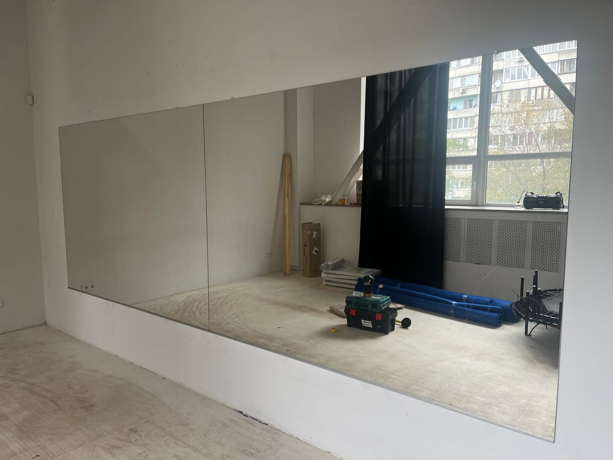

Стандартные зеркала из магазина редко подходят идеально: то великовато для ниши, то маловато для стены, то не та форма. Когда нужен точный размер, выручает **зеркало на заказ**. Мы — производитель, поэтому изготавливаем зеркала на заказ в Киеве по вашим размерам без переплат. Объясняем, как это работает, от чего зависит цена и за сколько дней зеркало будет готово.

## Как заказывают зеркало по размеру

Процесс простой и состоит из нескольких шагов:

1. **Заявка или звонок** — вы рассказываете, какое зеркало нужно и куда.
2. **Замер** — мастер выезжает и снимает точные размеры (в пределах Киева это бесплатно). Если размеры уже известны — принимаем заказ без выезда.
3. **Изготовление** — режем и обрабатываем стекло по вашим параметрам.
4. **Монтаж** — доставляем и надёжно устанавливаем «под ключ».

## От чего зависит цена

- **Размер и толщина стекла** — большая площадь и более толстое стекло стоят дороже.
- **Обработка края** — обычная шлифовка, еврокромка или фацет.
- **Форма** — прямоугольная проще, круглая/овальная или с вырезами — сложнее.
- **Дополнительные опции** — подсветка, антизапотевание, крепления, отверстия под розетки.
- **Монтаж** — тип поверхности и сложность установки.

Благодаря заказу по размеру вы **не переплачиваете за лишнее** и получаете именно то, что нужно. Посмотреть направления можно в категории [зеркала в интерьере](/ru/katalog/dzerkala-v-interyeri/).

## Цена за квадратный метр

Зеркало на заказ считают **за квадратными метрами** полотна: площадь × стоимость м² + обработка края и дополнительные опции. Поэтому выгодно заказывать точный размер — вы платите только за свою площадь, без переплат за «лишнее».

Примеры площади по размеру:

- зеркало **1×1 м** — это 1 м²;
- зеркало **1,2×2 м** — 2,4 м²;
- зеркало **2×2 метра** — 4 м².

На итоговую **цену за м²** влияют: толщина стекла (4/5/6 мм), обработка края (шлифовка или фацет), наличие подсветки и антизапотевания, форма и монтаж. Мы — производитель, поэтому цена за квадратный метр ниже, чем в магазинах-посредниках. Чтобы узнать точную цену за м² под ваш размер — [оставьте заявку](#zayavka), рассчитаем бесплатно.

## Прайс: цены зеркал по размерам

Ниже — фактически **каталог зеркал стандартных (средних) размеров**: изготовление зеркал типовых размеров от производителя, с чёткой ценой. Готовые стандартные размеры зеркал (стекло 4 мм, полированный край). Цена — за зеркало без плёнки и крепления; по желанию добавляем плёнку безопасности (+100 грн) и крепление (+85 грн). Нужен другой размер — [рассчитаем по вашим](#zayavka).

| Размер, мм | Цена |
| --- | ---: |
| [500×700](/ru/tovar/dzerkalo-500x700/) | **990 грн** |
| 500×800 | 1090 грн |
| 500×900 | 1190 грн |
| [500×1000](/ru/tovar/dzerkalo-500x1000/) | **1290 грн** |
| 500×1200 | 1490 грн |
| 500×1400 | 1690 грн |
| [500×1500](/ru/tovar/dzerkalo-500x1500/) | **1790 грн** |
| 500×1600 | 1890 грн |
| 500×1700 | 1990 грн |
| 500×1800 | 2090 грн |
| 500×2000 | 2290 грн |
| 600×700 | 1090 грн |
| [600×800](/ru/tovar/dzerkalo-600x800/) | **1190 грн** |
| [600×900](/ru/tovar/dzerkalo-600x900/) | **1290 грн** |
| 600×1000 | 1490 грн |
| 600×1200 | 1690 грн |
| 600×1400 | 1990 грн |
| [600×1600](/ru/tovar/dzerkalo-600x1600/) | **2190 грн** |
| 600×1700 | 2290 грн |
| 600×1800 | 2490 грн |
| 600×2000 | 2790 грн |
| 700×700 | 1190 грн |
| 700×800 | 1290 грн |
| 700×900 | 1390 грн |
| [700×1000](/ru/tovar/dzerkalo-700x1000/) | **1390 грн** |
| 700×1200 | 1790 грн |
| 700×1400 | 2190 грн |
| 700×1600 | 2490 грн |
| [700×1700](/ru/tovar/dzerkalo-700x1700/) | **2690 грн** |
| 700×1800 | 2890 грн |
| 700×2000 | 3190 грн |
| 800×800 | 1490 грн |
| 800×900 | 1590 грн |
| [800×1000](/ru/tovar/dzerkalo-800x1000/) | **1690 грн** |
| 800×1200 | 2190 грн |
| 800×1400 | 2590 грн |
| 800×1600 | 2990 грн |
| 800×1700 | 3190 грн |
| [800×1800](/ru/tovar/dzerkalo-800x1800/) | **3390 грн** |
| 800×2000 | 3690 грн |
| 900×900 | 1790 грн |
| 900×1000 | 1990 грн |
| [900×1200](/ru/tovar/dzerkalo-900x1200/) | **2190 грн** |
| 900×1400 | 2690 грн |
| 900×1600 | 3190 грн |
| 900×1700 | 3390 грн |
| 900×1800 | 3590 грн |
| 900×2000 | 3990 грн |
| [1000×1000](/ru/tovar/dzerkalo-1000x1000/) | **1990 грн** |
| 1000×1200 | 2390 грн |
| 1000×1400 | 2790 грн |
| 1000×1600 | 3190 грн |
| 1000×1700 | 3390 грн |
| 1000×1800 | 3590 грн |
| 1000×2000 | 3990 грн |
| 1100×1600 | 3490 грн |
| 1100×1800 | 3890 грн |
| 1100×2000 | 4290 грн |
| 1200×1200 | 2990 грн |
| 1200×1400 | 3390 грн |
| 1200×1600 | 3990 грн |
| 1200×1800 | 4290 грн |
| 1200×2000 | 4790 грн |

## Сколько дней изготавливается

Сроки зависят от сложности:

- простые зеркала по размеру — от 1–2 рабочих дней;
- зеркала с подсветкой или дополнительными опциями — чуть дольше.

Точный срок мы называем сразу при оформлении заказа.

## Почему стоит заказывать у производителя

- точный размер под ваше пространство без компромиссов;
- контроль качества стекла и обработки;
- замеры, изготовление и монтаж в одних руках;
- прозрачная цена без скрытых доплат.

Чтобы узнать стоимость под ваш проект — [оставьте заявку](#zayavka), и мы бесплатно рассчитаем.

## Какие зеркала можно заказать

На заказ мы изготавливаем зеркала любого типа и формы:

- [зеркало для ванной](/ru/katalog/dzerkala-dlya-vannoyi/) — влагостойкое, с подсветкой и антизапотеванием;
- [зеркало с LED-подсветкой](/ru/katalog/dzerkala-z-led-pidsvitkoyu/) — для ванной, спальни, прихожей;
- [зеркало с фацетом](/ru/katalog/dzerkala-z-fatsetom/) — с изящной шлифованной гранью;
- [зеркальные панно и плитка](/ru/katalog/dzerkalni-panno/) — для декоративных стен;
- [зеркала для спортзалов и студий](/ru/katalog/dzerkala-dlya-sportzaliv/) — большие безопасные полотна;
- зеркала в полный рост, круглые, овальные и фигурные — по индивидуальным размерам.

Любое из них делаем точно по вашим размерам и с доставкой Новой Почтой по всей Украине — [оставьте заявку](#zayavka).

## Частые вопросы

**Бесплатный ли замер?**
Да, в пределах Киева замер бесплатный.

**Можно ли заказать зеркало сложной формы?**
Да — с вырезами под мебель, розетки, нестандартным контуром или закруглениями.

**Вы устанавливаете зеркало сами?**
Да, выполняем профессиональный монтаж, в том числе больших и тяжёлых полотен.

**Сколько стоит зеркало 2×2 метра?**
Зеркало 2×2 м — это 4 м². Цену считаем за площадь полотна плюс обработка края и опции (толщина стекла, фацет, подсветка). Точную стоимость назовём по заявке — рассчитаем бесплатно.

**Какая цена за квадратный метр зеркала?**
Цена за м² зависит от толщины стекла, обработки края и дополнительных опций (подсветка, антизапотевание, форма). Мы — производитель, поэтому стоимость за квадратный метр ниже, чем у посредников; точную цифру называем после уточнения размера.
