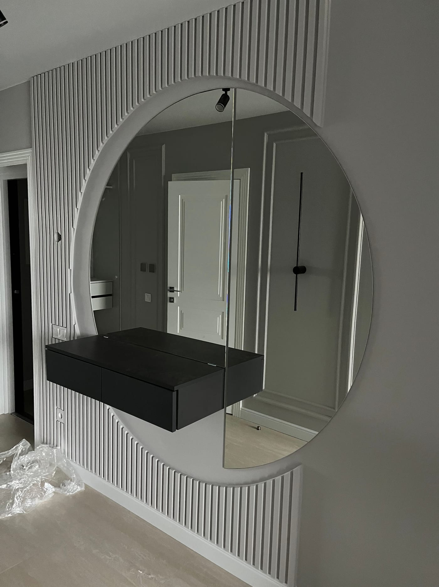

Круглое зеркало — один из самых популярных трендов в интерьере: оно смягчает строгие линии, работает как акцент и подходит почти к любому стилю — от минимализма до классики. Рассказываем, какой диаметр выбрать, с рамой или без, и как заказать круглое зеркало по вашим размерам.

## Почему выбирают круглое зеркало

- **Смягчает интерьер.** Округлая форма уравновешивает прямые линии мебели, дверей и плитки.
- **Становится акцентом.** Одно большое круглое зеркало на стене выглядит как самостоятельный элемент декора.
- **Универсальное.** Подходит в ванную, прихожую, гостиную, спальню и над туалетным столиком.
- **Визуально расширяет пространство.** Как и любое зеркало, добавляет света и глубины комнате.

## Где уместно круглое зеркало

- **в ванной** — над раковиной, часто с LED-подсветкой и антизапотеванием;
- **в прихожей** — встречает гостей и добавляет света в узком пространстве;
- **в гостиной** — акцент над консолью, комодом или диваном;
- **в спальне** — над туалетным столиком или как декор;
- **в салонах красоты и студиях** — стильное рабочее зеркало.

## Какой диаметр выбрать

- **50–60 см** — компактное, над раковиной или столиком;
- **70–90 см** — универсальный размер для ванной и прихожей;
- **100 см и больше** — большое акцентное зеркало для гостиной или пространства с высоким потолком.

Мы — производитель, поэтому режем круг **любого диаметра** точно под вашу стену.

## С рамой, с фацетом или с подсветкой

- **Без рамы** — чистый минималистичный круг, край аккуратно шлифуется и полируется.
- **С фацетом** — шлифованная грань по кругу даёт эффектную игру света. Подробнее — [зеркало с фацетом](/ru/katalog/dzerkala-z-fatsetom/).
- **С LED-подсветкой** — мягкий контурный свет, современный вид. Смотрите [зеркала с LED-подсветкой](/ru/katalog/dzerkala-z-led-pidsvitkoyu/).
- **В раме** — металлическая или цветная рама под ваш интерьер.

## Сколько стоит и как заказать

Цена зависит от диаметра, обработки края (обычная, фацет), наличия подсветки и рамы. Мы изготавливаем круглое зеркало **на заказ по вашим размерам**, делаем замеры и монтаж в Киеве и области и отправляем Новой Почтой по всей Украине. Готовые решения — в категории [зеркала в интерьере](/ru/katalog/dzerkala-v-interyeri/). Чтобы рассчитать стоимость — [оставьте заявку](#zayavka).

## Частые вопросы

**Зеркало какого диаметра сделать в ванную?**
Чаще всего выбирают 70–90 см над раковиной; точный размер подбираем под ширину мебели.

**Можно ли круглое зеркало с подсветкой в ванную?**
Да, делаем круглые зеркала с LED-подсветкой и антизапотеванием — идеально для ванной комнаты.

**Вы делаете только круглые или и овальные?**
Изготавливаем круглые, овальные и фигурные зеркала любых размеров на заказ.
