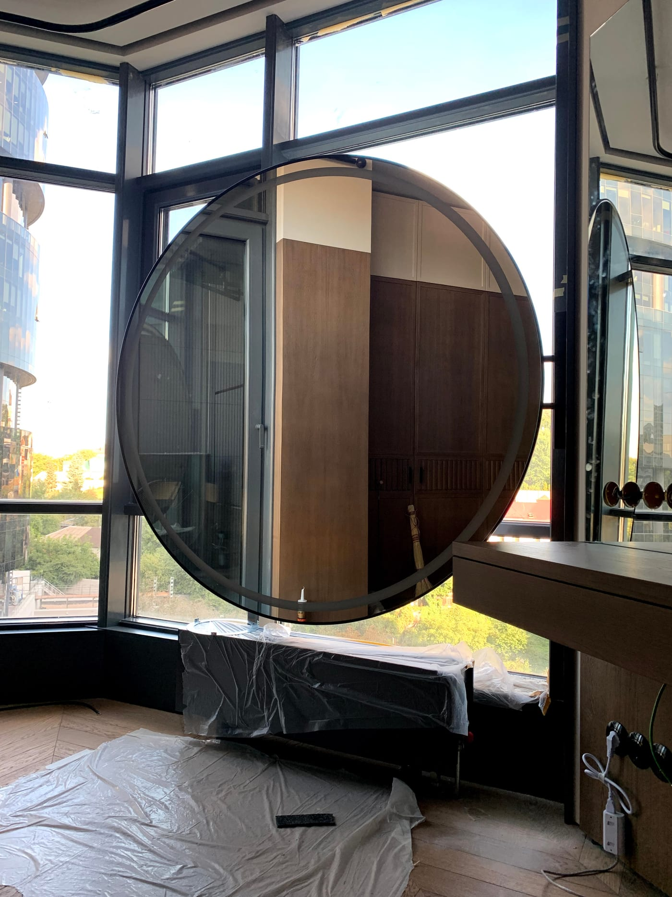

Круглое зеркало с LED-подсветкой — один из самых популярных трендов в интерьере последних лет. Мягкая форма без острых углов и свет, который будто «парит» вокруг, делают его стильным акцентом в любой комнате. Рассказываем, почему оно так хорошо смотрится, куда подходит и как выбрать размер.

## Почему круглая форма так популярна

- **Смягчает интерьер.** Прямые линии мебели и плитки уравновешиваются плавным кругом — пространство выглядит уютнее.
- **Универсальна.** Круглое зеркало подходит и к минимализму, и к классике, и к стилю модерн.
- **Эффект «парения».** Контурная подсветка из-под краёв создаёт световое кольцо на стене — смотрится дорого и современно.
- **Безопаснее.** Нет острых углов — актуально для детских и проходных зон.

## Куда подходит круглое зеркало с подсветкой

- **Ванная комната** — над раковиной, особенно в современных интерьерах.
- **Прихожая** — круглое зеркало с подсветкой работает и как декор, и как практичный элемент перед выходом.
- **Спальня, зона макияжа** — мягкий фронтальный свет удобен для ежедневного ухода.
- **Гостиная** — как декоративный акцент на стене.

## Какой размер выбрать

Ориентировочные рекомендации:

- **Ø500–600 мм** — компактное, для небольшой ванной или узкой прихожей.
- **Ø700–800 мм** — самый универсальный размер над стандартной раковиной.
- **Ø900 мм и больше** — эффектный акцент для просторных помещений.

Точный диаметр лучше подбирать под ширину раковины или мебели — мы подскажем оптимальный вариант. Другие модели смотрите в категории [зеркала с LED-подсветкой](/ru/katalog/dzerkala-z-led-pidsvitkoyu/).

## Как заказать

Мы изготавливаем круглые зеркала **по вашему диаметру** с нужным типом подсветки (контурная, фронтальная), температурой света и опциями вроде антизапотевания. Выполняем замер и монтаж в Киеве и области. Чтобы узнать цену — [оставьте заявку](#zayavka).

## Частые вопросы

**Какая подсветка лучше для круглого зеркала?**
Для декоративного эффекта — контурная (по периметру). Если нужен свет для макияжа — добавляем фронтальную.

**Можно ли сделать круглое зеркало с подогревом?**
Да, антизапотевание доступно для круглых зеркал так же, как и для прямоугольных.

**Бывает ли овальная форма вместо круглой?**
Да, изготавливаем и овальные зеркала с подсветкой по индивидуальным размерам.
