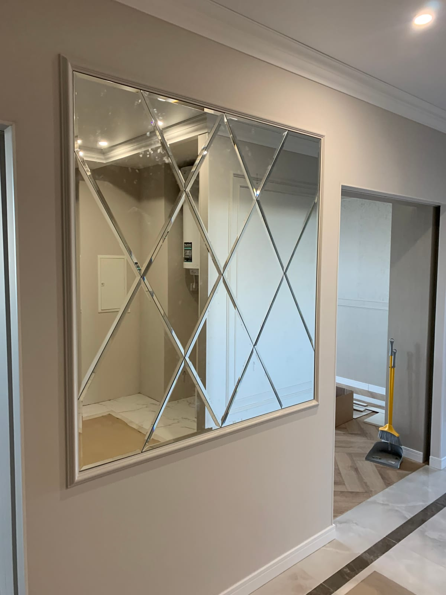

Если Вы собираетесь использовать стекло или зеркало без рамы, то необходимо обязательно обработать его кромку. Необработанные края стекла острые, о них можно легко порезаться.

Обработка стекла производится на специальных станках. Вручную полировать и шлифовать изделия долго и дорого. Аппаратная шлифовка и полировка кромки делает стекло пригодным для создания различной стеклянной мебели, люстр, аквариумов, перегородок, а также использования его в интерьере как элемент декора.

Для вставки стекол в оконные рамы или двери их кромки можно не шлифовать. Но это снизит прочность стекла или зеркала, повысит вероятность того, что стекло разобьется при резком закрытии двери или окна. Поэтому мы рекомендуем производить хотя бы первичную шлифовку стекол и зеркал для любого вида использования.

Виды обработки стекла:

-
Шлифовка края стекла. Самый простой и дешевый способ обработки кромки стекла абразивными дисками, на собственном оборудовании. Делает стекло безопасным для окружающих, о него уже нельзя порезаться. Шлифуется стекло чаще всего под углом от 45 до 90 градусов, но могут создаваться закругленные углы или воспроизводится трапециевидная форма кромки (еврокромка). Результат шлифовки – грани стекла уже не режутся, но становятся матовыми и шершавыми. Часто шлифовка стекла является первым этапом в процессе обработки, производится перед полировкой.

-
Еврокромка - обработка кромки в виде трапеции. Наиболее популярный вид шлифовки стекла, повышает прочность изделия.

-
Полировка стекла или зеркала. Чтобы сделать кромку прозрачной и гладкой, производят полировку стекла,на высокоточном оборудовании.

-
Фацет –обработка кромки фацет от 5мм (подробно об этом виде обработки можно прочесть на странице Зеркала с фацетом).

Преимущества полировки и шлифовки стекол:

-
делают кромку стекла безопасной для окружающих;

-
придают стеклу и зеркалу эстетичный вид;

-
уменьшает вероятность образования сколов и трещин на стекле;

-
с помощью шлифовки и полировки можно убрать небольшие царапины на поверхности стекла (например, на стеклах автомобиля).

Когда необходимо заказывать обработку стекла?

Шлифовка и полировка обязательно должна производиться при подготовке стекла для создания:

-
стеклянной мебели;

-
торгово-выставочного оборудования;

-
витрин;

-
зеркал;

-
аквариумов;

-
мелких элементов декора.

### Шлифовку зеркал и стекол можно заказать в Киеве в нашей компании
по телефону 097-177-25-77.

сайт создан компанией
