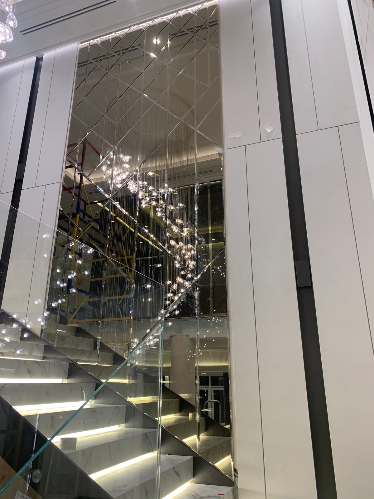

Тонированное зеркало — это зеркало с цветным оттенком (графит, бронза, сатин), которое добавляет интерьеру глубины, мягкости и премиального вида. В отличие от обычного «серебристого», оно даёт спокойное, благородное отражение и эффектно смотрится в панно и на стенах. Рассказываем о цветах, применении и как заказать.

## Что такое тонированное зеркало

Это то же качественное зеркало, но с цветным напылением, которое придаёт отражению оттенок. Оно не «бьёт» ярким блеском, а работает деликатнее — поэтому его часто выбирают для дизайнерских интерьеров, панно и акцентных стен.

## Цвета и их эффект

- **Графит (серый/дымчатый)** — самый популярный: сдержанный, современный, хорошо сочетается с тёмными и светлыми интерьерами.
- **Бронза** — тёплый золотисто-коричневый оттенок, добавляет роскоши и уюта, подходит к классике и ар-деко.
- **Сатин (матированное)** — мягкое рассеянное отражение без резкого блеска.

Тонированные элементы можно комбинировать с обычным зеркалом — так узор панно выглядит глубже и интереснее.

## Где применяют тонированное зеркало

- **в зеркальных панно** — глубокий цвет делает композицию дороже. Смотрите [зеркальные панно](/ru/katalog/dzerkalni-panno/);
- **в зеркальной плитке** — на стену или потолок. Подробнее — [зеркальная плитка](/ru/katalog/dzerkalna-plitka/);
- **на акцентных стенах** — в гостиной, спальне, зоне ТВ;
- **в фасадах мебели и нишах** — стильное решение для шкафов и барных зон;
- **с фацетом** — тонированное зеркало с фацетом смотрится особенно эффектно. См. [зеркало с фацетом](/ru/katalog/dzerkala-z-fatsetom/).

## Преимущества

- благородный, дизайнерский вид без «дешёвого» блеска;
- маскирует отпечатки и выглядит чище в ежедневном использовании;
- легко комбинируется с другими оттенками в панно;
- то же производство на заказ — под ваши размеры и раскладку.

## Сколько стоит и как заказать

Стоимость зависит от цвета, площади, формы и наличия фацета. Мы — производитель, поэтому режем и обрабатываем тонированное зеркало **по вашим размерам**, разрабатываем раскладку панно, делаем замеры и монтаж в Киеве и области, отправляем по всей Украине. Смотрите также [зеркала в интерьере](/ru/katalog/dzerkala-v-interyeri/). Чтобы узнать цену — [оставьте заявку](#zayavka).

## Частые вопросы

**Какой цвет тонирования выбрать?**
Самый универсальный — графит: он подходит почти к любому интерьеру. Бронза — для тёплых, классических помещений.

**Можно ли тонированное зеркало в ванную?**
Да, тонированное зеркало влагостойкое и подходит для ванной; часто комбинируют с фацетом.

**Вы делаете панно из тонированного зеркала?**
Да, разрабатываем раскладку и изготавливаем панно из тонированных и обычных элементов «под ключ».
