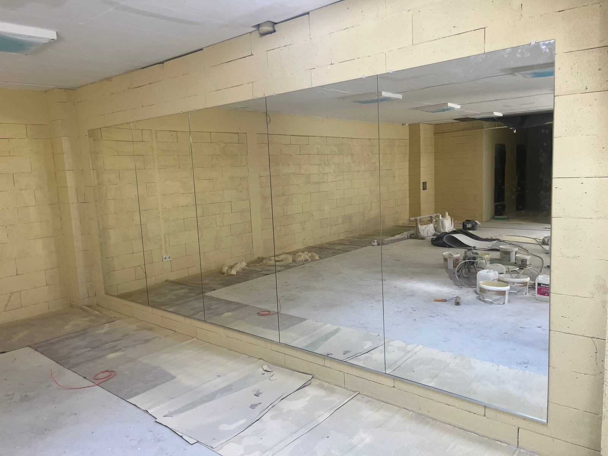

Велике дзеркало — це десятки кілограмів крихкого скла на стіні. Якщо змонтувати його неправильно, наслідки можуть бути небезпечними. Тому монтаж великих дзеркал — це не «приклеїти й готово», а продумана робота. Розповідаємо, як це робиться безпечно.

## Захисна плівка — основа безпеки

Найважливіше при монтажі великого дзеркала — **захисна плівка** з тильного боку. Що вона дає:

- якщо скло трісне чи розіб'ється від удару, уламки **залишаються на плівці** й не розлітаються;
- це критично для спортзалів, студій, громадських місць і будинків з дітьми;
- плівка не видно з лицьового боку й не впливає на якість відображення.

Для великих полотен у залах плівка фактично обов'язкова.

## Яка товщина скла потрібна

Товщина полотна впливає на жорсткість: тонке скло на великій площі «грає» й дає ефект **кривого дзеркала** — спотворює відображення. Тому чим більше полотно, тим товще скло:

| Дзеркало | Рекомендована товщина |
|---|---|
| Невелике настінне (до 1 м) | 3–4 мм |
| Велике / у повний зріст (1,8–2 м) | 4–5 мм |
| Дзеркальна стіна у спортзалі | 5–6 мм |

Для великогабаритних дзеркал (від 1,8–2 м заввишки) обирайте **не менше 4–5 мм** — це прибирає спотворення й додає міцності.

## Способи кріплення під різні стіни

Спосіб монтажу залежить від ваги дзеркала й типу поверхні:

- **На нейтральний клей/силікон для дзеркал** — для рівних міцних стін; спеціальний склад не роз'їдає амальгаму й не лишає плям.
- **Притискний металевий профіль** — якщо стіна має нерівності: дзеркало притискається профілем, а не «тягнеться» по кривій поверхні.
- **Механічне кріплення** (тримачі, кліпси) — для важких полотен.
- **Комбінований** — клей плюс механічна страховка для максимальної надійності.

Для гіпсокартону, плитки чи нерівних стін потрібен особливий підхід — це визначає майстер на місці.

## Типові помилки при самостійному монтажі

- кріплення тільки на клей без урахування ваги полотна;
- монтаж без захисної плівки на велике дзеркало;
- неправильний клей, що «з'їдає» амальгаму й залишає плями;
- нерівна стіна, через яку дзеркало дає спотворення або трісне від напруги.

Саме тому великі дзеркала краще довіряти професіоналам.

## Як замовити монтаж

Ми виконуємо **повний цикл**: виготовлення за розміром, наклеювання захисної плівки, доставку та безпечний монтаж. Особливо це актуально для [дзеркал у спортзали та студії](/katalog/dzerkala-dlya-sportzaliv/). Щоб обговорити ваш об'єкт — [залиште заявку](#zayavka).

## Поширені запитання

**Чи обов'язкова захисна плівка на велике дзеркало?**
Для великих полотен, особливо у залах і громадських місцях, — так, це питання безпеки.

**Чи можна повісити велике дзеркало на гіпсокартон?**
Так, але потрібне правильне кріплення з урахуванням ваги — це визначає майстер.

**Ви даєте гарантію на монтаж?**
Так, ми відповідаємо за якість і надійність встановлення.
