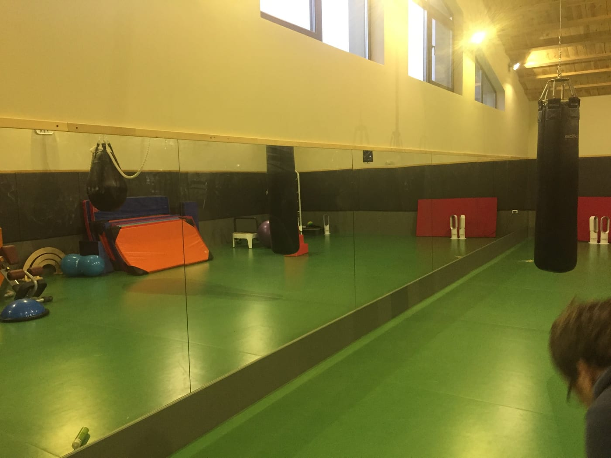

У залі боксу та єдиноборств дзеркало допомагає відпрацьовувати техніку ударів, стійку й роботу ніг. Але це простір з високим навантаженням, тож **безпека дзеркал тут — питання номер один**. Розповідаємо, яке скло й монтаж обрати для боксерського залу.

> Готові прорахувати? Дивіться **[дзеркала для боксу та кросфіту на замовлення](/dzerkala-dlya-boksu-ta-krosfitu/)** — характеристики, плівка безпеки, ціна від 2100 грн.

## Навіщо дзеркала у залі боксу

- **Техніка ударів і стійка.** Спортсмен бачить себе й коригує рухи.
- **Робота ніг.** Контроль пересувань і балансу.
- **Простір і світло.** Дзеркальна стіна робить зал візуально більшим.

## Безпека — головне

У боксі та єдиноборствах ризик удару по стіні високий (рукавицею, снарядом, під час падіння). Тому дзеркало **обов'язково** монтується **на захисну плівку** з тильного боку: навіть якщо скло трісне, воно **залишиться на плівці й не розлетиться** на друзки. Це критична вимога для контактних видів спорту. Докладніше — [безпечний монтаж великих дзеркал](/statti/bezpechnyy-montazh-velykykh-dzerkal/).

## Міцне скло й надійне кріплення

Для боксерських залів беруть **міцніше скло** (зазвичай 4–6 мм) і **надійне кріплення** з урахуванням вібрацій і навантажень. За потреби дзеркальну зону роблять лише там, де немає прямого контакту зі снарядами, а решту стіни лишають закритою.

## Розміри

Дзеркало роблять від підлоги (з відступом 10–15 см) заввишки від 2 м, щоб спортсмен бачив себе повністю. Розкладку полотен плануємо під ваш зал і розташування рингу чи мішків.

## Скільки коштує і як замовити

Ціна залежить від площі, товщини скла та монтажу. Ми — виробник у Києві: заміри, виготовлення **за вашими розмірами**, безпечний монтаж і доставка по Україні. Дивіться також [дзеркала для спортзалу](/statti/dzerkala-dlya-sportzalu-rozmiry-montazh/) та [фітнес-клубу](/statti/dzerkalna-stina-u-fitnes-klub/). Категорія — [дзеркала для спортзалів і студій](/katalog/dzerkala-dlya-sportzaliv/). Щоб порахувати — [залиште заявку](#zayavka).

## Поширені запитання

**Чи безпечні дзеркала у боксерському залі?**
Так, за умови монтажу на захисну плівку — скло не розлетиться навіть при ударі.

**Яка товщина скла потрібна?**
Зазвичай 4–6 мм — таке скло жорсткіше й безпечніше для великих полотен.

**Чи можна дзеркало не на всю стіну?**
Так, робимо дзеркальну зону лише там, де це потрібно й безпечно.
