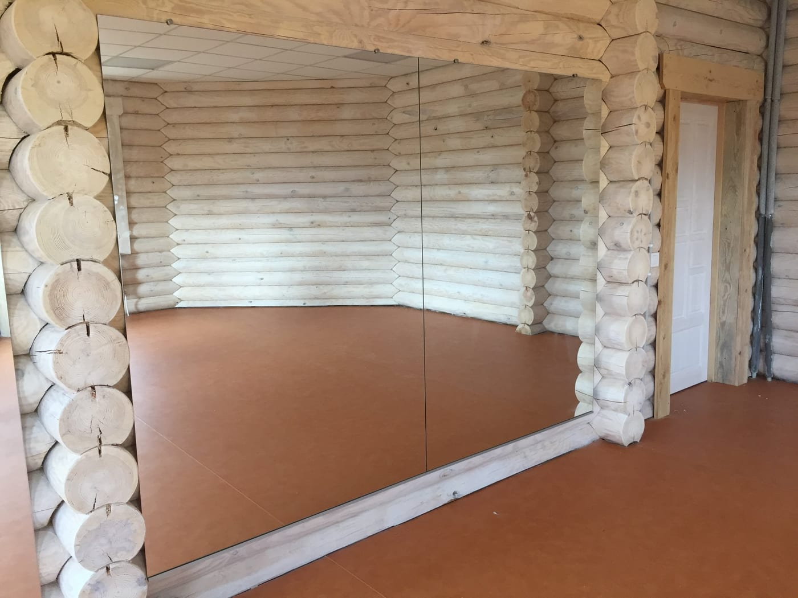

Домашній спортзал — це зручно: тренуєшся коли завгодно, без черг і абонементів. І тут, як і в клубі, потрібне велике дзеркало — щоб контролювати техніку, стежити за поставою й візуально розширити кімнату. Розповідаємо, яке дзеркало обрати для домашнього чи приватного залу та як безпечно його змонтувати.

## Навіщо дзеркало у домашньому залі

- **Контроль техніки** під час вправ — як у справжньому клубі.
- **Відчуття простору.** Дзеркальна стіна візуально збільшує кімнату й додає світла — особливо важливо для залу у квартирі чи підвалі.
- **Мотивація.** Бачити себе в процесі — приємно й дисциплінує.

## Який розмір обрати

Удома дзеркало підбирають під конкретну стіну:

- **висота** — від підлоги (з відступом 10–15 см) до 2 м, щоб бачити себе повністю;
- **ширина** — від 1–1,5 м; часто закривають одну стіну чи її частину;
- для невеликих кімнат навіть одне велике полотно суттєво «розширює» простір.

Ми — виробник, тож ріжемо дзеркало **точно під ваш розмір**, зокрема під нестандартні стіни, ніші та скоси.

## Безпека вдома

Навіть удома велике дзеркало варто монтувати **на захисну плівку** з тильного боку — при випадковому ударі (гантеллю, м'ячем) скло не розлетиться. Це особливо важливо, якщо вдома є діти. Докладніше — [безпечний монтаж великих дзеркал](/statti/bezpechnyy-montazh-velykykh-dzerkal/).

## Додаткові опції

- **LED-підсвітка** — якщо зал у приміщенні без вікон.
- **Акуратна обробка краю** та приховане кріплення — щоб дзеркало гарно вписалося в інтер'єр.

## Скільки коштує і як замовити

Ціна залежить від розміру, товщини скла та монтажу. Ми — виробник у Києві: заміри, виготовлення **за вашими розмірами**, монтаж і доставка по Україні. Огляд усіх типів залів — [дзеркала для залів і студій](/statti/dzerkala-dlya-zaliv-i-studiy/); для великих залів — [дзеркала для спортзалу](/statti/dzerkala-dlya-sportzalu-rozmiry-montazh/). Щоб порахувати під вашу кімнату — [залиште заявку](#zayavka).

## Поширені запитання

**Яке дзеркало обрати для домашнього залу?**
Велике полотно від підлоги до ~2 м на одну стіну — воно і для контролю техніки, і візуально розширює кімнату.

**Чи потрібна плівка для домашнього дзеркала?**
Так, для безпеки її варто робити — особливо якщо тренуєтесь з вагою або вдома є діти.

**Ви робите заміри й монтаж у квартирі/будинку?**
Так, у Києві та області; готові дзеркала відправляємо по всій Україні.
