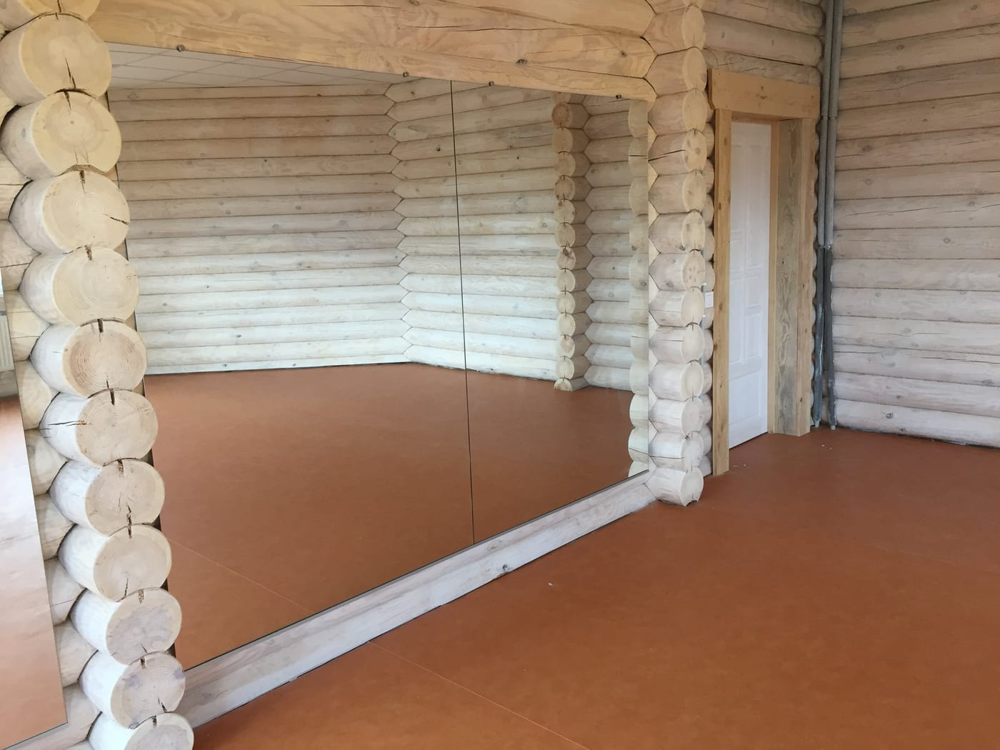

Пілатес — це про точність, вирівнювання та усвідомлений контроль кожного руху. Дзеркало у студії пілатесу допомагає стежити за положенням тіла, симетрією й технікою на маті чи реформері. Розповідаємо, яку дзеркальну стіну обрати для пілатесу.

## Навіщо дзеркала у студії пілатесу

- **Точний контроль положення** тіла й хребта під час вправ.
- **Симетрія.** Видно, чи однаково працюють обидві сторони.
- **Спокій і простір.** Рівне відображення без відволікання, більше світла в залі.

## Висота й рівне скло

Дзеркало роблять **від підлоги** (з відступом 10–15 см) заввишки від 2 м — щоб було видно тіло і лежачи на маті, і стоячи, і на обладнанні. Для пілатесу критично **рівне відображення без хвиль** — інакше спотворюються лінії тіла. Тому використовуємо якісне скло достатньої товщини (4–6 мм).

## Безпека

Велике дзеркало монтується **на захисну плівку** з тильного боку — при випадковому ударі чи падінні скло не розлетиться. Докладніше — [безпечний монтаж великих дзеркал](/statti/bezpechnyy-montazh-velykykh-dzerkal/).

## Скільки коштує і як замовити

Ціна залежить від площі стіни, товщини скла та монтажу. Ми — виробник у Києві: заміри, виготовлення **за розмірами вашої студії**, монтаж і доставка по Україні. Дивіться також [дзеркала для йоги](/statti/dzerkala-dlya-yohy/), [стрейчінгу](/statti/dzerkala-dlya-streychyngu/) та огляд — [дзеркала для залів і студій](/statti/dzerkala-dlya-zaliv-i-studiy/). Категорія — [дзеркала для спортзалів і студій](/katalog/dzerkala-dlya-sportzaliv/). Щоб порахувати — [залиште заявку](#zayavka).

## Поширені запитання

**Чому для пілатесу важливе рівне скло?**
Бо ви контролюєте лінії й симетрію тіла — хвилі на дешевому склі спотворюють відображення.

**Якої висоти дзеркало для пілатесу?**
Від підлоги до 2 м і вище — щоб бачити тіло у будь-якому положенні, зокрема на маті.

**Ви робите заміри й монтаж?**
Так, у Києві та області; полотна відправляємо по всій Україні.
