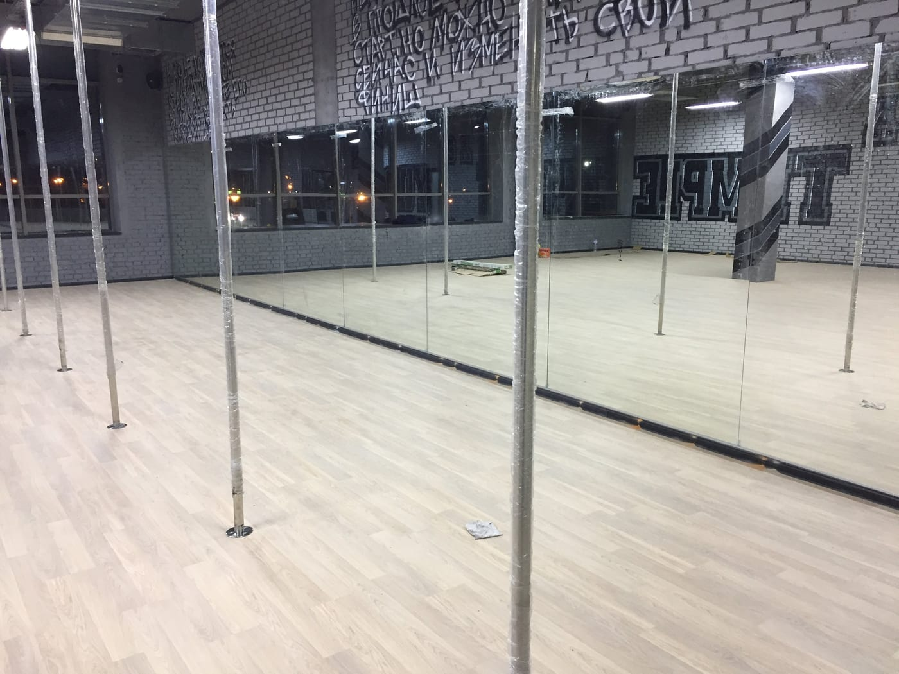

У студії пул денсу (pole dance) дзеркало — обов'язковий елемент: воно допомагає відпрацьовувати елементи, лінії та переходи на пілоні, а також контролювати тіло в перевернутих положеннях. Через специфіку занять до дзеркал тут особливі вимоги. Розповідаємо, яку дзеркальну стіну обрати для пул денсу.

> Готові прорахувати? Дивіться **[дзеркала для пул дансу на замовлення](/dzerkala-dlya-pul-dansu/)** — висока стіна до стелі, безпека, ціна від 2100 грн.

## Навіщо дзеркала у студії пул денсу

- **Контроль елементів.** Видно лінії тіла, носочки, положення на пілоні.
- **Перевернуті положення.** Висока стіна дає бачити себе навіть у стійках і зльотах.
- **Атмосфера.** Дзеркальна стіна робить студію ефектнішою й просторішою.

## Висота — до стелі

Для пул денсу дзеркало роблять **максимально високим — часто від підлоги до стелі**, щоб було видно все тіло у верхніх елементах на пілоні. Стіну збирають суцільною, без «розривів» у відображенні.

## Розкладка навколо пілонів

Дзеркальну стіну плануємо з урахуванням розташування **пілонів**: полотна підганяємо так, щоб пілони не перекривали ключові ракурси, а кріплення не заважали обертанню. Розкладку розробляємо під вашу студію.

## Скло без спотворень і безпека

Потрібне **рівне відображення без хвиль** (якісне скло 4–6 мм) і обов'язкова **захисна плівка** з тильного боку — при ударі чи падінні скло не розлетиться. Докладніше — [безпечний монтаж великих дзеркал](/statti/bezpechnyy-montazh-velykykh-dzerkal/).

## Скільки коштує і як замовити

Ціна залежить від площі стіни (особливо за монтажу до стелі), товщини скла та складності розкладки навколо пілонів. Ми — виробник у Києві: заміри, виготовлення **за вашими розмірами**, монтаж і доставка по Україні. Дивіться також [дзеркала для танцювальної студії](/statti/dzerkala-dlya-tantsyuvalnoyi-studiyi/), [стрейчінгу](/statti/dzerkala-dlya-streychyngu/) та [спортзалу](/statti/dzerkala-dlya-sportzalu-rozmiry-montazh/). Категорія — [дзеркала для спортзалів і студій](/katalog/dzerkala-dlya-sportzaliv/). Щоб порахувати — [залиште заявку](#zayavka).

## Поширені запитання

**Якої висоти дзеркала для пул денсу?**
Найкраще від підлоги до стелі — щоб бачити тіло у верхніх елементах на пілоні.

**Як бути з пілонами біля стіни?**
Розкладку полотен плануємо так, щоб пілони не перекривали ракурси, а кріплення не заважали.

**Чи безпечні великі дзеркала у студії?**
Так, за умови монтажу на захисну плівку та надійного кріплення.
