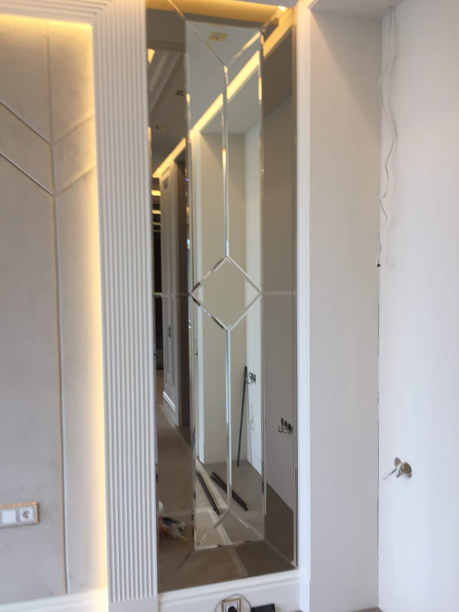

Салон краси продає не лише послуги, а й враження — а формують його світло та дзеркала. Від них залежить і зручність майстрів, і те, наскільки «дорогим» виглядає простір. Розповідаємо, які дзеркала обрати для різних зон салону краси й як замовити їх під ваш інтер'єр.

## Дзеркала для різних зон салону

- **Робочі місця майстрів** — велике рівне дзеркало перед кріслом, часто з LED-підсвіткою.
- **Гримерна / зона візажу** — [дзеркало з LED-підсвіткою](/katalog/dzerkala-z-led-pidsvitkoyu/), у якому добре видно макіяж без спотворення кольорів.
- **Ресепшн і зона очікування** — велике настінне дзеркало або [дзеркальне панно](/katalog/dzerkalni-panno/) як акцент.
- **Манікюр / косметологія** — акуратні дзеркала під конкретну зону.
- **Приміряльні та коридори** — дзеркала [у повний зріст](/statti/dzerkalo-v-povnyy-zrist-na-zamovlennya/).

## Світло — половина успіху

Для салону краси критично важливе **рівне нейтральне світло** без жовтизни й тіней — саме воно дає правильне сприйняття кольору волосся, макіяжу та шкіри. Оптимально — дзеркало з вбудованою LED-підсвіткою по контуру, за потреби з регулюванням яскравості. Це і зручність для майстра, і «інстаграмна» картинка для клієнта.

## Преміальний вигляд

Щоб салон виглядав дорого, використовують:

- **[дзеркала з фацетом](/katalog/dzerkala-z-fatsetom/)** — грань дає шляхетну гру світла;
- **[тоновані дзеркала](/statti/tonovane-dzerkalo-grafit-bronza/)** (графіт, бронза) — для глибокого кольору;
- **дзеркальні панно** — акцентна стіна на ресепшн чи в залі;
- **фігурні та [круглі дзеркала](/statti/krugle-dzerkalo-na-zamovlennya/)** — трендові форми.

## Безпека й довговічність

Салон — це висока прохідність, тож дзеркала мають бути з якісного скла з акуратно обробленим краєм. Для великих полотен і дзеркальних стін застосовуємо захисну плівку з тильного боку — при пошкодженні скло не розлітається.

## Чому вигідно замовляти у виробника

- **Під ваш простір і планування** — а не «що є в магазині».
- **Під фірмовий стиль** — форма, рама, підсвітка під бренд салону.
- **Єдина якість для всіх зон**, якщо обладнуєте салон «під ключ» або мережу.
- **Ціна від виробника** без переплат посередникам.

## Скільки коштує і як замовити

Ціна залежить від кількості й розміру дзеркал, типу підсвітки, обробки краю та монтажу. Ми — [виробник дзеркал на замовлення](/statti/dzerkala-na-zamovlennya-v-kievi/) у Києві: робимо заміри, виготовляємо за вашими розмірами й монтуємо в Києві та області, доставляємо по всій Україні. Дивіться також [дзеркала для барбершопу](/statti/dzerkala-v-barbershop/). Щоб отримати прорахунок — [залиште заявку](#zayavka).

## Поширені запитання

**Яке дзеркало обрати для робочого місця в салоні?**
Велике рівне дзеркало з нейтральною LED-підсвіткою — воно зручне для майстра й гарно показує результат клієнту.

**Чи можна дзеркала під фірмовий стиль салону?**
Так, робимо потрібну форму (зокрема фігурні, круглі, з фацетом) і раму під ваш бренд.

**Ви обладнуєте салон повністю?**
Так, виготовляємо комплект дзеркал єдиної якості для всіх зон — робочих місць, гримерної, ресепшн.

**Чи є доставка в інші міста?**
Так, відправляємо по всій Україні; заміри та монтаж — у Києві та області.
