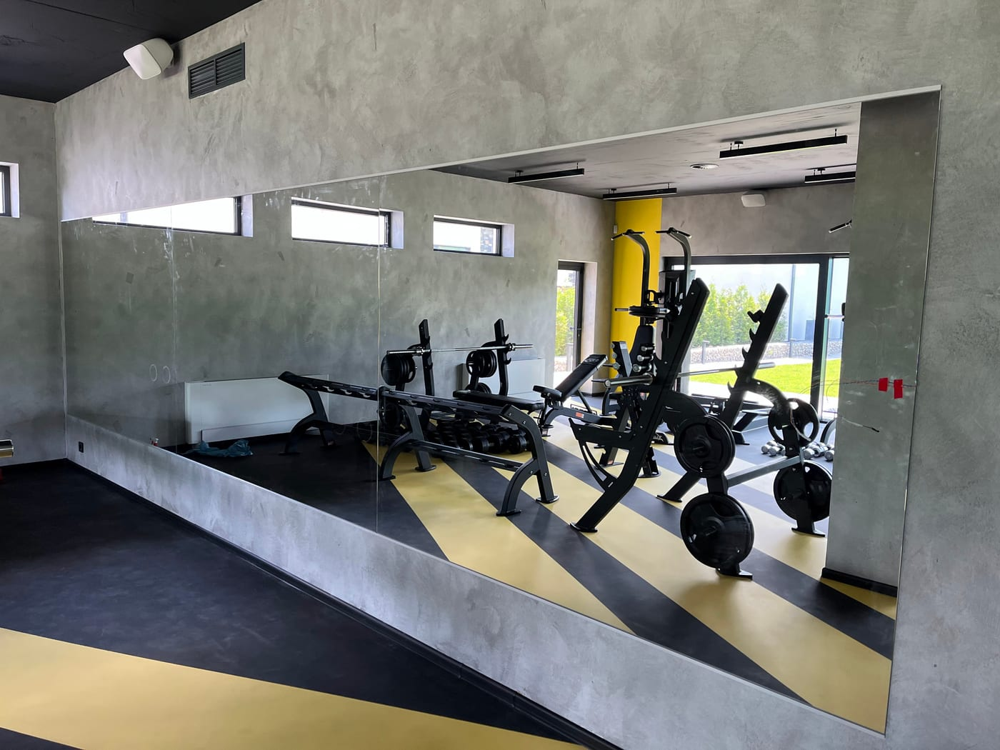

Дзеркала — обов'язковий елемент будь-якого спортзалу, фітнес-клубу чи студії: вони допомагають контролювати техніку, візуально розширюють зал і роблять його світлішим. Але великі полотна — це питання не лише естетики, а й безпеки. Розповідаємо, як правильно обрати й змонтувати дзеркала для залу.

> Замовляєте стіну в зал? Дивіться **[дзеркала для спортзалу під ключ](/dzerkala-dlya-sportzalu-pid-klyuch/)** — виготовлення, безпечне кріплення й монтаж однією бригадою, від 2800 грн.

## Для яких залів потрібні дзеркала

Дзеркальна стіна доречна практично в будь-якому приміщенні для тренувань:

- **тренажерний зал і спортзал** — контроль техніки під час вправ;
- **[фітнес-клуб](/statti/dzerkalna-stina-u-fitnes-klub/)** — велика дзеркальна стіна на груповий зал;
- **[танцювальний зал](/statti/dzerkala-dlya-tantsyuvalnoyi-studiyi/)** — суцільне дзеркало від підлоги для хореографії;
- **[йога](/statti/dzerkala-dlya-yohy/) та [стрейчінг](/statti/dzerkala-dlya-streychyngu/)** — рівне полотно від підлоги для контролю пози;
- **[бокс і єдиноборства](/statti/dzerkala-dlya-boksu/)** — міцне скло з обов'язковою захисною плівкою;
- **[пул денс](/statti/dzerkala-dlya-pul-dansu/)** — висока стіна до стелі з розкладкою навколо пілонів;
- **[кросфіт](/statti/dzerkala-dlya-krosfitu/), [пілатес](/statti/dzerkala-dlya-pilatesu/), [гімнастика](/statti/dzerkala-dlya-himnastyky/)** — функціональні та студійні зали;
- **[реабілітація та ЛФК](/statti/dzerkala-dlya-reabilitatsiyi/)** — медичні й реабілітаційні центри;
- **[домашній (приватний) зал](/statti/dzerkala-dlya-domashnoho-sportzalu/)** — під вашу кімнату чи будинок.

## Які розміри обрати

- **Висота.** Оптимально — від підлоги (або з невеликим відступом) до 2–2,2 м, щоб людина бачила себе в повний зріст під час вправ.
- **Ширина.** Зазвичай дзеркальну стіну збирають із кількох полотен, закриваючи всю потрібну ділянку.
- **Відступ від підлоги.** Часто лишають 10–15 см, щоб захистити край від вологи та ударів.

Точну розкладку полотен ми розраховуємо під розміри вашого залу.

## Товщина скла

Для спортзалів використовують **міцніше скло** — зазвичай товщиною 4–6 мм, жорсткіше й безпечніше для великих полотен. Тонше скло на великій площі «грає» й дає викривлення відображення, тому для залів воно не підходить. Конкретну товщину підбираємо під розмір дзеркала та спосіб монтажу.

## Способи монтажу

- **На клей/герметик** — полотно приклеюється до підготовленої рівної стіни.
- **Механічне кріплення** — за допомогою профілів або кріплень, видимих чи прихованих.

Часто способи комбінують. Майстер обирає рішення під тип і стан вашої стіни. Докладніше про роботу з великими полотнами — у статті [безпечний монтаж великих дзеркал](/statti/bezpechnyy-montazh-velykykh-dzerkal/).

## Безпека — головне

Велике дзеркало у залі обов'язково монтується **на захисну плівку** з тильного боку. Якщо станеться удар (м'ячем, гантеллю, під час падіння), скло **залишиться на плівці й не розлетиться** на друзки. Це ключова вимога безпеки для приміщень, де займаються люди.

Подивитися напрям можна в категорії [дзеркала для спортзалів](/katalog/dzerkala-dlya-sportzaliv/), а огляд усіх типів залів — у статті [дзеркала для залів і студій](/statti/dzerkala-dlya-zaliv-i-studiy/).

## Освітлення й додаткові опції

- **Правильне світло.** Дзеркальна стіна відбиває освітлення й робить зал світлішим; за потреби додаємо LED-підсвітку.
- **Підігрів.** У вологих зонах (басейни, wellness) дзеркало можна зробити з підігрівом проти запотівання.
- **Сегментування.** Велику стіну ділимо на секції — це спрощує доставку, монтаж і подальше обслуговування.

## Догляд за дзеркалами в залі

Дзеркала в залі протирають м'якою тканиною без абразивів; для великих полотен важлива акуратна обробка країв ще на виробництві, щоб не було сколів. За правильного монтажу дзеркальна стіна служить роками без втрати вигляду.

## Характеристики дзеркал для залу

| Параметр | Значення |
| --- | --- |
| Товщина скла | 4–6 мм (під розмір полотна) |
| Макс. розмір полотна | до 3200×2200 мм (більше — секціями) |
| Плівка безпеки | Так, антиосколкова (обов'язково для залів) |
| Обробка краю | Полірування |
| Кріплення | Клей/герметик або профіль (приховане чи видиме) |
| Відступ від підлоги | 10–15 см (за потреби) |
| Доставка | Самовивіз Київ / Нова Пошта по Україні |

## Скільки коштує дзеркало для спортзалу

Ціну рахують за **площею дзеркальної стіни** плюс товщина скла та монтаж. Орієнтир: готове **дзеркало для залу 2×1 м (2000×1000 мм) — від 2800 грн**; велику суцільну стіну рахуємо за м² під ваш проєкт. Точний прорахунок — безкоштовно, за потреби з виїздом на заміри. Готовий варіант — товар [дзеркало для спортзалу 2000×1000 мм](/tovar/dzerkalo-dlya-sportzalu-2000x1000/).

## Чому замовляти у виробника Lux Dzerkalo

- **Виробник із 2011 року** — власне виробництво, без націнки посередників.
- **Заміри + монтаж «під ключ» своєю бригадою** — не просто продаємо скло, а й безпечно встановлюємо великі полотна.
- **Безпека** — антиосколкова плівка на всі дзеркала для залів.
- **Доставка Новою Поштою** по всій Україні; заміри й монтаж — Київ та область.

Щоб отримати прорахунок під ваш зал — [залиште заявку](#zayavka), і ми безкоштовно все порахуємо.

## Поширені запитання

**Чи безпечні великі дзеркала у залі?**
Так, за умови монтажу на захисну плівку та надійного кріплення — скло не розлетиться навіть при ударі.

**Яка товщина скла потрібна для спортзалу?**
Зазвичай 4–6 мм залежно від розміру полотна — таке скло жорсткіше й не дає викривлень.

**Скільки днів займає виготовлення й монтаж?**
Зазвичай кілька робочих днів; точний термін залежить від обсягу й називається при замовленні.

**Чи можна дзеркало від підлоги до стелі?**
Так, монтуємо суцільні полотна або секції на будь-яку висоту вашого залу.

**Ви робите дзеркала для залів в інших містах?**
Виготовляємо й відправляємо полотна по всій Україні; заміри та монтаж виконуємо в Києві та області.
