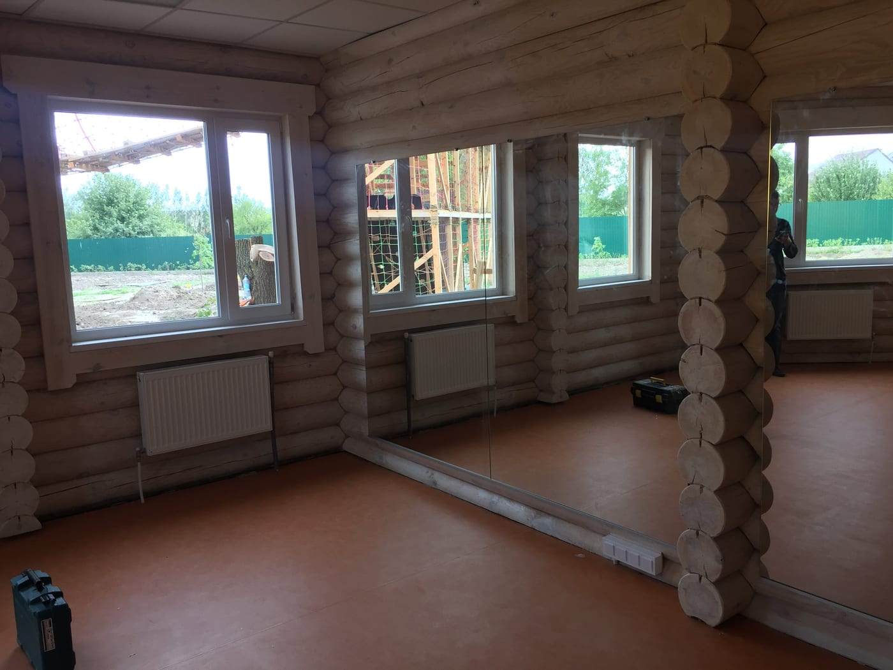

У студії стрейчінгу та розтяжки дзеркало — робочий інструмент: воно допомагає контролювати техніку, симетрію й лінії тіла під час вправ на гнучкість. Розповідаємо, яку дзеркальну стіну обрати для стрейчінгу та як її безпечно змонтувати.

> Готові прорахувати? Дивіться **[дзеркала для стретчингу на замовлення](/dzerkala-dlya-streychyngu/)** — стіна до підлоги, рівне відображення, ціна від 1900 грн.

## Навіщо дзеркала у стрейчінг-студії

- **Контроль техніки.** Видно правильність положення тіла й амплітуду.
- **Симетрія.** Легко порівняти роботу лівої та правої сторони.
- **Простір і світло.** Дзеркальна стіна візуально розширює зал.

## Висота й розкладка

Дзеркало роблять **від підлоги** (або з відступом 10–15 см) заввишки від 2 м — щоб було видно все тіло і стоячи, і в нахилах, і на підлозі. Стіну збирають суцільною на всю потрібну ширину.

## Скло без спотворень

Для точного контролю ліній тіла потрібне **рівне відображення без хвиль**. Використовуємо якісне скло достатньої товщини (4–6 мм), що не «грає» на великих полотнах.

## Безпека

Велике дзеркало монтується **на захисну плівку** — при ударі чи падінні скло не розлетиться. Це обов'язково для залів з активним рухом. Докладніше — [безпечний монтаж великих дзеркал](/statti/bezpechnyy-montazh-velykykh-dzerkal/).

## Скільки коштує і як замовити

Ціна залежить від площі стіни, товщини скла та монтажу. Ми — виробник у Києві: заміри, виготовлення **за вашими розмірами**, монтаж і доставка по Україні. Дивіться також [дзеркала для йоги](/statti/dzerkala-dlya-yohy/), [танцювальної студії](/statti/dzerkala-dlya-tantsyuvalnoyi-studiyi/) та [спортзалу](/statti/dzerkala-dlya-sportzalu-rozmiry-montazh/). Категорія — [дзеркала для спортзалів і студій](/katalog/dzerkala-dlya-sportzaliv/). Щоб порахувати — [залиште заявку](#zayavka).

## Поширені запитання

**Якої висоти дзеркала для стрейчінгу?**
Від підлоги до 2 м і вище — щоб бачити тіло у будь-якому положенні, зокрема на підлозі.

**Чи спотворює велике дзеркало лінії тіла?**
Ні, якщо це якісне скло достатньої товщини — саме таке ми й ставимо.

**Ви виїжджаєте на заміри?**
Так, у Києві та області; полотна відправляємо по всій Україні.
