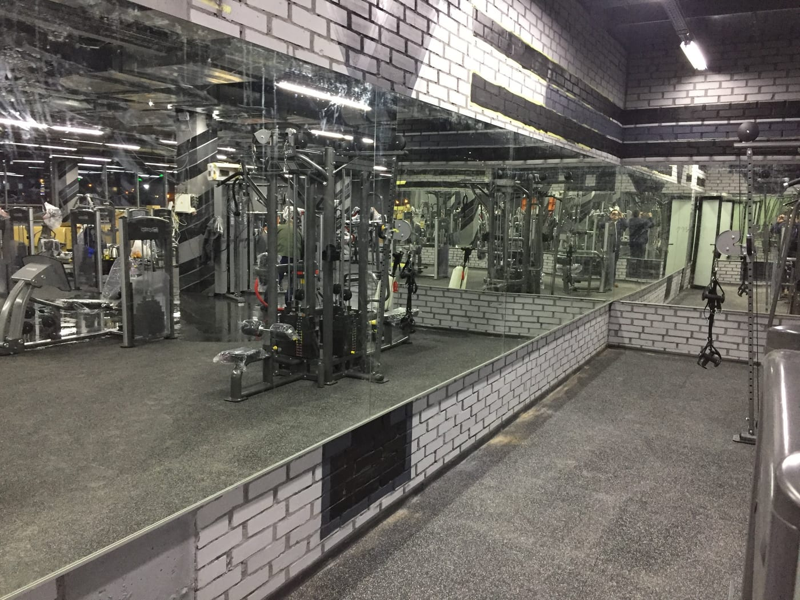

Велика дзеркальна стіна — обов'язковий елемент майже будь-якого залу чи студії: вона допомагає контролювати техніку, візуально розширює простір і робить його світлішим. Але для кожного напряму є свої нюанси — висота, товщина скла, безпека. Зібрали всі типи залів в одному місці й дали посилання на детальні матеріали. Ми — **виробник у Києві**: заміри, виготовлення за вашими розмірами, безпечний монтаж і доставка по всій Україні.

## Що спільного для всіх залів

- **Суцільна дзеркальна стіна** — без «розривів» у відображенні, на всю потрібну ширину.
- **Висота від підлоги** (з відступом 10–15 см) — щоб було видно тіло повністю.
- **Якісне скло 4–6 мм** — рівне відображення без хвиль і спотворень.
- **Захисна плівка** з тильного боку — головна вимога безпеки: при ударі скло не розлітається.

Докладніше про технологію — [безпечний монтаж великих дзеркал](/statti/bezpechnyy-montazh-velykykh-dzerkal/).

## Оберіть свій тип залу

### 🏋️ Спортзал і тренажерний зал
Великі полотна із захисною плівкою, стійкі до навантажень. Детально: [дзеркала для залу та спортзалу](/statti/dzerkala-dlya-sportzalu-rozmiry-montazh/).

### 🤸 Фітнес-клуб
Дзеркальна стіна на груповий зал; як рахується ціна за м². Детально: [дзеркальна стіна у фітнес-клуб](/statti/dzerkalna-stina-u-fitnes-klub/).

### 🩰 Танцювальна студія
Суцільне дзеркало від підлоги для контролю ліній і синхронності, з урахуванням балетного станка. Детально: [дзеркала для танцювальної студії](/statti/dzerkala-dlya-tantsyuvalnoyi-studiyi/).

### 🧘 Йога
Рівне відображення й спокійне світло для контролю пози. Детально: [дзеркала для йоги](/statti/dzerkala-dlya-yohy/).

### 🤸‍♀️ Стрейчінг і розтяжка
Висока стіна, щоб бачити тіло у будь-якому положенні, зокрема на підлозі. Детально: [дзеркала для стрейчінгу](/statti/dzerkala-dlya-streychyngu/).

### 🥊 Бокс і єдиноборства
Міцне скло й **обов'язкова захисна плівка** — критично для контактних видів. Детально: [дзеркала для боксу](/statti/dzerkala-dlya-boksu/).

### 💃 Пул денс (pole dance)
Стіна часто **від підлоги до стелі**, з розкладкою навколо пілонів. Детально: [дзеркала для пул денсу](/statti/dzerkala-dlya-pul-dansu/).

## Скільки коштує і як замовити

Ціна залежить від площі дзеркальної стіни, товщини скла та складності монтажу. Ми виготовляємо дзеркала для залів **за вашими розмірами**, безкоштовно рахуємо вартість і за потреби виїжджаємо на заміри. Категорія — [дзеркала для спортзалів і студій](/katalog/dzerkala-dlya-sportzaliv/). Щоб отримати прорахунок під ваш зал — [залиште заявку](#zayavka).

## Поширені запитання

**Чи безпечні великі дзеркала у залі?**
Так, за умови монтажу на захисну плівку та надійного кріплення — скло не розлетиться навіть при ударі.

**Яка товщина скла потрібна для залу?**
Зазвичай 4–6 мм — таке скло жорсткіше й не дає викривлень на великих полотнах.

**Ви робите зали в інших містах?**
Виготовляємо й відправляємо полотна по всій Україні; заміри та монтаж — у Києві та області.
