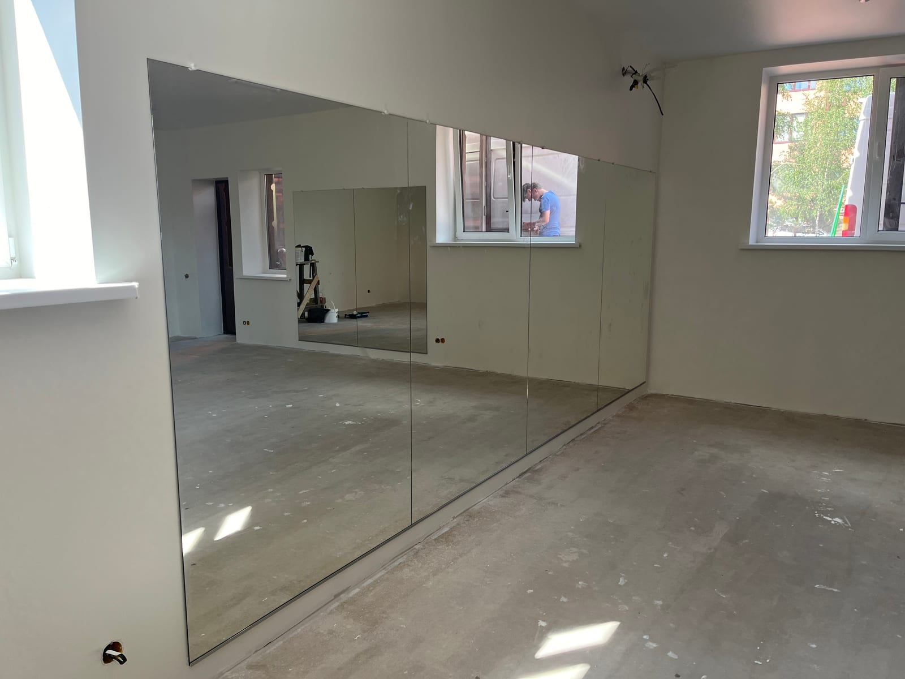

Дзеркала відіграють важливу роль в інтер'єрі: вони візуально збільшують простір, додають світла й стають стильним акцентом. Але навіть за широкого асортименту магазинів не завжди вдається знайти саме той варіант, що ідеально підійде до вашої стіни й стилю. Саме тоді виручають **дзеркала на замовлення** — виготовлені за вашими розмірами та побажаннями. Ми — виробнича майстерня в Києві, тож **виготовлення дзеркал** будь-яких розмірів і форм — наша основна робота. Розповідаємо, що ми робимо, як проходить замовлення й від чого залежить ціна.

## Чому обирають дзеркала на замовлення

- **Точний розмір і форма.** Дзеркало виготовляється під конкретну стіну чи нішу — без компромісів.
- **Унікальність.** Ви отримуєте виріб, що доповнює саме ваш інтер'єр.
- **Додаткові функції.** LED-підсвітка, підігрів проти запотівання, регулювання яскравості.
- **Якість від виробника.** Без переплат посередникам і з гарантією на роботу.

## Які дзеркала ми виготовляємо на замовлення

- **[Дзеркало у ванну](/katalog/dzerkala-dlya-vannoyi/)** — вологостійке, з підсвіткою та антизапотіванням.
- **[Дзеркало з фацетом](/katalog/dzerkala-z-fatsetom/)** — шліфована грань додає «дорогого» вигляду.
- **[Дзеркало з LED-підсвіткою](/katalog/dzerkala-z-led-pidsvitkoyu/)** — м'яке сучасне світло.
- **[Дзеркальні панно](/katalog/dzerkalni-panno/)** — композиція на всю стіну.
- **[Дзеркало у повний зріст](/statti/dzerkalo-v-povnyy-zrist-na-zamovlennya/)** — настінне чи підлогове.
- **[Круглі та фігурні](/statti/krugle-dzerkalo-na-zamovlennya/)**, **[тоновані](/statti/tonovane-dzerkalo-grafit-bronza/)** та **[декоративні](/statti/zerkala-dekorativnye/)** дзеркала.
- **[Дзеркала для спортзалу та студій](/katalog/dzerkala-dlya-sportzaliv/)** — великі полотна із захисною плівкою.
- **Для бізнесу** — [барбершопу](/statti/dzerkala-v-barbershop/), [салону краси](/statti/dzerkala-dlya-salonu-krasy/) та [перукарні](/statti/dzerkala-dlya-perukarni/): під робочі місця, з LED-підсвіткою.

## Як проходить замовлення

1. **Заявка.** Ви залишаєте заявку або телефонуєте — обговорюємо завдання.
2. **Заміри.** Майстер виїжджає на заміри та консультує щодо рішень.
3. **Виготовлення.** Ріжемо й обробляємо дзеркало за вашими розмірами на власному виробництві.
4. **Монтаж.** Доставляємо й встановлюємо — чисто, акуратно та надійно.

## Від чого залежить ціна

Вартість дзеркала на замовлення формують кілька чинників:

- розмір і форма (прямокутне, коло, овал, фігурне);
- обробка краю — звичайна шліфовка або фацет;
- додатки — LED-підсвітка, підігрів, рама, тонування;
- складність монтажу та висота приміщення.

Ми — **виробник у Києві**, тож ціна нижча, ніж у магазинах-посередниках. Орієнтовні ціни готових розмірів — **від 990 грн**: дивіться повний [прайс дзеркал за розмірами](/statti/dzerkalo-za-rozmirom-na-zamovlennya-kiyiv/). Готові напрями — у [каталозі](/katalog/), а точний прорахунок зробимо після замірів.

## Доставка й монтаж

Робимо заміри та монтаж **у Києві та області**, а готові дзеркала відправляємо **Новою Поштою по всій Україні** — надійно пакуємо, щоб виріб доїхав цілим.

## Поширені запитання

**Скільки коштує дзеркало на замовлення?**
Готові розміри — **від 990 грн**; підсумкова ціна залежить від розміру, форми та опцій (фацет, LED-підсвітка, підігрів). Ми — виробник, тож рахуємо під ваш розмір без переплат; орієнтир — [прайс за розмірами](/statti/dzerkalo-za-rozmirom-na-zamovlennya-kiyiv/).

**За скільки днів виготовляють дзеркало на замовлення?**
Зазвичай кілька робочих днів — точний термін залежить від розміру, обробки та завантаженості; називаємо його при замовленні.

**Чи можна дзеркало нестандартної форми?**
Так, виготовляємо круглі, овальні та фігурні дзеркала будь-яких розмірів за вашим ескізом.

**Ви робите заміри безкоштовно?**
Так, виїзд на заміри у Києві та області — щоб дзеркало ідеально стало на місце.

**Чи є доставка в інші міста?**
Так, відправляємо Новою Поштою по всій Україні; заміри та монтаж — у Києві та області.

**Де замовити виготовлення дзеркал у Києві?**
У нашій майстерні: виготовлення дзеркал на замовлення за вашими розмірами — з замірами, доставкою й монтажем у Києві та області. [Залиште заявку](#zayavka) або телефонуйте.

Щоб отримати прорахунок під ваше приміщення — [залиште заявку](#zayavka), і ми зв'яжемось з вами.
