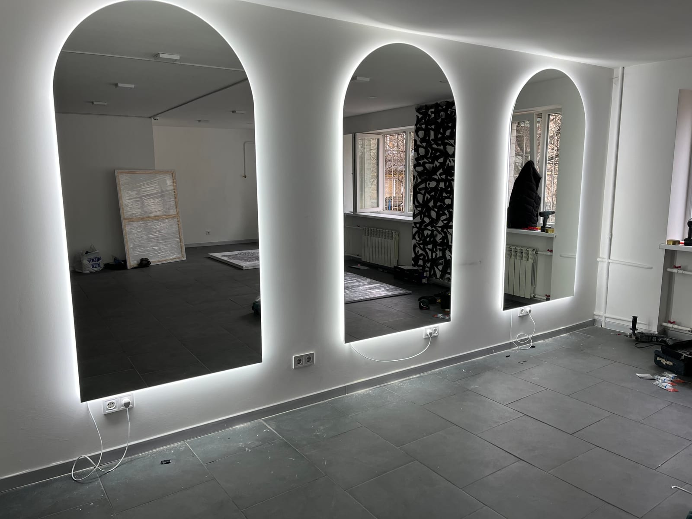

У барбершопі дзеркало — це не декор, а головний робочий інструмент: біля нього майстер працює весь день, а клієнт бачить результат. Тому дзеркала для барбершопу мають бути правильного розміру, з якісним світлом і надійно змонтовані. Розповідаємо, як обрати й замовити дзеркала для барбершопу під ваш простір.

## Чому барбершопу потрібні якісні дзеркала

- **Комфорт клієнта.** Велике чисте дзеркало з рівним відображенням — частина враження від закладу.
- **Зручність майстра.** Правильна висота й світло дають точність у роботі.
- **Стиль закладу.** Форма, рама й підсвітка дзеркал формують упізнаваний інтер'єр.
- **Довговічність.** Комерційне навантаження вимагає якісного скла й надійного монтажу.

## Які дзеркала обирають для барбершопу

- **Дзеркало на робоче місце** — прямокутне полотно перед кріслом клієнта.
- **[З LED-підсвіткою](/katalog/dzerkala-z-led-pidsvitkoyu/)** — рівне безтіньове світло, у якому добре видно роботу.
- **У рамі** — металева або кольорова рама під фірмовий стиль (чорна, латунь, дерево).
- **Арочні та фігурні** — трендовий формат для сучасних барбершопів і салонів.
- **Велика дзеркальна стіна** — для просторих залів і зон очікування; дивіться [дзеркала в інтер'єрі](/katalog/dzerkala-v-interyeri/).

## Розміри для робочого місця

- **Висота полотна** — зазвичай 100–160 см, щоб клієнт бачив себе сидячи, а майстер — робочу зону.
- **Ширина** — від 60 см на одне місце; для «острівних» станцій роблять ширші або двосторонні.
- **Висота монтажу** — центр дзеркала приблизно на рівні очей клієнта, що сидить.

Точні розміри підбираємо під ваші крісла, стійки та планування залу.

## Світло — критично важливе

Для барбершопу світло має бути **рівним і нейтральним**, без різких тіней і жовтизни. Оптимально — дзеркало з вбудованою LED-підсвіткою по контуру: воно освітлює обличчя рівномірно й не спотворює кольори. За потреби додаємо регулювання яскравості, а у вологих зонах — підігрів проти запотівання.

## Матеріали й безпека

Використовуємо якісне вологостійке скло з акуратно обробленим краєм. Для великих полотен і дзеркальних стін застосовуємо захисну плівку з тильного боку — при пошкодженні скло не розлітається. Це важливо для громадського закладу з високою прохідністю.

## Чому вигідно замовляти у виробника

- **Під ваші розміри й планування** — жодних компромісів зі стандартними дзеркалами.
- **Під фірмовий стиль** — форма, рама, підсвітка під бренд закладу.
- **Ціна без посередників** і єдина якість, якщо обладнуєте кілька робочих місць чи мережу.
- **Заміри та монтаж «під ключ»** — у Києві та області, доставка по Україні.

## Скільки коштує і як замовити

Ціна залежить від розміру, кількості робочих місць, типу підсвітки, рами та складності монтажу. Ми — [виробник дзеркал на замовлення](/statti/dzerkala-na-zamovlennya-v-kievi/) у Києві: робимо заміри, виготовляємо за вашими розмірами й монтуємо. Щоб отримати прорахунок під ваш барбершоп — [залиште заявку](#zayavka).

## Поширені запитання

**Яке дзеркало обрати для робочого місця барбера?**
Прямокутне полотно 100–160 см заввишки з рівною LED-підсвіткою — оптимум для роботи та комфорту клієнта.

**Чи можна дзеркала під фірмовий стиль закладу?**
Так, робимо дзеркала потрібної форми (зокрема арочні та фігурні) з рамою під ваш бренд.

**Ви обладнуєте кілька робочих місць одразу?**
Так, виготовляємо комплект дзеркал єдиної якості для всіх станцій — зручно для барбершопів і мереж.

**Чи є доставка в інші міста?**
Так, відправляємо по всій Україні; заміри та монтаж — у Києві та області.
