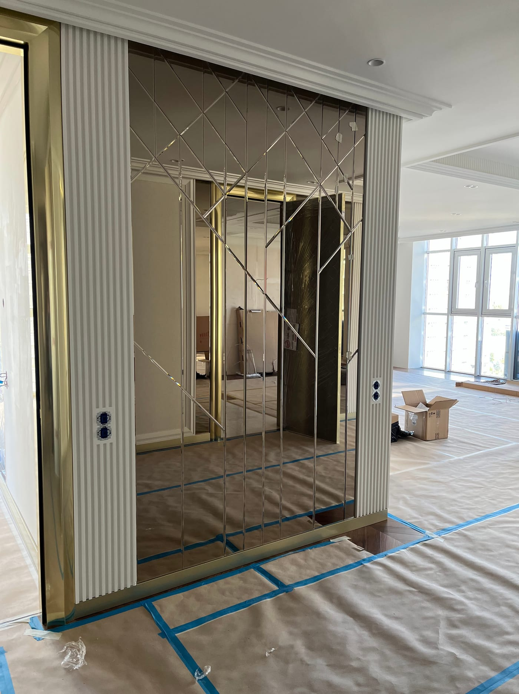

Багато хто помилково вважає, що така стильна та оригінальна дзеркальна плитка потребує специфічного догляду та вдвічі більше часу для прибирання. Але це не так. Правильно обрана дзеркальна плитка на замовлення дуже практична і проста у догляді. Не вірите? Давайте розглянемо конкретні приклади.

Переваги дзеркальної плитки

Якщо ви хочете купити дзеркальну плитку в Києві, то спочатку повинні розуміти в чому її основні переваги. І так, давайте розглянемо все по порядку:

- вона ефектно виглядає;
- оптично збільшує приміщення;
- надає інтер'єру унікального шарму;
- дозволяє створювати будь-які комбінації в інтер'єрі.

Її переваги починаються з етапу збирання, тому що вона не викликає труднощів. Виконати монтаж дзеркальної плитки можна за допомогою спеціального клею або використовуючи спеціальні клейкі стрічки. Який метод правильніший виробник пише в інструкції.

Рухаючись далі відзначимо, що дзеркальна настінна плитка всупереч загальній думці проста у догляді, практична і довговічна. Щоб очистити поверхню, не потрібно використовувати агресивні миючі засоби для догляду за плиткою. Вона чиститься як ваше дзеркало. Для якісного прибирання і надання блиску достатньо оцтової води або засобу для дзеркал.

Щодо прибирання навколо кухонної робочої зони або раковини — тут доведеться докласти трохи більше зусиль, але це цілком логічно і не потребує додаткових пояснень.

Сьогодні купити дзеркальну плитку віддають перевагу людям, які цінують незвичайний зовнішній вигляд інтер'єру та яскраві акценти. І навіть факт необхідності частішого очищення поверхні не зменшує позитивних відгуків споживачів.

Дзеркальна плитка на кухні у ванній та навіть вітальні

Найчастіше у ванній та кухні використовується дуже маленька, мозаїчна дзеркальна плитка. Вона здатна оживити мінімальний інтер'єр, внести шарм в оформлення стін. На кухні її часто використовують для обробки робочої поверхні, де накопичуються бризки та бруд. З дзеркальної поверхні вони легко видаляються м'якою губкою або щіткою та миючим засобом.

Якщо хочете збільшити вітальню і зробити кімнату світлішою, тоді обов'язково оберіть велику дзеркальну плитку на всю стіну або її частину. З неї створюються шикарні панно. А може, ви шукаєте нестандартне рішення? Тоді варто вибрати шестикутну плитку. Трохи фантазії та інтер'єр буде просто чарівний.

Вам потрібне виготовлення дзеркальної плитки найвищої якості? Готові виконати ваше замовлення! Завдяки багаторічному досвіду на ринку та сотням позитивних відгуків від клієнтів ми можемо гарантувати, що ви залишитеся задоволені отриманим результатом.
