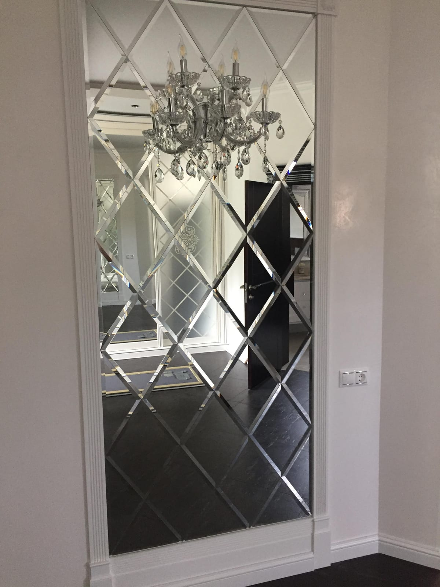

Вам подобаються гарні дзеркальні панно, але все не наважуєтесь замовити таке у свою квартиру, будинок, офіс? Вважаєте, що це невиправдано дорого і непрактично? Поспішаємо запевнити вас у протилежному. Наприклад візьмемо популярне дзеркальне панно ЄВРО-ПЛИТКА. Це найпрактичніший і найфункціональніший елемент декору вашого інтер'єру, який ніколи не вийде з моди, до того ж буде простим і невибагливим у догляді.

Основні критерії вибору

Не варто плутати дзеркальне панно на замовлення із звичайною дзеркальною плиткою. Це різні речі, хоча мають багато спільного, наприклад: довговічність, дзеркальне відображення поверхні, легкість у догляді (для очищення не потрібні спеціальні засоби). Плюс до всього будь-яка поверхня, що відображає, оптично збільшує інтер'єр і додає йому особливий шарм і стиль. Ну і, звичайно ж, простота у складанні та монтажі.

Але при цьому критерії вибору дзеркального панно у Києві дещо інші. При виборі дзеркального панно слід враховувати:

- Розмір та форму. Вибір залежить від потрібного розташування панно та стилю інтер'єру. Великі панно можуть бути гарним вибором для вітальні або спальні, в той час як невеликі можуть підійти для ванних кімнат або коридорів.
- Рама. Стильне дзеркальне панно у спальню чи вітальню може мати різні типи рам, які можуть бути виготовлені з різних матеріалів, таких як дерево, метал чи пластик. Рама може додатково оформити дзеркало та поєднуватися із загальним стилем інтер'єру.
- Якість дзеркала. Важливо зважати на якість матеріалу при виборі дзеркальної прикраси інтер'єру. Поверхня повинна бути гладкою та без дефектів, таких як відколи або подряпини.
- Стиль та дизайн. Підбираються відповідно до загального стилю інтер'єру. Наприклад, класичне дзеркало з традиційною рамою може бути гарним варіантом для класичного інтер'єру, а дзеркало в незвичайній рамі може підійти для сучасного дизайну і стати його родзинкою.
- Функціональність. Панно може виконувати не тільки декоративну функцію, але також використовуватися для освітлення або вміщати дзеркальні полички для зберігання невеликих статуеток, книг і т.д.
- Безпека. Якщо дзеркало буде встановлено в дитячій кімнаті або в місці, де є високий ризик його пошкодження, важливо звернути увагу на безпеку та вибрати матеріал, який не ламатиметься і розсипатиметься на мільйони шматків у разі пошкодження.

Ці критерії можуть бути корисні при виборі та допомогти знайти ідеальний варіант для конкретного інтер'єру. Бажаєте дзеркальне панно купити у Києві чи замовити з доставкою до регіонів України? Ми можемо у цьому допомогти. У нас великий асортимент та багаторічний досвід на ринку. Сотні задоволених клієнтів вже замовили та встановили гарні декоративні панно у своїх квартирах, офісах, готелях та ресторанах.

Якщо вам потрібна додаткова консультація — наші фахівці оперативно дадуть відповідь на всі ваші питання та допоможуть оформити замовлення.
