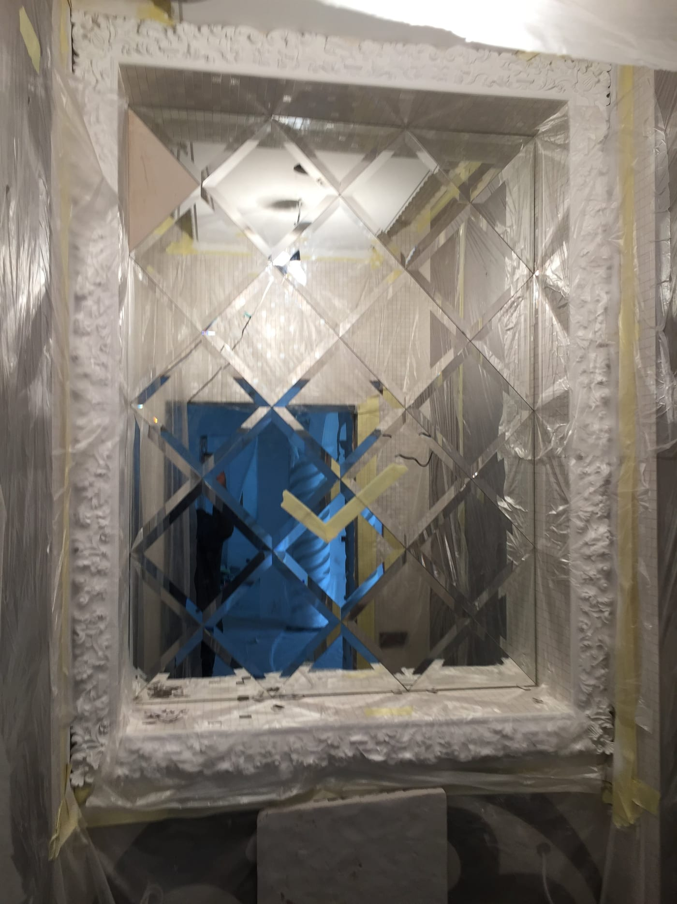
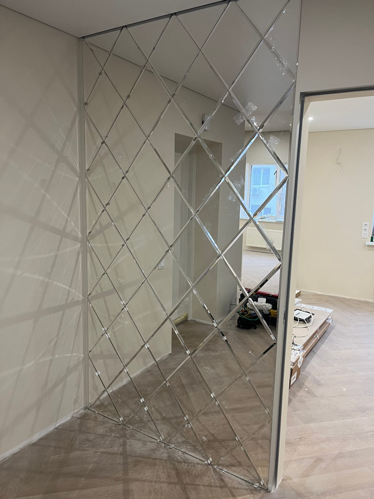

Вам подобаються гарні дзеркальні панно, але все не наважуєтесь замовити таке у свою квартиру, будинок, офіс? Вважаєте, що це невиправдано дорого і непрактично? Поспішаємо запевнити вас у протилежному. Дзеркальне панно — найпрактичніший і найфункціональніший елемент декору інтер'єру, який ніколи не вийде з моди, до того ж простий і невибагливий у догляді.

## Дзеркальне панно з фацетом

Найефектніший варіант — **дзеркальне панно з фацетом**: кожен елемент має шліфовану під кутом грань (фацет), яка красиво заломлює світло й надає композиції «дорогого» вигляду. З окремих дзеркальних плиток чи ромбів із фацетом збирають панно на всю стіну — у вітальню, спальню, передпокій, ресторан чи готель. Фацет робимо від 5 мм; ширину грані й розкладку елементів підбираємо під ваш простір. Детальніше про обробку — [дзеркало з фацетом](/statti/dzerkalo-z-fatsetom-shcho-tse/).

## Дзеркальні панелі на стіну

**Дзеркальні панелі** — це модулі (квадрат, ромб, прямокутник), з яких формують суцільну дзеркальну поверхню на стіні чи стелі. Вони візуально розширюють кімнату, додають світла й слугують декоративним акцентом. Купити дзеркальні панелі можна у складі панно або окремо — з фацетом чи з рівним полірованим краєм, потрібного розміру. Схожий формат — [дзеркальна плитка](/katalog/dzerkalna-plitka/).

Основні критерії вибору

Не варто плутати дзеркальне панно на замовлення із звичайною дзеркальною плиткою. Це різні речі, хоча мають багато спільного, наприклад: довговічність, дзеркальне відображення поверхні, легкість у догляді (для очищення не потрібні спеціальні засоби). Плюс до всього будь-яка поверхня, що відображає, оптично збільшує інтер'єр і додає йому особливий шарм і стиль. Ну і, звичайно ж, простота у складанні та монтажі.

Але при цьому критерії вибору дзеркального панно у Києві дещо інші. При виборі дзеркального панно слід враховувати:

- Розмір та форму. Вибір залежить від потрібного розташування панно та стилю інтер'єру. Великі панно можуть бути гарним вибором для вітальні або спальні, в той час як невеликі можуть підійти для ванних кімнат або коридорів.
- Рама. Стильне дзеркальне панно у спальню чи вітальню може мати різні типи рам, які можуть бути виготовлені з різних матеріалів, таких як дерево, метал чи пластик. Рама може додатково оформити дзеркало та поєднуватися із загальним стилем інтер'єру.
- Якість дзеркала. Важливо зважати на якість матеріалу при виборі дзеркальної прикраси інтер'єру. Поверхня повинна бути гладкою та без дефектів, таких як відколи або подряпини.
- Стиль та дизайн. Підбираються відповідно до загального стилю інтер'єру. Наприклад, класичне дзеркало з традиційною рамою може бути гарним варіантом для класичного інтер'єру, а дзеркало в незвичайній рамі може підійти для сучасного дизайну і стати його родзинкою.
- Функціональність. Панно може виконувати не тільки декоративну функцію, але також використовуватися для освітлення або вміщати дзеркальні полички для зберігання невеликих статуеток, книг і т.д.
- Безпека. Якщо дзеркало буде встановлено в дитячій кімнаті або в місці, де є високий ризик його пошкодження, важливо звернути увагу на безпеку та вибрати матеріал, який не ламатиметься і розсипатиметься на мільйони шматків у разі пошкодження.

Ці критерії можуть бути корисні при виборі та допомогти знайти ідеальний варіант для конкретного інтер'єру. Бажаєте дзеркальне панно купити у Києві чи замовити з доставкою до регіонів України? Ми можемо у цьому допомогти. У нас великий асортимент та багаторічний досвід на ринку. Сотні задоволених клієнтів вже замовили та встановили гарні декоративні панно у своїх квартирах, офісах, готелях та ресторанах.

## Панно чи плитка — що обрати

| Критерій | Дзеркальне панно | Дзеркальна плитка |
|---|---|---|
| Що це | композиція під конкретну стіну | типовий модуль |
| Розкладка | ромб, індивідуальний рисунок | рядами |
| Ефект | акцентна «дорога» стіна | суцільна дзеркальна поверхня |
| Ціна | від 1800 грн/м² | від 900 грн/м² |

## Поширені запитання

**Скільки коштує дзеркальне панно з фацетом?**
Ціна залежить від площі, розміру елементів і типу фацету. Ми — виробник, тож рахуємо під ваш розмір — [залиште заявку](#zayavka).

**Чим панно відрізняється від дзеркальної плитки?**
Панно — це продумана композиція під конкретну стіну (розкладка, форма, фацет), а плитка — типовий модуль. Часто панно й збирають із дзеркальних панелей чи плиток із фацетом.

**Куди підходить дзеркальне панно?**
Вітальня, спальня, передпокій, а також ресторани, готелі, салони й офіси.

Якщо вам потрібна додаткова консультація — наші фахівці оперативно дадуть відповідь на всі ваші питання та допоможуть оформити замовлення. [Залиште заявку](#zayavka), і ми порахуємо панно під ваш інтер'єр.
