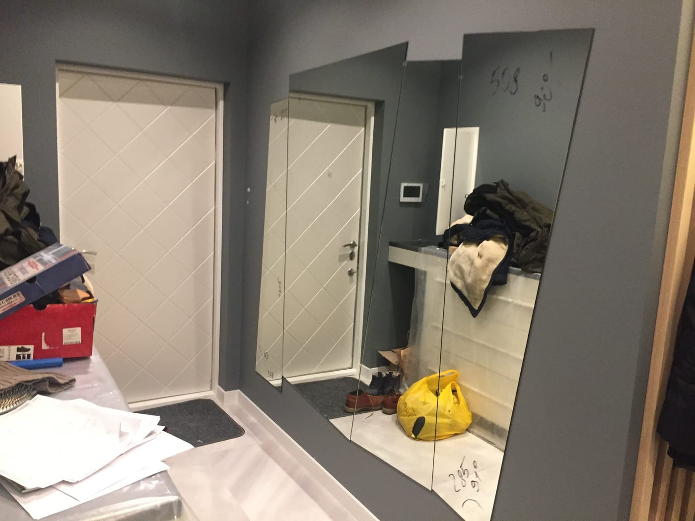

Передпокій — перше, що бачать гості, і місце, де ми щодня збираємось перед виходом. Часто він вузький і темний, і саме дзеркало здатне це виправити: зробити простір світлішим, візуально ширшим і функціональнішим. Розповідаємо, як обрати дзеркало у передпокій.

## Як дзеркало змінює вузький передпокій

- **Розширює простір.** Велике дзеркало на стіні візуально подвоює ширину коридору.
- **Додає світла.** Відбиває природне й штучне освітлення, роблячи темний передпокій яскравішим.
- **Виконує практичну роль.** Перед виходом зручно оцінити весь образ.

## Які розміри та форму обрати

- **Вузький високий прямокутник** — класика для коридору, не «з'їдає» прохід.
- **Дзеркало в повний зріст** — якщо є вільна ділянка стіни; зручно перед виходом.
- **Кругле чи овальне** — м'яка форма як акцент над консоллю чи комодом.

Точні розміри підбираємо під ширину стіни й меблі. Дивіться варіанти в категорії [дзеркала в інтер'єрі](/katalog/dzerkala-v-interyeri/).

## Дзеркало в коридор на стіну з підсвіткою

У коридорах часто бракує природного світла, тому **дзеркало в коридор на стіну з підсвіткою** — практичне й популярне рішення: LED-підсвітка освітлює обличчя перед виходом і слугує додатковим джерелом світла у темному просторі. Світло розміщують по периметру, фронтально (рівномірне освітлення обличчя) або приховано — для м'якого фонового сяйва; за бажанням додаємо сенсорне вмикання, регулювання яскравості й антизапотівання. Саме таке **дзеркало з фоновою підсвіткою для коридору** — стильне й сучасне рішення, коли потрібне м'яке рівномірне світло без яскравих ламп.

Обрати тип світла допоможе стаття про [вибір дзеркала з LED-підсвіткою](/statti/dzerkalo-z-led-pidsvitkoyu-yak-vybraty/), а готові рішення — у категорії [дзеркала з LED-підсвіткою](/katalog/dzerkala-z-led-pidsvitkoyu/) або замовте [дзеркало на стіну](/tovar/dzerkalo-na-stinu/) із підсвіткою за вашими розмірами.

## Поради з розміщення

- вішайте дзеркало на рівні очей середньостатистичної людини;
- над консоллю лишайте 20–30 см відступу до стільниці;
- для вузького коридору обирайте вертикальне дзеркало — воно «витягує» простір.

Щоб підібрати дзеркало під ваш передпокій і порахувати ціну — [залиште заявку](#zayavka).

## Гарні та стильні дзеркала в передпокій

Гарне дзеркало в передпокій — це не лише практична річ, а й елемент декору, що задає настрій із порога. Ми виготовляємо стильні дзеркала для передпокою під ваш інтер'єр:

- **з фацетом** — додає глибини й «дорогого» вигляду;
- **з LED-підсвіткою** — м'яке світло й відчуття простору;
- **у тонкій рамі або без рами** — мінімалізм під сучасний інтер'єр;
- **фігурні та арочні** — модний декоративний акцент.

## Дзеркало в коридор: рішення для вузького простору

Коридор часто найтемніше й найвужче місце у квартирі. Замовити дзеркало в коридор варто вертикальне й на всю висоту стіни — воно візуально розсуває стіни й додає світла. Для довгого коридору добре працюють дзеркала для коридору в ряд або суцільна дзеркальна смуга.

Щоб замовити гарне дзеркало в передпокій чи коридор за вашими розмірами — [залиште заявку](#zayavka) або перегляньте готові рішення в категорії [дзеркала в інтер'єрі](/katalog/dzerkala-v-interyeri/).

## Поширені запитання

**Яке дзеркало підійде для дуже вузького коридору?**
Вузьке вертикальне дзеркало на всю висоту стіни — воно не заважає проходу й візуально розширює простір.

**Чи можна дзеркало з поличкою для дрібниць?**
Так, виготовляємо дзеркала з інтегрованими поличками чи в комплекті з консоллю.

**Чи робите ви дзеркало нестандартної форми для передпокою?**
Так — кругле, овальне, арочне або за індивідуальним контуром.

**Чи можна дзеркало в коридор на стіну з підсвіткою?**
Так, це один із найпопулярніших варіантів для коридору. Робимо LED-підсвітку по периметру, фронтальну або приховану, із сенсорним вмиканням, регулюванням яскравості й антизапотіванням — за вашими розмірами.
