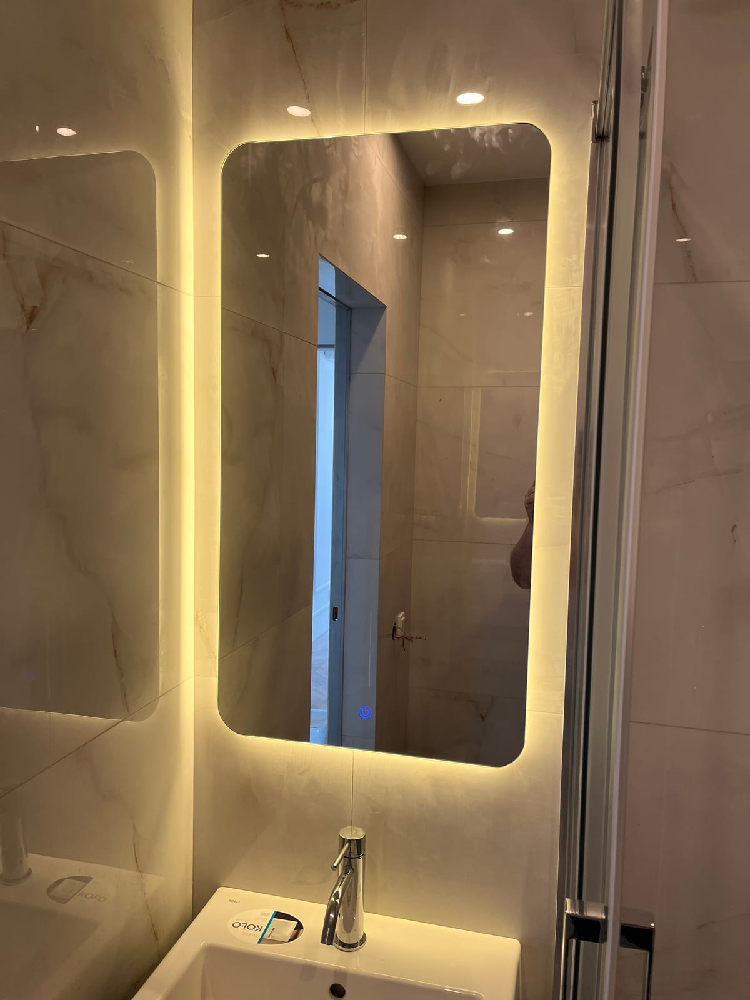

Спальня — місце відпочинку, тому дзеркало тут має бути не лише практичним (одягнутися, зробити макіяж), а й затишним, щоб не «різати» простір. Розповідаємо, яке дзеркало обрати у спальню, якого розміру та де його краще розмістити.

## Де розмістити дзеркало у спальні

- **Дзеркало в повний зріст** — біля шафи чи гардеробної, щоб бачити образ повністю. Докладніше — [дзеркало в повний зріст](/statti/dzerkalo-v-povnyy-zrist-na-zamovlennya/).
- **Над комодом чи туалетним столиком** — зона для макіяжу; тут доречна підсвітка.
- **На дверцятах шафи-купе** — економить місце й додає світла.
- **Акцентне дзеркало над узголів'ям** — декоративний елемент (краще з безпечним монтажем).

## Яку підсвітку обрати

Для зони макіяжу важливе рівномірне світло без тіней, тому **дзеркало з LED-підсвіткою** — найкращий вибір. Оберіть нейтральне або тепле світло, за бажанням — із регулюванням яскравості. Докладніше — у статті [як вибрати дзеркало з підсвіткою](/statti/dzerkalo-z-led-pidsvitkoyu-yak-vybraty/).

## Розмір і форма

- для зони макіяжу достатньо дзеркала 50–70 см завширшки;
- для перегляду образу — у повний зріст (висота від 140 см);
- кругле чи овальне дзеркало створює м'яку, затишну атмосферу спальні;
- у маленькій спальні велике дзеркало візуально розширює простір.

Точні розміри підбираємо під ваш інтер'єр. Готові рішення — у категорії [дзеркала в інтер'єрі](/katalog/dzerkala-v-interyeri/).

## Як замовити дзеркало у спальню

Ми — виробник, тож виготовляємо дзеркало у спальню **на замовлення за вашими розмірами**: обираєте форму, підсвітку, обробку краю. Виконуємо заміри й безпечний монтаж у Києві та області, відправляємо Новою Поштою по всій Україні. Щоб дізнатися ціну — [залиште заявку](#zayavka).

## Поширені запитання

**Яке дзеркало обрати для макіяжу?**
Дзеркало з фронтальною LED-підсвіткою — воно дає рівномірне світло без тіней на обличчі.

**Чи безпечне дзеркало над ліжком?**
Так, за умови надійного кріплення та монтажу на захисну плівку — у разі удару скло не розлетиться.

**Чи можна дзеркало з підігрівом у спальню?**
Підігрів актуальніший для ванної, але за бажанням додаємо будь-які опції до дзеркала у спальню.
