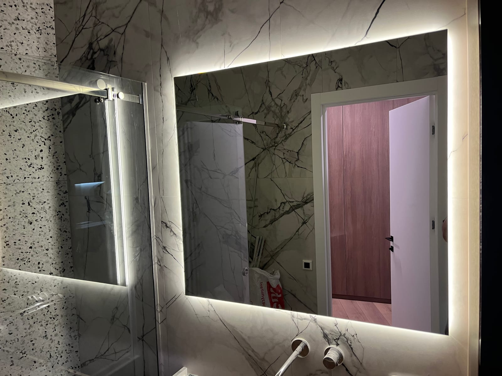

Дзеркало — головний функціональний елемент ванної кімнати: біля нього ми починаємо й завершуємо день. Тому воно має бути вологостійким, зручного розміру й із правильним світлом. Розповідаємо, яке дзеркало обрати у ванну кімнату та як замовити його за вашими розмірами у виробника в Києві.

## Яке дзеркало обрати у ванну

- **[З LED-підсвіткою](/katalog/dzerkala-z-led-pidsvitkoyu/)** — рівне світло без тіней, зручно для макіяжу й гоління; сучасний вигляд.
- **[З антизапотіванням](/statti/dzerkalo-z-antyzapotivannyam-dlya-vannoyi/)** — підігрів не дає дзеркалу пітніти після душу.
- **[З фацетом](/katalog/dzerkala-z-fatsetom/)** — шліфована грань додає «дорогого» вигляду.
- **[Кругле чи фігурне](/statti/krugle-dzerkalo-na-zamovlennya/)** — трендові форми, що пом'якшують інтер'єр.

## Розмір і розміщення

- **Ширина** — часто роблять дзеркало по ширині раковини або тумби (чи трохи ширше).
- **Висота** — щоб було зручно і дорослим, і дітям; для маленьких ванних велике дзеркало візуально розширює простір і додає світла.
- **Розміщення** — над раковиною; за потреби — дзеркальна стіна чи ніша.

Ми — виробник, тож ріжемо дзеркало **точно за вашими розмірами**, зокрема під нестандартні ніші.

## Вологість і безпека

Для ванної використовуємо **вологостійке дзеркало** з якісним сріблястим покриттям і акуратно обробленим краєм. Це важливо, бо у ванній постійна волога й перепади температури. За потреби додаємо підігрів (антизапотівання) та безпечне кріплення.

## Чому вигідно замовляти у виробника

- **Точний розмір і форма** — без компромісів зі стандартними дзеркалами з магазину.
- **Ціна без посередників.**
- **Додаткові опції** — підсвітка, підігрів, фацет, форма.
- **Заміри та монтаж «під ключ»** — у Києві та області, доставка по Україні.

## Скільки коштує і як замовити

Ціна залежить від розміру, форми, наявності підсвітки, підігріву та обробки краю. Щоб дізнатися вартість дзеркала у ванну — [залиште заявку](#zayavka), і ми порахуємо під ваш простір. Дивіться також [дзеркальну плитку у ванну](/statti/dzerkalna-plitka-u-vannu-ta-na-stinu/) та категорію [дзеркала для ванної](/katalog/dzerkala-dlya-vannoyi/).

## Поширені запитання

**Яке дзеркало краще у ванну — з підсвіткою чи без?**
З LED-підсвіткою зручніше: рівне світло без тіней. Для вологих ванних додають ще й підігрів проти запотівання.

**Чи можна дзеркало нестандартної форми у ванну?**
Так, робимо круглі, овальні та фігурні дзеркала будь-яких розмірів на замовлення.

**Ви робите заміри й монтаж?**
Так, у Києві та області; готові дзеркала відправляємо Новою Поштою по всій Україні.
