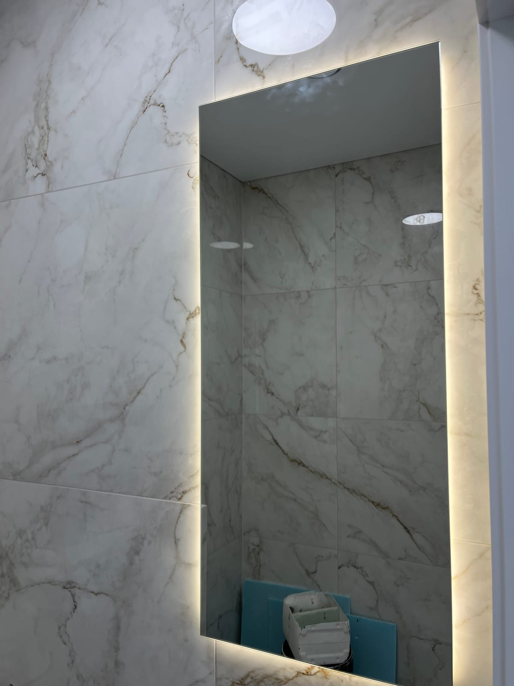

Якщо Ви плануєте облаштувати квартиру повністю з нуля, тоді Вам може знадобитися і дзеркало у ванну кімнату, купити в Києві яке можна у безлічі різних компаній. Але незважаючи на це, Вам варто звертатися за допомогою тільки до справжніх фахівців, які точно зможуть запропонувати Вам дзеркалом необхідних розмірів і форми, а також можливістю додаткової обробки.

У нашій компанії Ви можете в Києві купити дзеркало у ванну кімнату з декількома додатковими послугами з обробки, включаючи піскоструминну обробку, а також полірування та шліфування. Завдяки таким варіантам, кожен наш товар є унікальним і повністю відповідає вимогам замовника, незалежно від складності такої роботи. Тому в ванну кімнату в Києві дзеркала Ви можете купувати саме у нас.

### Для того, щоб в нашій компанії дзеркало у ванну кімнату купити в Києві, Вам слід просто зв'язатися з співробітниками нашої компанії і домовитися з ними про зустріч або відразу оформленні замовлення.

Однак ми рекомендуємо Вам приїхати до нас, так як ми зможемо показати Вам приклади виконаних робіт і каталог можливостей, що дозволить Вам точно вирішити, чи підходить Вам певна покупка чи ні. Також наші співробітники зможуть запропонувати Вам свою консультацію при необхідності, якщо у Вас виникли складнощі з вибором відповідного товару.

Ми не обмежуємося тільки пропозицією купити в Києві дзеркало у ванну кімнату, а можемо надати дзеркальні поверхні в якості декоративних елементів і в інші приміщення, так як сьогодні такий варіант є досить популярним. Наприклад, покриття стін і стелі дзеркальною плиткою застосовується навіть в магазинах і різних салонах.
