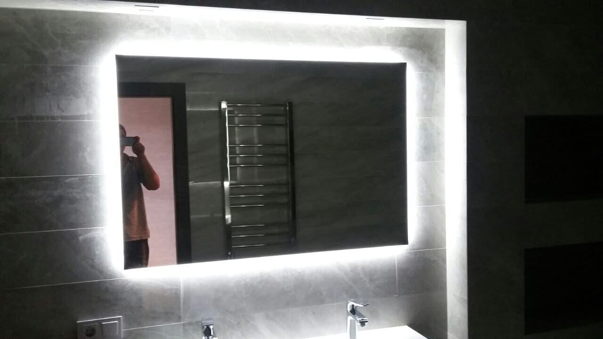

Запітніле дзеркало після гарячого душу — звична дрібна незручність у ванній. Доводиться витирати поверхню рушником або чекати, поки волога зійде сама. Сучасне рішення цієї проблеми — дзеркало з антизапотіванням (підігрівом). Розповідаємо, як воно працює, чи безпечне й коли його варто замовляти.

## Як працює антизапотівання

За дзеркалом (із тильного боку) кріпиться тонка **нагрівальна плівка або мат**. Коли ви заходите у ванну, плівка трохи підігріває поверхню дзеркала — приблизно до температури тіла. Через це конденсат на теплому склі не утворюється, і дзеркало залишається прозорим навіть у парі.

Підігрів можна:

- вмикати окремою кнопкою або синхронно зі світлом;
- залишати ввімкненим увесь час прийняття душу;
- комбінувати з LED-підсвіткою в одному дзеркалі.

## Чи безпечно це у ванній

Так. Нагрівальні плівки для дзеркал розраховані саме на вологі приміщення:

- працюють на безпечній низькій потужності, лише трохи нагріваючи скло;
- мають герметичну, повністю ізольовану проводку;
- не контактують з водою — плівка прихована за дзеркалом і захищена.

Монтаж і підключення виконує майстер, тож усе відповідає вимогам безпеки.

## Кому варто замовити дзеркало з підігрівом

- родинам, де ванною користуються кілька людей поспіль;
- якщо ви голитесь або робите макіяж одразу після душу;
- у санвузлах зі слабкою вентиляцією, де волога довго не сходить;
- усім, хто цінує комфорт і не любить щодня витирати дзеркало.

Антизапотівання — це опція, яку ми додаємо до дзеркала **будь-якого розміру та форми**, зокрема разом із підсвіткою. Детальніше про варіанти — у категорії [дзеркала для ванної кімнати](/katalog/dzerkala-dlya-vannoyi/).

## Скільки коштує

Підігрів додається як опція до основної вартості дзеркала й залежить від площі поверхні. Точну суму рахуємо під конкретний розмір — [залиште заявку](#zayavka), і ми безкоштовно проконсультуємо та порахуємо.

## Поширені запитання

**Чи багато електроенергії споживає підігрів?**
Ні. Нагрівальна плівка працює на низькій потужності й вмикається лише за потреби.

**Чи можна поєднати підігрів і LED-підсвітку?**
Так, це найпопулярніша комбінація для ванної — світло без тіней плюс чисте дзеркало у парі.

**Чи довговічна нагрівальна плівка?**
Так, якісна плівка розрахована на тривалу роботу; ми використовуємо надійні матеріали та надаємо гарантію.
