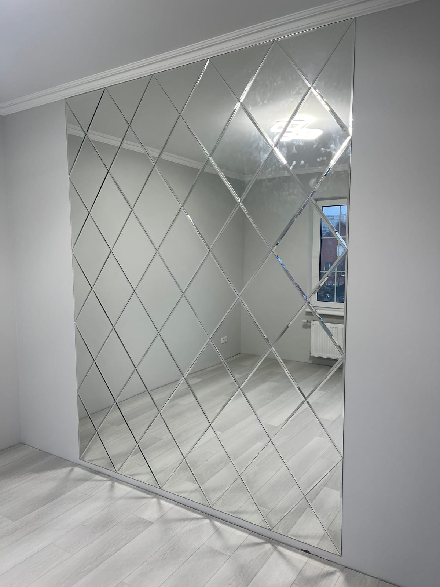

Якщо ви обираєте дзеркало й натрапили на слово «фацет» — це про оздоблення краю, яке робить виріб витонченішим. Розповідаємо простими словами, що таке фацет, якої ширини він буває та в яких інтер'єрах доречний.

## Що таке фацет

**Фацет** — це шліфована й відполірована грань (скіс) по периметру дзеркала. Замість рівного прямого краю майстер знімає фаску під кутом, і вона починає **заломлювати світло**, як кришталь. Завдяки цьому:

- дзеркало виглядає об'ємнішим і «дорожчим»;
- по краю з'являється легка гра світла;
- виріб набуває завершеного, шляхетного вигляду.

## Якої ширини буває фацет

Ми виготовляємо фацет двох найпопулярніших розмірів — **10 і 15 мм**:

| Ширина фацету | Вигляд | Де застосовують |
|---|---|---|
| **10 мм** | делікатніший скіс | стримані та сучасні інтер'єри |
| **15 мм** | ширша грань, сильніша гра світла | преміальний акцент, великі дзеркала й панно |

Чим ширший фацет, тим помітніша гра світла — підкажемо оптимальний варіант під ваш стиль.

## Де доречне дзеркало з фацетом

- **Вітальня та спальня** — як акцентне дзеркало на стіні.
- **Передпокій** — додає простору шляхетності.
- **Дзеркальні панно та плитка** — фацет на кожному елементі створює ефект кришталевої стіни. Докладніше — у категорії [дзеркала з фацетом](/katalog/dzerkala-z-fatsetom/).
- **Класичні та неокласичні інтер'єри** — фацет ідеально пасує до такого стилю.

## Фацет чи звичайний край: що обрати

- якщо інтер'єр стриманий і сучасний — достатньо акуратної шліфованої кромки;
- якщо хочеться акценту, відчуття «дорого» й гри світла — обирайте фацет;
- для дзеркальних композицій (панно, плитка) фацет майже завжди виграшний.

Щоб підібрати дзеркало з фацетом під ваш інтер'єр і дізнатися ціну — [залиште заявку](#zayavka).

## Поширені запитання

**Який фацет обрати — 10 чи 15 мм?**
10 мм — стриманіший варіант для сучасних інтер'єрів, 15 мм — виразніший преміальний акцент із сильнішою грою світла. Підкажемо під ваш стиль.

**Фацет робить дзеркало дорожчим?**
Так, обробка фацета — додаткова робота, тому коштує більше за звичайну кромку. Але саме фацет дає той самий «дорогий» вигляд.

**Чи можна фацет на дзеркалі будь-якої форми?**
Так — на прямокутному, круглому, овальному та фігурному дзеркалі.

**Чи поєднується фацет із підсвіткою?**
Так, фацет і LED-підсвітка чудово працюють разом, підсилюючи гру світла.
