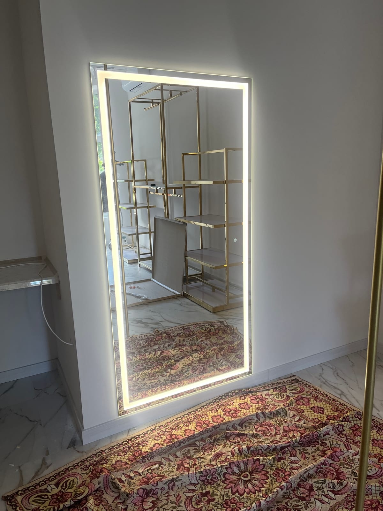

Дзеркало з LED-підсвіткою — це не лише джерело рівномірного світла для макіяжу чи гоління, а й сучасний акцент в інтер'єрі. Але моделей на ринку багато, і легко розгубитися: фронтальна чи контурна підсвітка, тепле чи холодне світло, чи потрібне антизапотівання. У цьому гайді розкладемо все по поличках, щоб ви обрали дзеркало, яке буде зручним саме для вас.

## Чим зручне дзеркало з LED-підсвіткою

Головна перевага — **рівномірне світло без тіней на обличчі**. На відміну від верхнього світильника, який світить згори й залишає тіні, підсвітка по периметру дзеркала освітлює обличчя м'яко та з усіх боків. Це зручно для макіяжу, гоління, догляду за шкірою.

Інші плюси:

- додає приміщенню сучасного вигляду й відчуття простору;
- економить електроенергію (LED споживає мало);
- слугує додатковим нічним освітленням у ванній чи спальні;
- довговічне — якісні LED-модулі працюють десятки тисяч годин.

## Види підсвітки: фронтальна, контурна, бічна

Це перше, що варто визначити, бо від типу залежить характер світла.

- **Фронтальна** — світло виходить «на вас» із матової смуги на поверхні дзеркала. Найкраще освітлює обличчя, ідеальна для макіяжу.
- **Контурна (по периметру)** — світло йде з-під країв дзеркала на стіну, створюючи ефект «паріння». Більше декоративна, м'яка атмосфера.
- **Бічна** — світлові смуги ліворуч і праворуч. Хороший компроміс: і обличчя освітлене, і виглядає стильно.

Можна комбінувати — наприклад, фронтальну для функціональності й контурну для атмосфери.

## Яке світло обрати: тепле, нейтральне чи холодне

Температуру світла вимірюють у Кельвінах (К):

- **Тепле (2700–3000 К)** — затишне, жовтувате. Підходить для спальні, вітальні.
- **Нейтральне (4000 К)** — максимально природне, не спотворює кольори. Універсальний вибір для ванної.
- **Холодне (5000–6500 К)** — біле, «денне». Підкреслює деталі, але може бути різкуватим.

Найзручніший варіант — дзеркало з **регулюванням температури**: одним дотиком перемикаєте світло від теплого до холодного залежно від завдання.

## Додаткові функції, які варто розглянути

- **Антизапотівання (підігрів)** — дзеркало не пітніє навіть після гарячого душу. Майже обов'язкова опція для ванної.
- **Димер (регулювання яскравості)** — світло від приглушеного нічного до яскравого денного.
- **Сенсорне або безконтактне вмикання** — торкання чи змах рукою, без вимикача на стіні.
- **Годинник, температура, Bluetooth-колонка** — для тих, хто любить технологічність.

Кожну з функцій ми додаємо за бажанням до дзеркала будь-якого розміру.

## Куди підходить дзеркало з підсвіткою

- **Ванна кімната** — найпопулярніше місце; тут важливі вологозахист і антизапотівання. Докладніше — у категорії [дзеркала для ванної кімнати](/katalog/dzerkala-dlya-vannoyi/).
- **Спальня, зона макіяжу** — фронтальна підсвітка з теплим/нейтральним світлом.
- **Передпокій** — підсвітка робить вузький простір світлішим і візуально ширшим.

## Як замовити дзеркало з LED-підсвіткою в Києві

Готові дзеркала рідко підходять ідеально за розміром. Тому ми виготовляємо їх **на замовлення за вашими розмірами** — ви обираєте форму, тип підсвітки, температуру світла й додаткові функції. Майстер виконує безкоштовний замір у Києві та області, а монтаж робимо «під ключ».

Подивитися варіанти можна в розділі [дзеркала з LED-підсвіткою](/katalog/dzerkala-z-led-pidsvitkoyu/), а щоб дізнатися ціну під ваш проєкт — [залиште заявку](#zayavka), і ми безкоштовно все порахуємо.

## Поширені запитання

**Чи безпечна LED-підсвітка у ванній?**
Так. Ми використовуємо вологозахищені модулі та герметичну ізольовану проводку, розраховані саме для вологих приміщень.

**Скільки служить LED-підсвітка?**
Якісні світлодіоди розраховані на десятки тисяч годин роботи. Ми використовуємо надійні модулі та надаємо гарантію.

**Чи можна зробити дзеркало нестандартної форми з підсвіткою?**
Так — прямокутне, кругле, овальне або з індивідуальними вирізами. Підсвітку інтегруємо під будь-яку форму.
