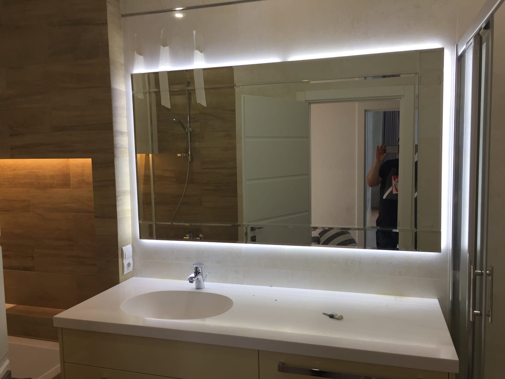

Перше питання, яке виникає при виборі дзеркала з підсвіткою, — скільки це коштуватиме. Однозначної цифри немає, бо кожне дзеркало виготовляється індивідуально. Але розуміти, з чого складається ціна, корисно — так ви зможете спланувати бюджет і не переплатити за непотрібні опції. Розберемося детально.

## Від чого залежить ціна дзеркала з підсвіткою

На вартість впливають кілька основних чинників:

- **Розмір** — що більша площа дзеркала, то більше матеріалу та роботи.
- **Тип і товщина скла** — стандартне 4 мм чи товстіше, зі звичайним сріблом чи з покращеним відображенням.
- **Вид підсвітки** — фронтальна, контурна чи бічна; довжина світлових смуг.
- **Додаткові функції** — антизапотівання (підігрів), димер, сенсорне вмикання, годинник, Bluetooth.
- **Форма та обробка краю** — прямокутне простіше, кругле/овальне чи з фацетом — дорожче.
- **Монтаж** — складність установлення та тип поверхні.

## Орієнтовні ціни на ринку

Щоб ви мали уявлення про порядок цифр, наведемо орієнтири по ринку Києва (точна ціна залежить від конфігурації):

- кругле дзеркало з підсвіткою Ø600 мм — приблизно від 2600 грн;
- прямокутне 100×80 см із фронтальною підсвіткою — приблизно від 3300 грн;
- велике дзеркало з підсвіткою у рамі — від 9000–10000 грн.

Це **орієнтири, а не фіксований прайс**: фінальну вартість рахуємо під конкретні розміри й набір функцій. Часто виходить вигідніше, ніж здається, бо ви не платите за зайве.

## Чому «під замовлення» вигідніше за готове

Здавалося б, готове дзеркало в магазині простіше. Але на практиці замовлення за розміром часто **економить гроші й нерви**:

- не потрібно переплачувати за «найближчий» більший розмір — робимо точно під ваш простір;
- не доведеться переробляти меблі чи нішу під стандартне дзеркало;
- ви платите лише за ті функції, які справді потрібні;
- виключений ризик купити річ, що не підійде.

## Як заощадити без втрати якості

- Оберіть **нейтральну** температуру світла замість дорогої моделі зі зміною температури, якщо вона вам не критична.
- Контурна підсвітка зазвичай дешевша за повну фронтальну — а виглядає ефектно.
- Для ванної не економте на **антизапотіванні** — це та опція, що реально окупається комфортом.
- Замовляйте заміри — точні розміри уникають переробок і зайвих витрат.

## Як дізнатися точну вартість

Найшвидший спосіб — [залишити заявку](#zayavka) або зателефонувати. Ми безкоштовно проконсультуємо, за потреби виконаємо замір у Києві та області й порахуємо вартість саме під ваш проєкт. Подивитися моделі можна в розділі [дзеркала з LED-підсвіткою](/katalog/dzerkala-z-led-pidsvitkoyu/).

## Поширені запитання

**Чи входить монтаж у вартість?**
Монтаж рахується окремо й залежить від складності, але ми завжди озвучуємо повну суму заздалегідь — без прихованих доплат.

**Чи безкоштовний замір?**
Так, замір у межах Києва безкоштовний.

**Скільки днів виготовляється дзеркало з підсвіткою?**
Зазвичай від кількох днів; точний термін називаємо при оформленні замовлення.
