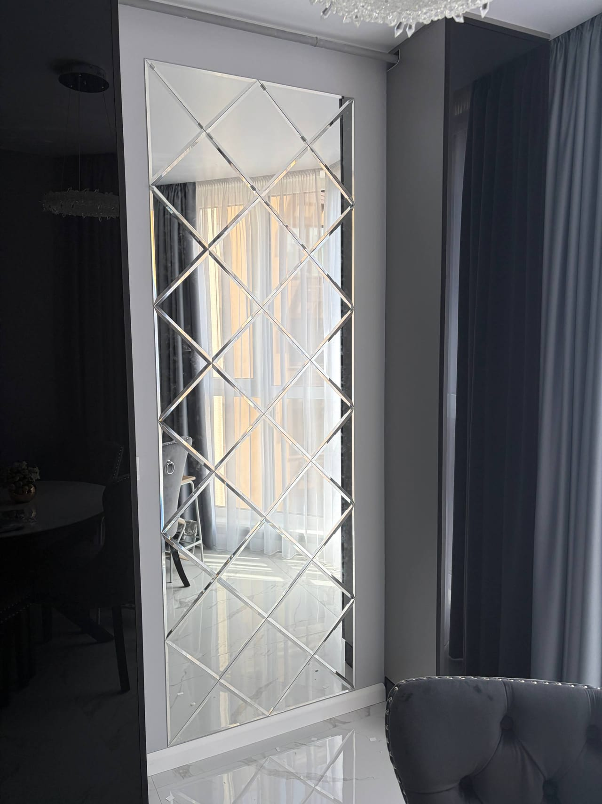

Форма дзеркала визначає, як воно «звучить» в інтер'єрі: строгий прямокутник, м'який овал чи сміливе фігурне дзеркало за вашим ескізом. Ми — виробник у Києві, тож ріжемо дзеркало **будь-якої форми** за вашими розмірами, з полірованим краєм або фацетом і, за бажанням, з LED-підсвіткою.

## Які форми ми виготовляємо

- **Прямокутне** — класика для ванної, передпокою, повного зросту.
- **Квадратне** — мінімалізм і симетрія.
- **Овальне** — м'якша альтернатива прямокутнику, витончений вигляд.
- **[Кругле](/statti/krugle-dzerkalo-na-zamovlennya/)** — універсальний акцент; ефектне з підсвіткою.
- **Аркове** — з дугоподібним верхом, у сучасному та класичному стилі.
- **Фігурне / нестандартне** — за вашим ескізом чи кресленням (хвиля, асиметрія, «сонце»).

Незвичні декоративні форми (сонце, зістарене, хвилясте) — у статті [декоративні дзеркала](/statti/zerkala-dekorativnye/).

## Як обрати форму під інтер'єр

- **Маленьке приміщення** — кругле чи овальне пом'якшує простір; велике прямокутне візуально розширює.
- **Сучасний стиль** — асиметрія, фігурне різання, безрамне дзеркало з полірованим краєм.
- **Класика** — арка, овал у рамі, фацет.
- **Ванна / зона макіяжу** — форма + [LED-підсвітка](/led-dzerkala-na-zamovlennya/) для рівного світла.

## Обробка й опції

Будь-яку форму робимо з:

- обробкою краю — **полірування (єврокромка)** або **фацет**;
- **LED-підсвіткою** (фронтальна чи фонова);
- отворами під кріплення й фурнітуру;
- вологостійким склом для ванної.

Про край докладніше — [дзеркало з фацетом](/statti/dzerkalo-z-fatsetom-shcho-tse/).

## Ціна та терміни

Вартість залежить від форми, розміру, товщини (4–6 мм) та обробки. Прості форми (прямокутник, квадрат) — дешевші; фігурне різання й фацет — дорожче. Виготовлення — зазвичай від 1–3 днів. Готове дзеркало під розмір і форму — див. [дзеркало на замовлення за розмірами](/statti/dzerkalo-za-rozmirom-na-zamovlennya-kiyiv/).

## Поширені запитання

**Чи можна дзеркало нестандартної форми?**
Так, ріжемо фігурні дзеркала за вашим ескізом або кресленням — хвиля, асиметрія, «сонце», будь-який контур.

**Яка форма дзеркала краща для маленької кімнати?**
Кругле чи овальне м'якшить простір, а велике прямокутне у повний зріст візуально його розширює.

**Ви обробляєте край будь-якої форми?**
Так, край завжди полірується (єврокромка) або робимо фацет — це безпечно й естетично.

**Чи можна підсвітку на фігурне дзеркало?**
Так, LED-підсвітка (особливо фонова Амбілайт) гарно підкреслює нестандартну форму.

Щоб порахувати дзеркало потрібної форми — [залиште заявку](#zayavka) або надішліть ескіз у Viber/Telegram.
