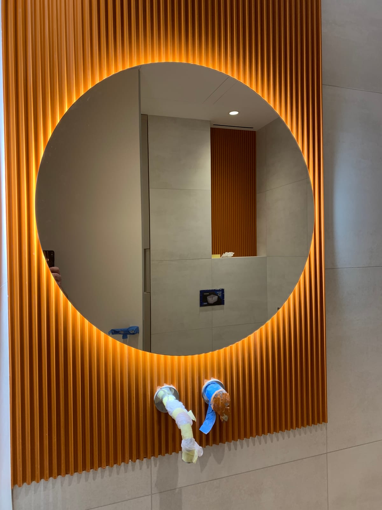

Кругле дзеркало з LED-підсвіткою — один із найпопулярніших трендів в інтер'єрі останніх років. М'яка форма без гострих кутів і світло, що ніби «парить» довкола, роблять його стильним акцентом у будь-якій кімнаті. Розповідаємо, чому воно так добре виглядає, куди підходить і як обрати розмір.

## Чому кругла форма така популярна

- **Пом'якшує інтер'єр.** Прямі лінії меблів і плитки врівноважуються плавним колом — простір виглядає затишніше.
- **Універсальна.** Кругле дзеркало пасує і до мінімалізму, і до класики, і до стилю модерн.
- **Ефект «паріння».** Контурна підсвітка з-під країв створює світлове кільце на стіні — виглядає дорого й сучасно.
- **Безпечніше.** Немає гострих кутів — актуально для дитячих і прохідних зон.

## Куди підходить кругле дзеркало з підсвіткою

- **Ванна кімната** — над раковиною, особливо в сучасних інтер'єрах.
- **Передпокій** — кругле дзеркало з підсвіткою працює і як декор, і як практичний елемент перед виходом.
- **Спальня, зона макіяжу** — м'яке фронтальне світло зручне для щоденного догляду.
- **Вітальня** — як декоративний акцент на стіні.

## Який розмір обрати

Орієнтовні рекомендації:

- **Ø500–600 мм** — компактне, для невеликої ванної чи вузького передпокою.
- **Ø700–800 мм** — найуніверсальніший розмір над стандартною раковиною.
- **Ø900 мм і більше** — ефектний акцент для просторих приміщень.

Точний діаметр краще підбирати під ширину раковини чи меблів — ми підкажемо оптимальний варіант. Інші моделі дивіться в категорії [дзеркала з LED-підсвіткою](/katalog/dzerkala-z-led-pidsvitkoyu/).

## Як замовити

Ми виготовляємо круглі дзеркала **за вашим діаметром** з потрібним типом підсвітки (контурна, фронтальна), температурою світла та опціями на кшталт антизапотівання. Виконуємо замір і монтаж у Києві та області. Щоб дізнатися ціну — [залиште заявку](#zayavka).

## Поширені запитання

**Яка підсвітка краща для круглого дзеркала?**
Для декоративного ефекту — контурна (по периметру). Якщо потрібне світло для макіяжу — додаємо фронтальну.

**Чи можна зробити кругле дзеркало з підігрівом?**
Так, антизапотівання доступне для круглих дзеркал так само, як і для прямокутних.

**Чи буває овальна форма замість круглої?**
Так, виготовляємо й овальні дзеркала з підсвіткою за індивідуальними розмірами.
