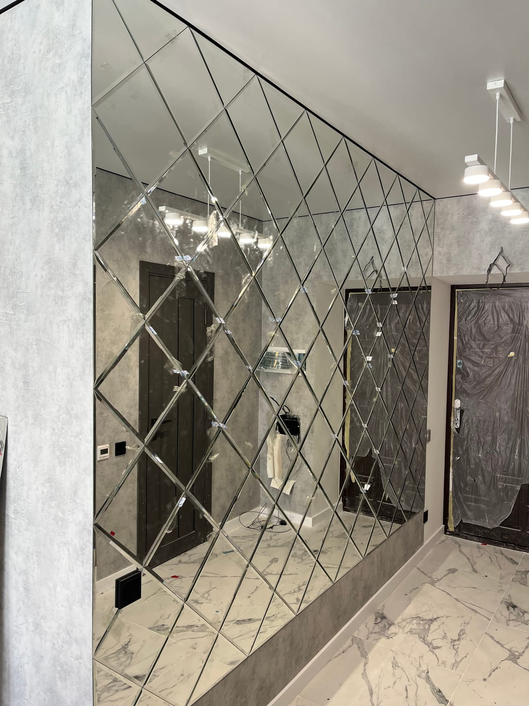

Декоративне дзеркало — це не просто предмет, у який дивляться: це повноцінний елемент декору, що візуально збільшує простір, додає світла й задає стиль інтер'єру. Розповідаємо, які бувають декоративні дзеркала, які форми обрати та як замовити їх за вашими розмірами у виробника.

## Що таке декоративне дзеркало

Декоративне дзеркало виконує одразу дві функції — практичну та естетичну. Воно відбиває світло й простір, а завдяки формі, обробці краю чи підсвітці стає акцентом на стіні. Такі дзеркала роблять під конкретний інтер'єр — за розміром, формою та стилем.

## Види декоративних дзеркал

- **Настінні** — класика: над консоллю, диваном, комодом чи каміном.
- **[У повний зріст](/statti/dzerkalo-v-povnyy-zrist-na-zamovlennya/)** — підлогові або настінні, практичні й ефектні.
- **[З фацетом](/katalog/dzerkala-z-fatsetom/)** — шліфована грань дає гру світла, як у хрусталю.
- **[Дзеркальні панно](/katalog/dzerkalni-panno/)** — композиція з елементів на всю стіну.
- **[З LED-підсвіткою](/katalog/dzerkala-z-led-pidsvitkoyu/)** — сучасний акцент із м'яким світлом.
- **[Круглі та фігурні](/statti/krugle-dzerkalo-na-zamovlennya/)** — пом'якшують інтер'єр, виглядають нетипово.
- **[Тоновані](/statti/tonovane-dzerkalo-grafit-bronza/)** — графіт чи бронза для глибокого, преміального вигляду.
- **Дзеркало-сонце** — промениста рама-акцент у стилі бохо чи класики.
- **Зістарене (антиковане)** — ефект старовини з патиною, для лофту й вінтажних інтер'єрів.
- **Хвилясте (асиметричне)** — сучасні органічні форми для сміливого дизайну.
- **З напиленням і тонуванням** — бронза, графіт, срібло для художнього ефекту.

## Де використовують декоративні дзеркала

- **у передпокої та коридорі** — додають світла й «розширюють» вузький простір ([детальніше](/statti/dzerkalo-u-peredpokiy/));
- **у вітальні** — головний акцент на стіні;
- **у спальні** — над туалетним столиком або як декор;
- **у ванній** — вологостійкі, часто з підсвіткою;
- **у салонах краси, ресторанах, шоурумах** — стильне комерційне рішення.

## Форми та обробка

Прямокутні, квадратні, круглі, овальні, фігурні — форму підбираємо під ваш простір. Край обробляємо (шліфування, полірування або фацет), за потреби додаємо раму, підсвітку чи тонування. Готові рішення дивіться у категорії [дзеркала в інтер'єрі](/katalog/dzerkala-v-interyeri/).

## Чому вигідно замовляти у виробника

- **Ціна без посередників** — ви не переплачуєте магазинам.
- **Будь-який розмір і форма** — ріжемо точно під вашу стіну.
- **Заміри та монтаж** — акуратно, безпечно, «під ключ».
- **Доставка** — Новою Поштою по всій Україні.

## Скільки коштує і як замовити

Ціна декоративного дзеркала залежить від розміру, форми, обробки краю (фацет), наявності підсвітки чи тонування. Ми — виробник у Києві: робимо заміри, виготовляємо **за вашими розмірами**, монтуємо в Києві та області й відправляємо по всій Україні. Щоб дізнатися вартість — [залиште заявку](#zayavka).

## Поширені запитання

**Чим декоративне дзеркало відрізняється від звичайного?**
Формою, обробкою та роллю в інтер'єрі — воно працює як елемент декору, а не лише як функціональний предмет.

**Яке декоративне дзеркало найпопулярніше?**
Настінні дзеркала з фацетом і дзеркальні панно — вони виглядають дорого й ефектно.

**Ви робите дзеркала нестандартної форми?**
Так, виготовляємо круглі, овальні та фігурні декоративні дзеркала будь-яких розмірів на замовлення.
